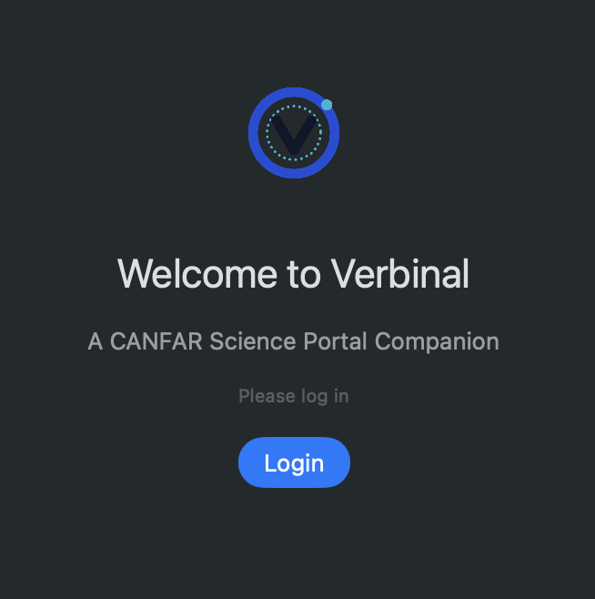
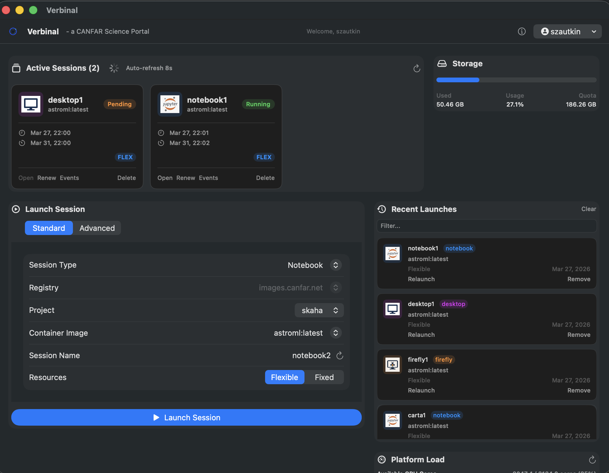

# Verbinal for macOS

A native macOS desktop companion for the [CANFAR Science Portal](https://www.canfar.net/), built with SwiftUI and XcodeGen.

This is the macOS counterpart of [Verbinal for Linux](https://github.com/szautkin/CanfarDesktopUbuntu) (Rust/GTK 4/libadwaita).

[](https://github.com/szautkin/canfar-macos/actions/workflows/ci.yml)
[](https://github.com/szautkin/canfar-macos/actions/workflows/release.yml)
[](LICENSE)

## Features

- Native SwiftUI macOS application
- Session management for CANFAR science sessions
- Storage quota view for home VOSpace usage
- Platform load view for cluster CPU, GPU, and RAM utilisation
- Recent launches for quick re-launch
- Secure credentials stored in macOS Keychain
- XcodeGen-based project configuration

## Screenshots




## Installation

### Download

Download the latest `.dmg` from [GitHub Releases](https://github.com/szautkin/canfar-macos/releases).

1. Open `Verbinal-macOS.dmg`
2. Drag **Verbinal** to **Applications**
3. On first launch, right-click the app and select **Open** (macOS Gatekeeper requires this for unsigned apps)

A `.zip` archive is also available if you prefer.

Verify your download with the `checksums-sha256.txt` file:

```bash
shasum -a 256 -c checksums-sha256.txt
```

### Build from source

See [Building](#building) below.

## Requirements

### Runtime
- macOS 14 or newer
- A CANFAR account

### Build
- Xcode 16 or newer
- XcodeGen 2.45 or newer

## Building

```bash
# Generate the Xcode project
xcodegen generate

# Debug build
xcodebuild build \
  -project Verbinal.xcodeproj \
  -scheme Verbinal \
  -destination 'platform=macOS' \
  -derivedDataPath .derivedData \
  CODE_SIGNING_ALLOWED=NO

# Run tests
xcodebuild test \
  -project Verbinal.xcodeproj \
  -scheme Verbinal \
  -destination 'platform=macOS' \
  -derivedDataPath .derivedData \
  CODE_SIGNING_ALLOWED=NO
```

For local development, you can also open the generated `Verbinal.xcodeproj` in Xcode and run the `Verbinal` scheme directly.

## Running Tests

```bash
xcodebuild test \
  -project Verbinal.xcodeproj \
  -scheme Verbinal \
  -destination 'platform=macOS' \
  -derivedDataPath .derivedData \
  CODE_SIGNING_ALLOWED=NO
```

## Code Quality

- All source files include AGPL-3.0 license headers
- CI runs build and test on every push and pull request
- Unit tests cover URL construction, model mapping, networking, XML parsing, and image parsing
- Strict separation of concerns: views, view models, services, and models
- Zero external dependencies — only Apple frameworks

## Project Structure

```text
project.yml           # XcodeGen source of truth
Verbinal/             # Application code, models, services, views
VerbinalTests/        # Unit tests for parsing and other pure logic
```

## Architecture

- SwiftUI for the UI layer
- Observation-based app state and view models
- Async/await networking with `URLSession`
- Clear separation between models, services, view models, and views

## API Endpoints

All communication is with CANFAR services over HTTPS. No telemetry, analytics, or third-party calls are present.

| Service | Base URL | Purpose |
|---------|----------|---------|
| Auth | `ws-cadc.canfar.net/ac` | Login, token validation |
| User info | `ws-uv.canfar.net/ac` | User profile retrieval |
| Sessions | `ws-uv.canfar.net/skaha/v1` | Session CRUD, images, context, stats |
| Storage | `ws-uv.canfar.net/arc` | VOSpace quota |

## License

[GNU Affero General Public License v3.0](LICENSE)

Copyright (C) 2025-2026 Serhii Zautkin

## Privacy

See [PRIVACY.md](PRIVACY.md). In short: no data collection, no telemetry, and no third-party services. Data stays on your machine or goes directly to CANFAR.

## Contributing

See [CONTRIBUTING.md](CONTRIBUTING.md).
