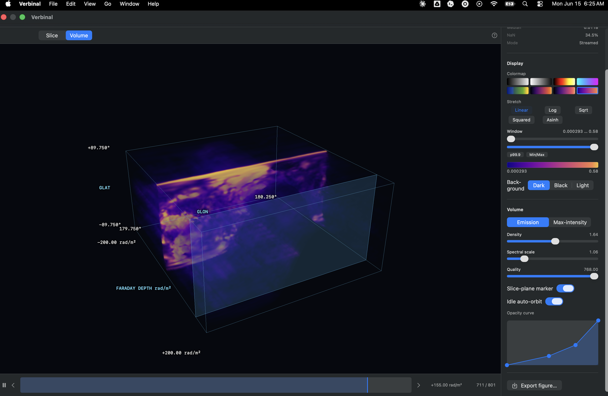
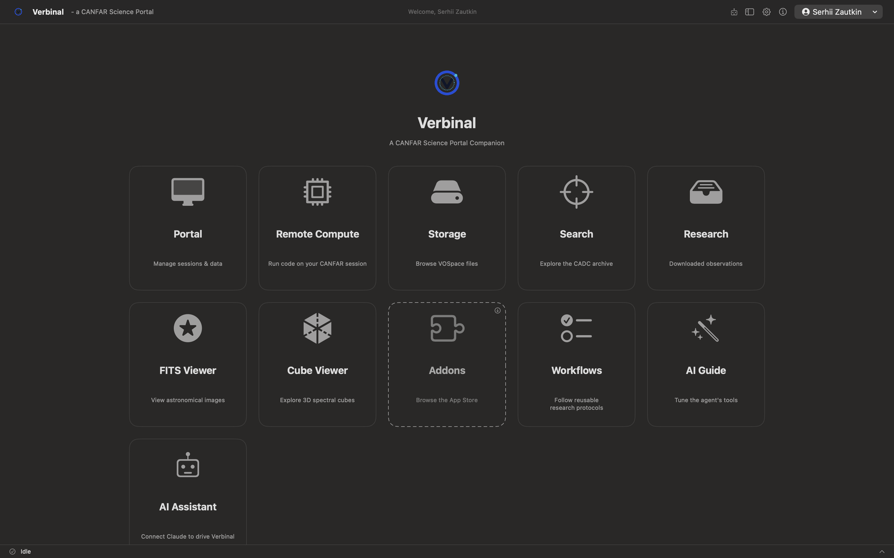
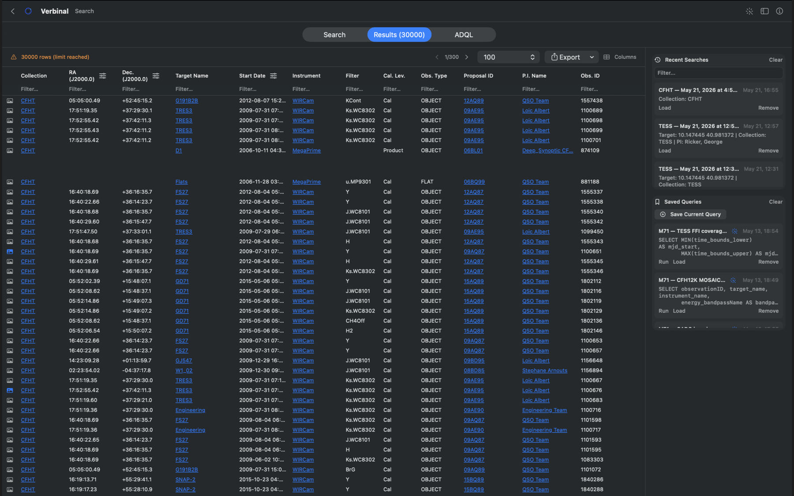
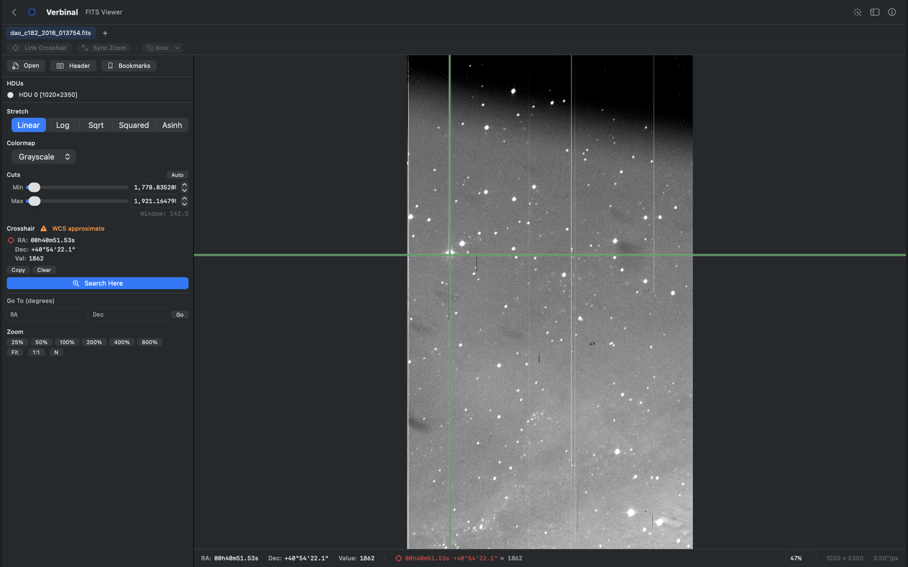
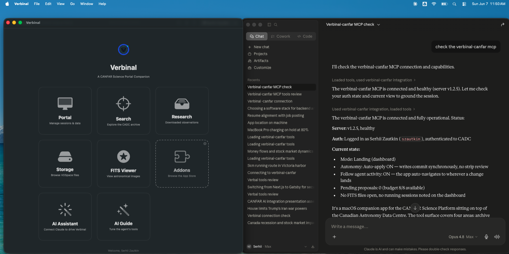

# Verbinal for macOS

A native macOS desktop companion for the [CANFAR Science Portal](https://www.canfar.net/), built with SwiftUI and XcodeGen.

Project home: **[verbinal.com](https://verbinal.com)**

[](https://github.com/szautkin/canfar-macos/actions/workflows/ci.yml)
[](https://github.com/szautkin/canfar-macos/actions/workflows/release.yml)
[](LICENSE)
[](https://apps.apple.com/ca/app/verbinal/id6761290036)
[](https://verbinal.com)

Available on the **[Mac App Store](https://apps.apple.com/ca/app/verbinal/id6761290036)**,
and as an unsigned build from [GitHub Releases](https://github.com/szautkin/canfar-macos/releases).

**User manual:** [read it online](https://szautkin.github.io/canfar-macos/), or here in the repository:
[English](docs/manual/en/00-contents.md) · [Français](docs/manual/fr/00-contents.md). It covers every
screen, setting and shortcut of Verbinal 1.4.

## Features

- **Sessions** — launch and manage Notebook, Desktop, CARTA, Contributed, and
  Firefly sessions on the CANFAR Skaha platform, no browser required. Auto-refreshing
  status, live platform load, CPU and RAM (and GPU, when there is one) on every session
  card, one-click re-launch from history, in-place event and container logs, and
  headless batch jobs that keep up with thousands of jobs — with a history kept after
  the platform drops them.
- **Remote Compute** (new in 1.4) — run Python or Bash on a session on your own CANFAR
  account, from the app or through your AI assistant. Every run and its output are kept,
  and a run survives signing out and quitting the app.
- **CADC archive search** — build queries against the CADC TAP service (with a radius for
  cone searches and VizieR beside CADC), review results in a sortable, filterable table,
  switch units (RA/Dec HMS·DMS, 14-unit spectral conversion), and open rich CAOM2
  observation detail — with an ADQL editor that checks your query as you type.
- **Research assistant** — a workspace that tracks your observations, with or without
  their files: download whole observations, choose individual files, or cut out just the
  region you need. Full-text search over notes and tags, and bundle export.
- **VOSpace storage** — a native file browser to browse, upload, organise, share and
  manage your VOSpace files, with quota and usage at a glance and a warning when a
  sensitive file is public.
- **FITS viewer** — hardware-accelerated, Metal-based rendering with pan/zoom, scaling
  modes, WCS-aware pixel readout, and full zenithal projections (TAN/SIN/STG/ZEA).
  Marks on your images kept with the file and exported to DS9, plotted spectra (such as
  HST x1d), and figures of the whole image or a region.
- **Cube Viewer** — explore FITS spectral cubes in 3D: a GPU ray-marched volume mode and
  a quantitative slice mode with WCS sky coordinates, spectral readout, and click-to-probe
  spectra — plus publication-quality figure export to PNG/PDF.
- **Workflows** — step-by-step research protocols (imaging, photometry, spectroscopy,
  cube kinematics, proposal preparation) as checklists you can copy, edit and track.
- **Image content discovery** — find which CANFAR container image carries the Python,
  R, system, and OS-level packages your workflow needs, before you launch.
- **AI assistant integration (MCP)** — a built-in Model Context Protocol server lets
  Claude Desktop, Claude Code and any other MCP client work in the app with you, through
  about two hundred tools — on your terms:
  - you allow each assistant session, and can give it instructions it must follow;
  - you choose, kind by kind, what an assistant may do without asking — deletes wait for
    you by default, and every change says why;
  - your assistant can see the window, point things out with numbered hints, and show
    its work on the activity bar, without ever pressing a button for you;
  - a session log explains every call, every change and every request to CADC and CANFAR.

  A guided setup wizard connects Claude in a few clicks, and an AI Guide tunes what each
  tool tells the assistant. [The manual's chapter 12](docs/manual/en/12-ai-assistant.md) explains it
  for you, [AGENTS.md](AGENTS.md) shows how to connect any client, and
  [docs/MCP-Setup.md](docs/MCP-Setup.md) covers how it works inside.
- **Privacy first** — no analytics or telemetry; credentials live in the macOS Keychain;
  all traffic goes directly to CANFAR/CADC over HTTPS.
- **Localized and accessible** — full English and French interfaces, with VoiceOver
  support.

## Screenshots

The 3D **Cube Viewer** (new in 1.3) — explore FITS spectral cubes as an interactive, GPU ray-marched volume:



| Home (1.4) | CADC archive search |
|------|---------------------|
|  |  |

| FITS viewer | AI assistant (MCP) driving Verbinal |
|-------------|-------------------------------------|
|  |  |

## Installation

### Download

Download the latest `.dmg` from [GitHub Releases](https://github.com/szautkin/canfar-macos/releases).

1. Open `Verbinal-macOS.dmg`
2. Drag **Verbinal** to **Applications**
3. On first launch, right-click the app and select **Open** (macOS Gatekeeper requires this for unsigned apps)

A `.zip` archive is also available if you prefer.

Verify your download with the `checksums-sha256.txt` file:

```bash
shasum -a 256 -c checksums-sha256.txt
```

### Build from source

See [Building](#building) below.

## Requirements

### Runtime
- macOS 14 or newer
- A CANFAR account

### Build
- Xcode 16 or newer
- XcodeGen 2.45 or newer

## Building

```bash
# Generate the Xcode project
xcodegen generate

# Debug build
xcodebuild build \
  -project Verbinal.xcodeproj \
  -scheme Verbinal \
  -destination 'platform=macOS' \
  -derivedDataPath .derivedData \
  CODE_SIGNING_ALLOWED=NO

# Run tests
xcodebuild test \
  -project Verbinal.xcodeproj \
  -scheme Verbinal \
  -destination 'platform=macOS' \
  -derivedDataPath .derivedData \
  CODE_SIGNING_ALLOWED=NO
```

For local development, you can also open the generated `Verbinal.xcodeproj` in Xcode and run the `Verbinal` scheme directly.

## Running Tests

```bash
xcodebuild test \
  -project Verbinal.xcodeproj \
  -scheme Verbinal \
  -destination 'platform=macOS' \
  -derivedDataPath .derivedData \
  CODE_SIGNING_ALLOWED=NO
```

## Code Quality

- All source files include MPL-2.0 license headers
- CI runs build and test on every push and pull request
- Unit tests cover URL construction, model mapping, networking, XML parsing, and image parsing
- Strict separation of concerns: views, view models, services, and models
- A single external dependency, pinned to an exact version: [GRDB](https://github.com/groue/GRDB.swift) 7.11.0 (in-app SQLite store); everything else is Apple frameworks

## Project Structure

```text
project.yml           # XcodeGen source of truth
Verbinal/             # Application code, models, services, views
VerbinalTests/        # Unit tests for parsing and other pure logic
```

## Architecture

- SwiftUI for the UI layer
- Observation-based app state and view models
- Async/await networking with `URLSession`
- Clear separation between models, services, view models, and views

## API Endpoints

All communication is with CANFAR services over HTTPS. No telemetry, analytics, or third-party calls are present.

| Service | Base URL | Purpose |
|---------|----------|---------|
| Auth | `ws-cadc.canfar.net/ac` | Login, token validation |
| User info | `ws-uv.canfar.net/ac` | User profile retrieval |
| Sessions | `ws-uv.canfar.net/skaha/v1` | Session CRUD, images, context, stats |
| Storage | `ws-uv.canfar.net/arc` | VOSpace quota |

## License

[Mozilla Public License 2.0](LICENSE)

Copyright (C) 2025-2026 Serhii Zautkin

## Privacy

See [PRIVACY.md](PRIVACY.md). In short: no data collection, no telemetry, and no third-party services. Data stays on your machine or goes directly to CANFAR.

## Related projects

These open-source companions help you get the most out of Verbinal:

- **[verbinal-execution](https://github.com/szautkin/verbinal-execution)** — a
  CANFAR/Skaha contributed-session image that powers Verbinal's AI **remote compute**
  (`run_code`). It is a file-drop watcher that runs agent-supplied Python/bash snippets
  and writes JSON results back — no shell, no inbound network. Run it in a contributed
  session to let your AI assistant execute code on the platform on your behalf.
- **[inspector-image](https://github.com/szautkin/inspector-image)** — a minimal
  Alpine container image with [Anchore syft](https://github.com/anchore/syft) preinstalled,
  used as the Skaha/CANFAR inspector that powers Verbinal's **image content discovery**
  (probing container images for their Python, R, system, and OS-level packages).

## Contributing

See [CONTRIBUTING.md](CONTRIBUTING.md).
