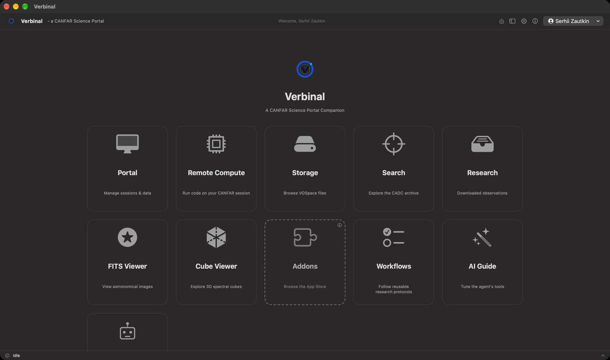
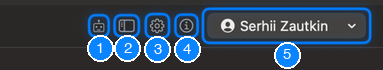
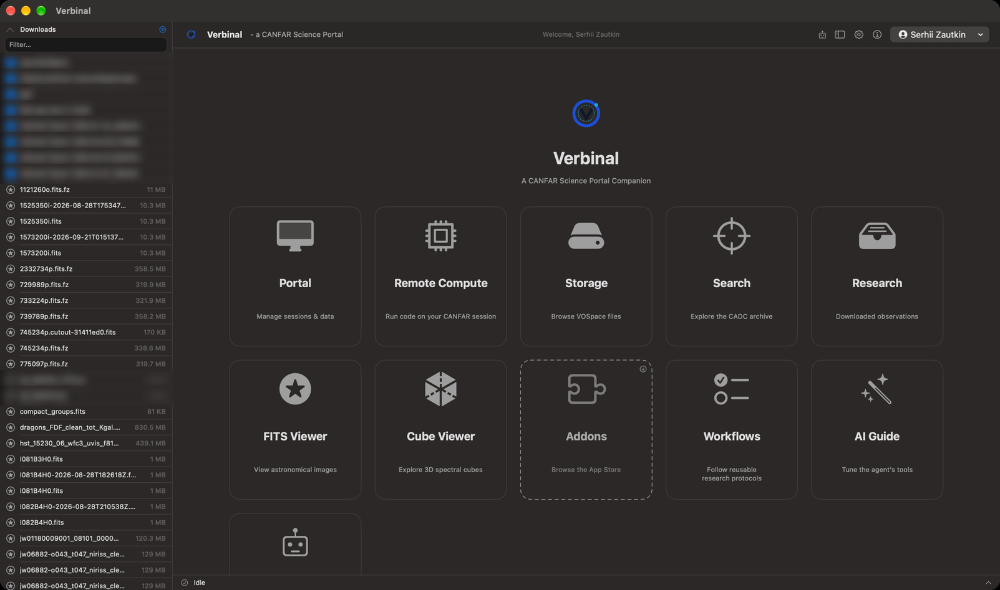
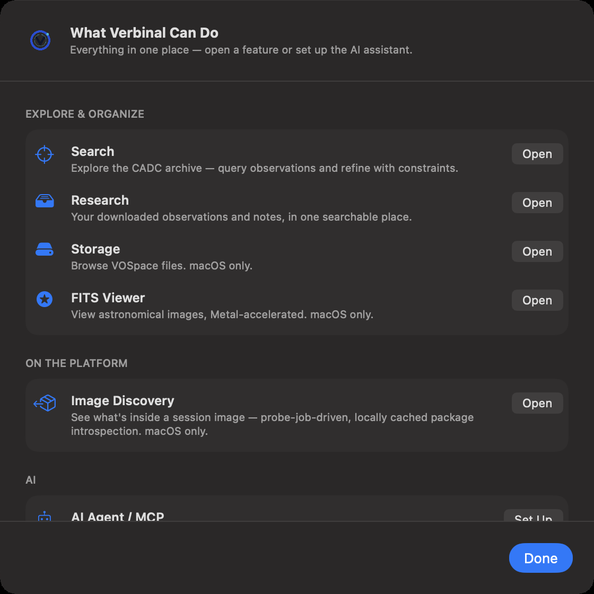
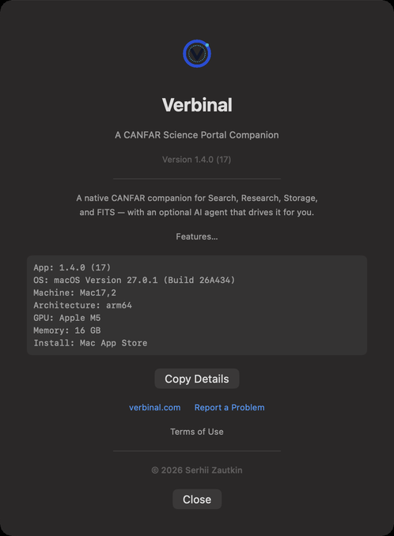

# Getting started

Verbinal is a Mac app for astronomers who use the Canadian Astronomy Data Centre (CADC) and the CANFAR
science platform. In one window you can search the archive, keep and read your observations, look at
FITS images and data cubes, manage your VOSpace storage, and run sessions, batch jobs and code on
CANFAR. This chapter installs it, walks through the first launch, and shows you around the window.

## What you need

- A Mac with **macOS 14 (Sonoma) or newer**, with Apple silicon or an Intel processor.
- For **Portal**, **Storage** and **Remote Compute**: a CADC account, and for sessions and jobs on
  CANFAR, an account that has access to the CANFAR science platform. See [canfar.net](https://www.canfar.net/).
- Nothing else for **Search**, **Research**, the **FITS Viewer**, the **Cube Viewer**, **Workflows**
  and the **AI Guide**: they work without signing in.
- On Windows or Linux: this manual is for the Mac. Verbinal for
  [Windows](https://github.com/szautkin/CanfarDesktop) and for
  [Linux](https://github.com/szautkin/CanfarDesktopUbuntu) are separate apps, with their own manuals to
  come.

## Installing Verbinal

Verbinal is free.

- **Mac App Store** (recommended): [Verbinal on the Mac App Store](https://apps.apple.com/ca/app/verbinal/id6761290036).
  The store keeps it up to date.
- **GitHub**: each release on [GitHub Releases](https://github.com/szautkin/canfar-macos/releases) has
  `Verbinal-macOS.dmg`, `Verbinal-macOS.zip` and `checksums-sha256.txt`. This build is not signed:
  open the disk image, drag **Verbinal** to **Applications**, and the first time, Control-click the app
  and choose **Open**.

## The first launch

1. **The Terms of Use.** Read them, tick **I have read and agree to the Terms of Use…**, then click
   **I Agree**. **Quit** (⌘Q) closes Verbinal instead. You see them again only when they change; they
   stay readable from **About Verbinal** ▸ **Terms of Use**.
2. **Welcome to Verbinal.** A short tour of what the app does. **Set up the AI assistant** starts the
   setup described in [Working with an AI assistant](12-ai-assistant.md#connecting-an-assistant);
   **Explore on my own** closes it. It shows once, and again when a new version has news for it.
3. **Notifications.** macOS asks whether Verbinal may send notifications. Verbinal uses them to tell
   you when a session is ready or fails to start, when batch jobs finish or fail, and when an export is
   done.

## Home

Home is where Verbinal opens. Each tile opens a part of the app:

| Tile | What it opens | Sign-in |
|---|---|---|
| **Portal** | Your CANFAR sessions, the launch form and batch jobs. [Chapter 6](06-portal-sessions.md) | yes |
| **Remote Compute** | A session on CANFAR that runs your code. [Chapter 10](10-remote-compute.md) | yes |
| **Storage** | Your VOSpace files. [Chapter 9](09-storage.md) | yes |
| **Search** | The CADC archive. [Chapter 2](02-search.md) | — |
| **Research** | The observations you keep, with your notes. [Chapter 3](03-research.md) | — |
| **FITS Viewer** | FITS images and spectra. [Chapter 4](04-fits-viewer.md) | — |
| **Cube Viewer** | Spectral cubes in 3D. [Chapter 5](05-cube-viewer.md) | — |
| **Addons** | The Mac App Store, to find Verbinal add-ons | — |
| **Workflows** | Step-by-step research protocols. [Chapter 11](11-workflows.md) | — |
| **AI Guide** | What every AI assistant is told. [Chapter 13](13-ai-guide.md) | — |
| **AI Assistant** | The setup that connects an AI assistant. [Chapter 12](12-ai-assistant.md) | — |

- While you are signed out, the tiles that need an account say **Locked**. Click one, sign in, and
  Verbinal takes you there.
- When an add-on such as Verbinal Pi (notebooks) is installed, its own tile takes the place of
  **Addons**.
- You can hide the **AI Guide** tile in **Settings ▸ MCP Clients**; the AI Guide itself stays in the
  **Go** menu.
- To come back to Home from anywhere, use the back arrow at the top left, or **Go ▸ Landing** (⌘0).

## The window

Every screen has the same toolbar at the top and the activity bar at the bottom.

1. **Pending changes**: what an AI assistant proposed and is waiting for you. A red badge counts them.
   See [Pending](12-ai-assistant.md#pending-changes-waiting-for-you).
2. **Show file browser** (⌘B): the files on this Mac, in a panel on the left.
3. **Settings** (⌘,). See [Settings](14-settings.md).
4. **About Verbinal**: the version, and details for a bug report.
5. **Your CADC account**: your name, with your email and institute in its menu, and **Sign Out**. When
   you are signed out, a **Sign In** button stands here instead.

The account menu is on Home and in Portal. On the other screens, the toolbar starts with a back arrow
(**Go back**) and the screen's name.

### The activity bar

The line at the bottom of the window says what Verbinal is doing: **Idle**, the task that is running,
or how many are. A task that failed shows in red. Click the line to see the **Activity** list: each
task, who started it (**You**, **Your assistant** or **Verbinal**), and what it is doing now or why it
failed. **Clear Finished** empties the finished ones from the list.

### The file browser

Press ⌘B, or click its toolbar button, to show the files on this Mac.

- It opens in your **Downloads** folder, where Verbinal saves what you download. The arrow beside the
  folder's name goes to the parent folder.
- **Filter…** narrows the list by name. The button at the top right shows only the files Verbinal
  opens: FITS (`.fits`, `.fit`, `.fts`, `.fz`), notebooks (`.ipynb`), Python (`.py`) and Markdown
  (`.md`).
- Click a folder to open it, and a FITS file to open it in the FITS Viewer. A file with a third axis
  asks first whether to open it as an image or as a cube. Other files open in their usual Mac app.
- Verbinal can read only the folders you let it. For a folder outside Downloads, click
  **Grant Access…** and choose it.

## Getting around

The **Go** menu reaches every screen from anywhere:

| Go | Shortcut |
|---|---|
| **Landing** (Home) | ⌘0 |
| **Search** | ⌘1 |
| **Research** | ⌘2 |
| **FITS Viewer** | ⌘3 |
| **Cube Viewer** | ⌘4 |
| **Workflows** | — |
| **Portal** | ⌘5 |
| **Storage** | ⌘6 |
| **AI Guide** | ⌘7 |
| **Image Discovery…** | ⌘8 |

Remote Compute is reached from its Home tile. Every menu and shortcut is in
[Keyboard shortcuts and menus](a-shortcuts-and-menus.md).

## Signing in and out

1. Click **Sign In** in the toolbar on Home, or a tile that says **Locked**.
2. In **Log In to CANFAR**, type your CADC **Username** and **Password**.
3. Leave **Remember me** ticked to stay signed in: Verbinal then keeps your password in the macOS
   Keychain, on this Mac only, and signs you in again by itself when your session with CADC expires.
   Untick it to keep only the session, so you sign in again when it expires.
4. Click **Log In**.

When Verbinal starts, it checks your saved session while Home is already usable; the tiles that need
an account unlock when the check is done. If the Mac is offline, the check waits for the network.

To sign out, open your account menu (your name, at the top right of Home or Portal) and choose
**Sign Out**.

## Language

Verbinal speaks English and French. To choose, open **Settings ▸ General ▸ Language**: **System**
follows your Mac, or pick **English** or **Français**. macOS applies an app's language when it starts,
so Verbinal shows **Restart required**; click **Restart Now**.

## Help, and what Verbinal can do

The **Help** menu has:

- **What Verbinal Can Do…**: an overview of its main features, each with a button to open it.
- **Connect an AI Agent…**: the assistant setup, as the **AI Assistant** tile opens it.
- **Verbinal Help** (⌘?): Verbinal's page on GitHub, which leads to this manual.
- **Report an Issue**: a new issue on GitHub, in your browser.

**About Verbinal** (the ⓘ button, or the **Verbinal** menu) shows the version and the details a bug
report needs: the app, macOS, the Mac, its architecture, GPU and memory, and where Verbinal was
installed from. **Copy Details** copies them. **Report a Problem** opens a new issue on GitHub, and
**Terms of Use** shows the terms you accepted.

## What an assistant can do here

An AI assistant can move between screens, open and close the file browser and the sheets, and read
the activity bar, as you can. Signing in and out stays yours: see
[Working with an AI assistant](12-ai-assistant.md).
