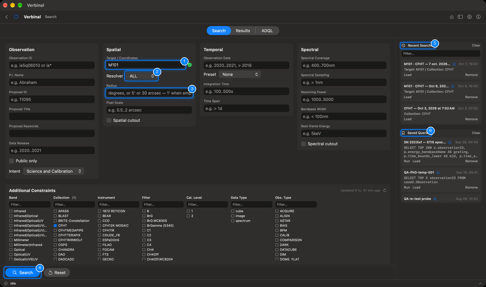
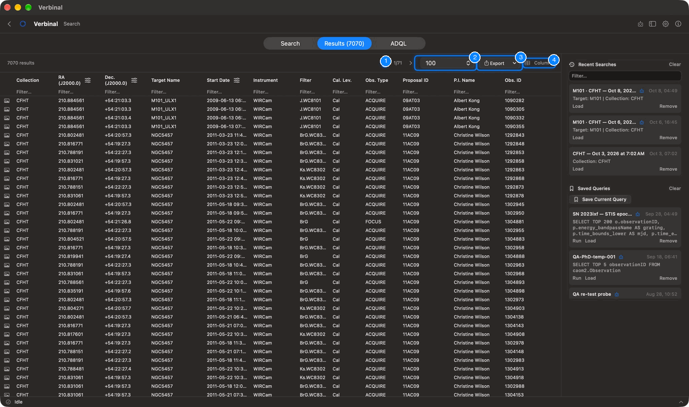
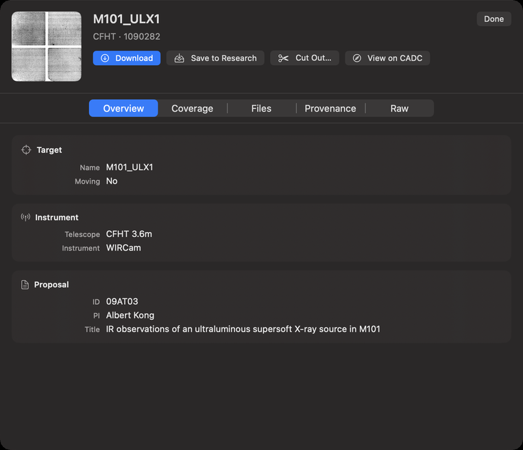
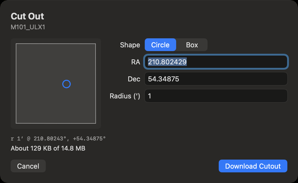
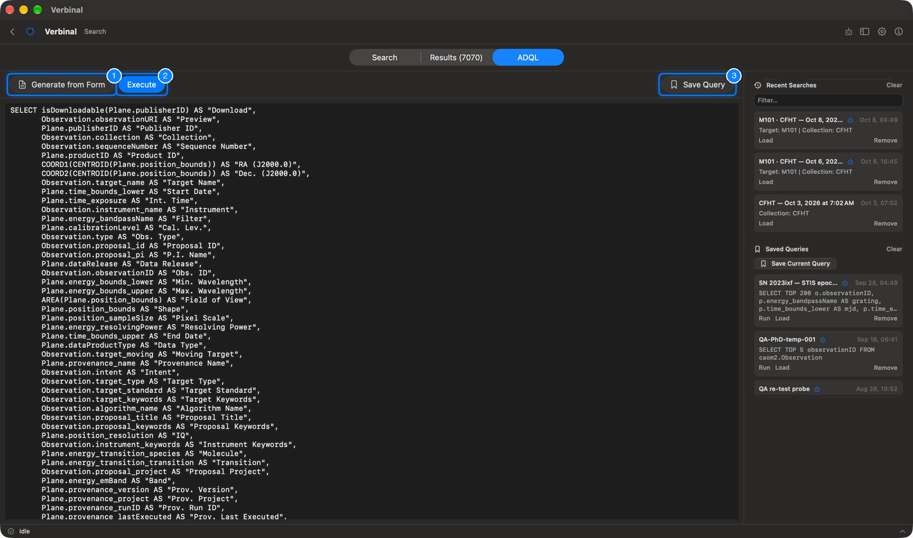

# Search the CADC archive

Search finds observations in the CADC archive: by target or position, by date, by wavelength, by
collection and instrument, or with your own ADQL query. It works without signing in; sign in to see
proprietary data you have access to. Open it from its Home tile, or **Go ▸ Search** (⌘1).

The screen has three tabs at the top, **Search**, **Results** and **ADQL**, and a side panel on the
right with your recent searches and saved queries.

## The search form

1. **Target / Coordinates**: a name (`M31`, `NGC 5457`, `SN 2023ixf`) or a position
   (`10.68 41.27`). As you type a name, Verbinal resolves it and shows **Resolved: RA …, Dec …** with
   a tick.
2. **Resolver**: which service turns names into positions: **ALL** (the default), **SIMBAD**, **NED**,
   **VIZIER**, or **NONE** to search the name as written in the archive.
3. **Radius**: the cone around the target, in degrees, or as `5'` or `30 arcsec`. Empty, it is 1′. A
   radius typed after the target (`M101 0.2deg`) wins.
4. **Search** (⌘↩) runs the search; **Reset** beside it clears every field and filter.
5. **Recent Searches**: every search you run, to load again.
6. **Saved Queries**: the queries you saved, to run or load.

The form has four groups, and **Additional Constraints** below them. Fill in only what you need;
ranges are written `a..b`, and `>` or `<` set one bound.

| Group | Fields |
|---|---|
| **Observation** | **Observation ID** (`*` as a wildcard), **P.I. Name**, **Proposal ID**, **Proposal Title**, **Proposal Keywords**, **Data Release**, **Public only**, and **Intent**: **Science and Calibration**, **Science only** or **Calibration only**. |
| **Spatial** | **Target / Coordinates**, **Resolver**, **Radius**, **Pixel Scale** (`0.5..2 arcsec`), and **Spatial cutout**. |
| **Temporal** | **Observation Date** (`2020..2021`, `> 2019`), **Preset** (**Past 24 hours**, **Past week**, **Past month**), **Integration Time** (`100..500s`), **Time Span** (`> 1d`). |
| **Spectral** | **Spectral Coverage** (`400..700nm`; units nm, um, mm, cm, m, Hz, A, eV), **Spectral Sampling**, **Resolving Power**, **Bandpass Width**, **Rest-frame Energy** (eV to GeV), and **Spectral cutout**. |

**Spatial cutout** and **Spectral cutout** make a download from these results fetch only the part of a
file inside the search's circle, or its wavelengths, cut on CADC's side. See
[Cutouts](#cutouts).

### Additional Constraints: the data train

Below the form, seven lists narrow the search by what the archive holds: **Band**, **Collection**,
**Instrument**, **Filter**, **Cal. Level**, **Data Type** and **Obs. Type**. Tick the values you want;
each list then shows only what goes with your ticks to its left (choose a collection, and the
instruments are that collection's). Each list has its own **Filter…** box. The lists come from CADC
and are kept on your Mac; the line above them says when they were updated, and its button fetches
them again.

### While a search runs

A search usually takes a few seconds. While it runs, the button shows **Waiting for CADC** with the
seconds; **Cancel** stops it.

## The results

The **Results** tab shows how many observations matched, a page at a time.

1. **Previous page** and **Next page** (⌘[ and ⌘]), with the page number.
2. **Rows per page**: 50, 100, 500, or **All**, up to the number it shows.
3. **Export** (⇧⌘E): the rows as you see them (**Current View**: **CSV (filtered)**,
   **TSV (filtered)**), or the whole query again from CADC (**Full Query (server)**: **CSV**, **TSV**,
   **VOTable**). You choose where to save the file.
4. **Columns**: which columns show. **Show All**, **Hide All**, **Reset to Defaults**, or tick them one
   by one; **Filter columns** finds one by name.

In the table:

- Click a column's header to sort by it; click again to reverse.
- The icon beside a header switches its unit: right ascension in hours or degrees, declination in
  degrees-minutes-seconds or degrees, dates as calendar dates or MJD, wavelengths in the unit you
  choose.
- The **Filter…** row under the headers (⌘F) narrows the rows by any column. The count then reads
  "… of … results".
- Hover over the camera icon at the start of a row to see the observation's preview.
- Double-click a row to open its detail.
- Right-click a row for **Open Detail**, **Open on CADC…**, **Download File…** (in your browser),
  **Save to Research**, **Copy Details**, **Copy Row** and **Copy Page**. Right-click a value to copy it,
  or to narrow the search to that value (**Narrow Search to** …).

When a search hits CADC's limit on rows, the count says so: more rows may exist. Narrow the search to
see them.

## An observation's detail

The detail shows the observation's preview, its target and collection, and five tabs:

| Tab | What it shows |
|---|---|
| **Overview** | The **Target** (name, type, redshift, moving, standard, keywords), the **Instrument** and **Telescope**, and the **Proposal** (ID, PI, project, title). |
| **Coverage** | For each plane: polarization, pixels, resolution, pixel scale, footprint, wavelength range, filter, band, resolving power, and the time it covers. |
| **Files** | Every file of the observation, each with its own **Download**. |
| **Provenance** | How it was made: pipeline, version, producer, run, inputs, and quality (limiting magnitude, background, sources). |
| **Raw** | Every column of the result, **All Columns**. |

Its buttons:

- **Download** fetches the observation's file, asks where to save it, and keeps the observation in
  Research. After that it reads **Re-download**. With a cutout ticked in the form, it reads
  **Download Cutout**.
- **Save to Research** keeps the observation in Research without its file: for notes, and to download
  later. Once kept, it reads **In Research**.
- **Cut Out…** opens the cutout editor.
- **View on CADC** opens the observation's page on CADC's website.

Some metadata of proprietary observations shows only when you are signed in.

## Cutouts

A cutout is the part of a file you need, cut on CADC's side, so you download a fraction of the file.
**Cut Out…** in an observation's detail opens the editor:

- **File**: which of the observation's files to cut, when it has several. The drawing shows the file's
  footprint and the region to cut.
- **Shape**: **Circle**, with its **Radius (′)**, or **Box**, with its **Width (′)** and **Height (′)**,
  centred on **RA** and **Dec** (degrees, or `hh:mm:ss` and `±dd:mm:ss`).
- **Images**: the extensions to cut. None ticked cuts every image the region falls on.
- **Also cut**: companion files, such as weights, cut on the same pixels and saved beside the cutout.
- **Shortest (nm)** and **Longest (nm)**: for a cube, the wavelengths to keep.

The editor says about how big the cutout will be. **Download Cutout** fetches it, asks where to save
it, and keeps it in Research with a link to its original observation.

## The ADQL editor

ADQL is the archive's query language. The **ADQL** tab lets you write a query yourself, or start from
the form.

1. **Generate from Form** writes the form's search as ADQL, to edit.
2. **Execute** (⇧⌘↩) runs it; the results go to the **Results** tab.
3. **Save Query** keeps it in **Saved Queries**.

Verbinal checks the query as you type, against the archive's tables and columns, and lists the problems
under it; click a problem to select it in the query. **Execute** waits until they are fixed.

## Recent searches and saved queries

The side panel keeps your searches.

- **Recent Searches**: each search you run, with what it asked. **Load** puts it back in the form, or in
  the ADQL editor if it was run from there; **Remove** deletes it; double-click a name to rename it.
  **Filter…** finds one; **Clear** empties the list.
- **Saved Queries**: **Save Current Query** keeps the current query under a name. Each has **Run**,
  **Load** and **Remove**; **Clear** deletes them all.

What an AI assistant made in these lists carries the **Created by AI agent** badge.

## What an assistant can do here

Everything on this screen: fill in the form and run it, read the results as you see them, sort, filter,
change units and columns, open details, export, write and check ADQL, save queries, cut out, and
download. It can also search VizieR catalogues at CDS, which the app itself offers only as a name
resolver.
