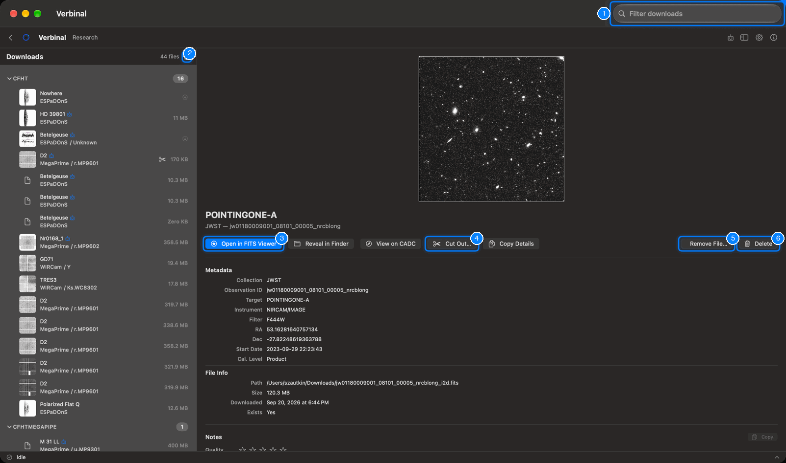
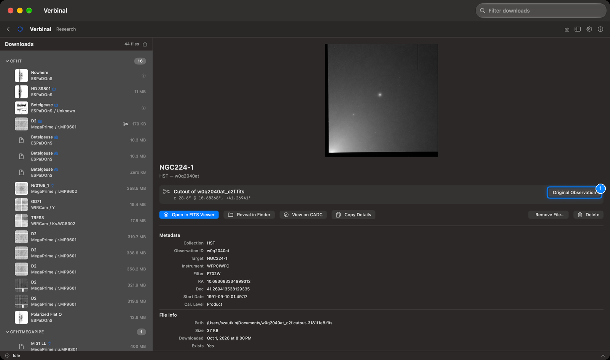
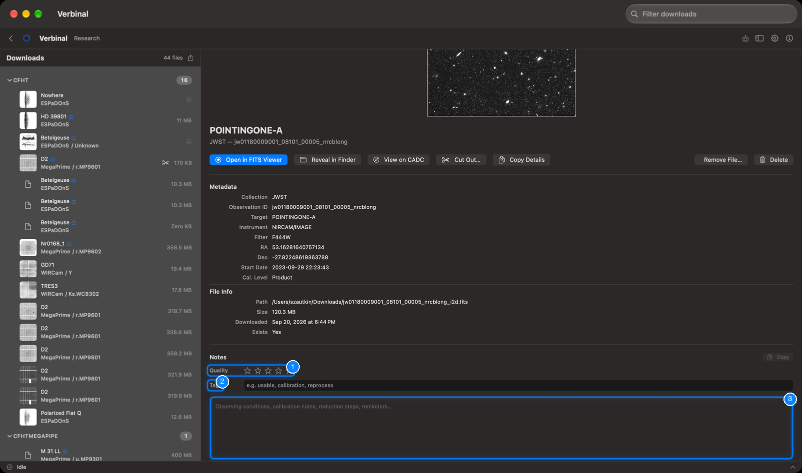
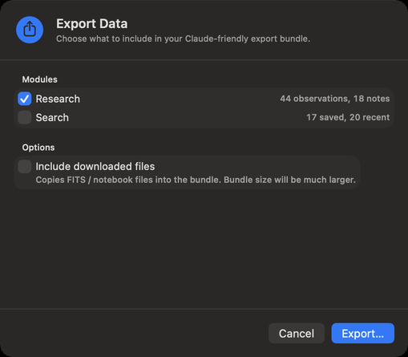

# Research: your observations

Research is where the observations you keep live, on this Mac: those you downloaded, those you saved
without their file, and your cutouts, each with your notes, tags and rating. It works without signing
in. Open it from its Home tile, or **Go ▸ Research** (⌘2).

1. **Filter downloads**: finds an observation by its target, collection, instrument or observation
   ID, and by the words of your notes and tags.
2. The export button beside the count: [Exporting everything](#exporting-everything).
3. **Open in FITS Viewer**: the observation's file, in the viewer that fits it.
4. **Cut Out…**: a part of the observation, as in Search.
5. **Remove File…**: deletes the file and keeps the observation.
6. **Delete**: removes the observation from Research.

## Getting observations into Research

From [Search](02-search.md), in an observation's detail or a result's right-click menu:

- **Download** fetches the file, asks where to save it, and keeps the observation here with it.
- **Save to Research** keeps the observation without its file, for notes now and a download later.
- **Download Cutout** keeps the cutout here, linked to its original observation.

## The list

The list on the left groups your observations by collection, with how many each holds. Each row
shows the preview, the target, the instrument and filter, and the file's size. Scissors mark a cutout;
an arrow marks an observation kept without its file. The count at the top says how many there are.

Right-click a row for **Open File**, **Reveal in Finder**, **Download**, **Copy Details** and
**Delete**.

Your observations also show in the Mac's Spotlight: search for a target, a collection or an instrument
there, and choosing a result opens Verbinal.

## An observation

Select a row to see the observation: its preview, target, collection and observation ID, then:

- **Metadata**: **Collection**, **Observation ID**, **Target**, **Instrument**, **Filter**, **RA**,
  **Dec**, **Start Date**, **Cal. Level**.
- **File Info**: the file's **Path**, **Size**, when it was **Downloaded**, and whether it **Exists**.
  For an observation kept without its file, **File** says **Not downloaded**.

Its buttons:

| Button | What it does |
|---|---|
| **Open in FITS Viewer** | Opens the file in the [FITS Viewer](04-fits-viewer.md). For a cube it reads **Open in Cube Viewer**; for a file that is not FITS, **Open File** opens it in its usual app. |
| **Reveal in Finder** | Shows the file in the Finder. |
| **View on CADC** | The observation's page on CADC's website. |
| **Cut Out…** | The [cutout editor](02-search.md#cutouts). |
| **Copy Details** | Copies the observation's ID, position, instrument and date as text. |
| **Download** | For an observation kept without its file: fetches it into this same record, with its notes. |
| **Download Again** | When the file is missing, cannot be opened, or is empty: fetches it again. |
| **Remove File…** | Deletes the file from this Mac; the observation, its details and notes stay, and **Download** fetches it again. |
| **Delete** | Removes the observation from Research, and its file from your disk. This cannot be undone. Your notes are kept: if you keep the observation again, they come back. |

### Cutouts

A cutout's record says what it is (**Cutout of** …) and the region it covers. **Original Observation**
shows the complete observation it was cut from, when that one is in Research too.

## Notes, tags and rating

Below the details, each observation has your notes:

1. **Quality**: one to five stars, from **Unusable** to **Excellent**; **Clear** removes the rating.
2. **Tags**: words separated by commas, such as `usable, calibration, reprocess`.
3. **Notes**: anything you want to remember: observing conditions, calibration notes, reduction
   steps. It says when you last edited it and how many words it holds, and **Copy** copies it.

Notes are saved as you type. The filter at the top searches them too.

## Exporting everything

**File ▸ Export All…** (⇧⌘E), or the export button in Research, opens **Export Data**: a bundle of your
work that you can archive, share, or give to an AI assistant.

1. Under **Modules**, tick what to include: **Research** (your observations and notes) and **Search**
   (your saved and recent searches).
2. Under **Options**, **Include downloaded files** copies the FITS and notebook files into the bundle
   too; it makes it much larger.
3. Click **Export…**, choose a folder, and click **Export Here**. Verbinal makes a folder named with the
   date and time inside it.

The bundle starts with a `README.md` and a `manifest.json` that describe what is in it. When it is
done, **Export complete** offers **Reveal in Finder**, **Copy Path**, **Share…**, and, when you are
signed in, **Upload to VOSpace**, which puts a zipped copy in the `Verbinal-Exports` folder of your
storage. A notification tells you when an export finishes.

## What an assistant can do here

It can list and read your observations and notes, write notes, tags and ratings (up to 50 at once),
open files in the viewers, download what you kept without a file, cut out, and export. Removing a file
or an observation waits for you unless you allowed that kind of change.
