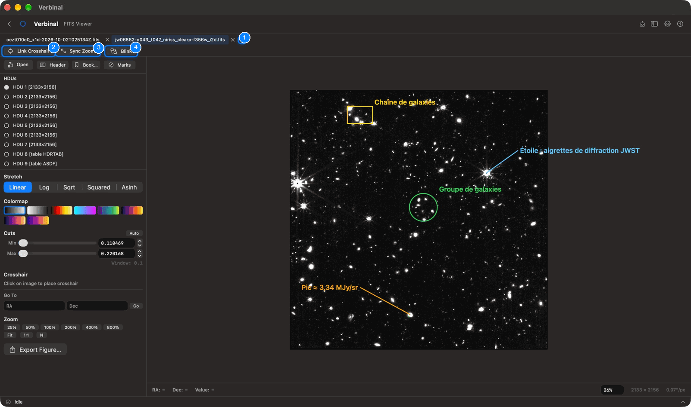
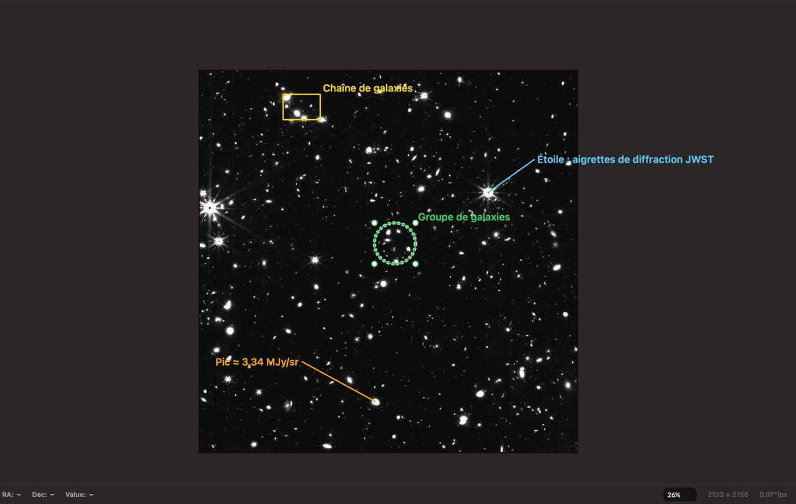
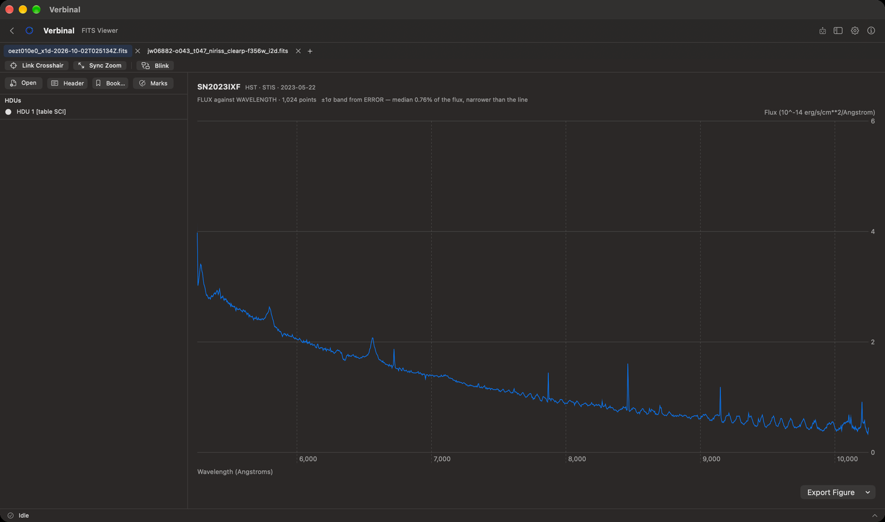
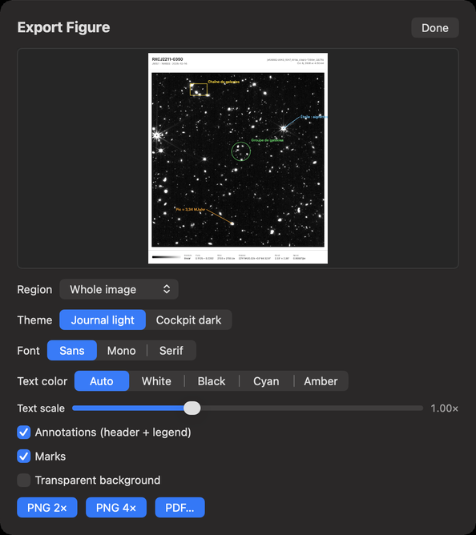

# FITS Viewer

The FITS Viewer shows FITS images and spectra, fast, with the world coordinates (WCS) of every pixel.
It reads single images, multi-extension files, compressed files (`.fz`) and tables that hold a
spectrum. It works without signing in. Open it from its Home tile, or **Go ▸ FITS Viewer** (⌘3).

1. The tabs, one per file, and **New tab** (⌘T).
2. **Link Crosshair**: the crosshair follows the same sky position in every tab.
3. **Sync Zoom**: every tab shows the same patch of sky.
4. **Blink**: alternates two tabs.

Below them, the side panel has the file's extensions, the display controls, and the **Open**,
**Header**, **Bookmarks** and **Marks** buttons. The image fills the rest, with a bar under it.

## Opening a file

- **Open** (or **Open FITS File…** in an empty tab) chooses a file on your Mac.
- Drag a FITS file onto the viewer.
- With no file open, the viewer lists the files you opened recently (**RECENTLY OPENED**); click one
  to open it again.
- From [Research](03-research.md) (**Open in FITS Viewer**), from [Storage](09-storage.md) (**Open in
  FITS Viewer**), or from the [file browser](01-getting-started.md#the-file-browser).

A file with a third axis, such as a spectral cube, asks first: **Open as…** **FITS Viewer (2D)** or
**Cube Viewer (3D)** (see [Cube Viewer](05-cube-viewer.md)).

Each file opens in a tab. ⌘T opens an empty tab; ⌘W, or the × on a tab, closes it.

## The display

The side panel, from the top:

- **HDUs**: the file's extensions, with each image's size or each table's name. Click one to show it.
- **Stretch**: how values become brightness: **Linear**, **Log**, **Sqrt**, **Squared** or **Asinh**.
- **Colormap**: **Grayscale**, **Inverted**, **Heat**, **Cool**, **Viridis**, **Inferno**, **Magma** or
  **Plasma**.
- **Cuts**: the values shown from black to white, with the **Min** and **Max** sliders or fields.
  **Auto** sets them from a little below the background to where the brightest percent begins.
- **Crosshair**, **Go To** and **Zoom**: see below.
- **Export Figure…**: see [Figures](#figures).

A file that lacks standard WCS shows **WCS approximate**: its coordinates are estimated and may be off.
An image whose pixels all have the same value shows a 0…1 range instead.

## Moving around the image

- **Zoom**: **25%** to **800%**, **Fit** (the whole image), **1:1** (one image pixel per screen pixel),
  and **N** (**North Up**: turns the image so north is up and east is left, keeping it all in view).
  The **View** menu has **Zoom In** (⌘+), **Zoom Out** (⌘−), **Actual Size** (⌥⌘1) and **Zoom to Fit**
  (⌥⌘0). Pinch or scroll on the trackpad to zoom and pan, or type a percentage in the zoom field at the
  bottom right and press Return.
- The bar under the image shows the **RA**, **Dec** and **Value** of the pixel under the pointer, and
  the image's size and pixel scale.

### The crosshair

Click the image to place the crosshair. The panel then shows its **RA**, **Dec** and value:

- **Copy** copies the coordinates.
- **Clear** (Esc) removes the crosshair.
- **Search Here** (⇧⌘L) searches the CADC archive at that position, in [Search](02-search.md). It needs
  WCS.

**Go To** puts the crosshair on a position you type: **RA** and **Dec**, in degrees or sexagesimal,
then **Go**. A position off the image says so.

### Header and image info

**Header** shows, in the side panel, a summary of the image (**Dimensions**, **Pixel range**, **WCS**,
**Scale**, **Center**, **Orientation**, **Field of view**) and every header card, with
**Filter keywords…** to find one.

### Bookmarks

**Bookmarks** keeps positions you want to come back to. Place the crosshair, type a
**Label (optional)**, and save it. Each bookmark has **Go To** and **Delete**.

## Comparing images

With two or more tabs open:

- **Link Crosshair**: placing the crosshair in one tab puts it at the same sky position in the others,
  through their WCS. If a tab has no exact WCS, or shows another part of the sky, a note says so.
- **Sync Zoom**: every tab shows the same angular size of sky.
- **Blink** (⇧⌘B): alternates the current tab with another. **Pause** and **Resume** (Space), **A** and
  **B** to show one (← and →), a slider for the interval (0.5 to 5 seconds), and **Stop** (Esc). Images
  without WCS blink unaligned.

## Marks

Marks are your annotations on an image: circles, boxes, callouts with a line, and text. Verbinal keeps
them for each file (and each extension) on this Mac; open the file again and they are there.

Open **Marks** in the side panel:

1. Turn on **Draw**, choose a **Shape** (**Circle**, **Box**, **Callout** or **Text**), then click or
   drag on the image.
2. Drag the shape to move it, a grip to resize it; double-click to rename it.
3. Style the selected mark: **Colour**, bold (**B**), label size, and outline thickness.

The panel lists every mark, with **Filter marks…**. **Export** saves them as **DS9 Regions…** or
**JSON…**; **Clear All** removes them all from this image, after asking.

Right-click a mark for **Edit Label**, **Copy Position**, **Centre on Mark**, **Search Here**,
**Export Figure Around Mark…**, **Export Marks as DS9 Regions…**, **Export Marks as JSON…** and
**Delete Mark** (⌫).

## Spectra

A table that holds a spectrum, such as an HST `x1d` file, opens as a plot: flux against wavelength,
with their units, and a ±1σ band from the error column when there is one. Files with several orders
plot them all. **Export Figure** saves the plot as **PNG 2×**, **PNG 4×** or **PDF…**.

## Figures

**Export Figure…** makes a publication figure of the image, with a preview:

| Setting | Choices |
|---|---|
| **Region** | **Whole image**, **View on screen**, or **Around** a mark |
| **Theme** | **Journal light** or **Cockpit dark** |
| **Font** | **Sans**, **Mono** or **Serif** |
| **Text color** | **Auto**, **White**, **Black**, **Cyan** or **Amber** |
| **Text scale** | A slider |
| **Annotations (header + legend)** | A header and a legend on the figure |
| **Marks** | Your marks on the figure |
| **Transparent background** | For a figure laid over something else |

Then **PNG 2×**, **PNG 4×** or **PDF…**. Figures are saved in your Downloads folder, under a name with
the date and time.

## What an assistant can do here

It can open files, switch tabs and extensions, set the stretch, colour map, cuts and zoom, turn North
Up, go to a position, read pixel values and the header, save bookmarks, blink and link tabs, search
at the crosshair, draw, edit and export marks, read spectra, and export figures. It sees the image as
you do.
