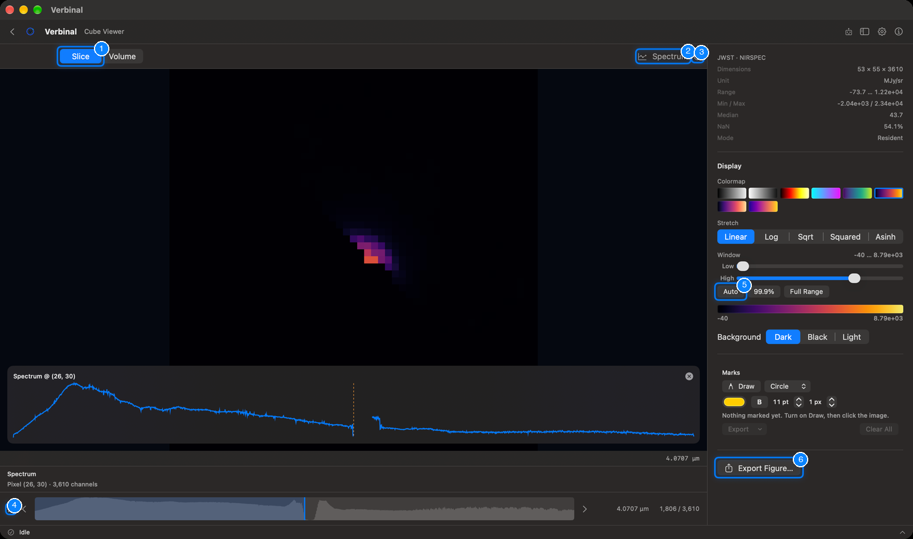
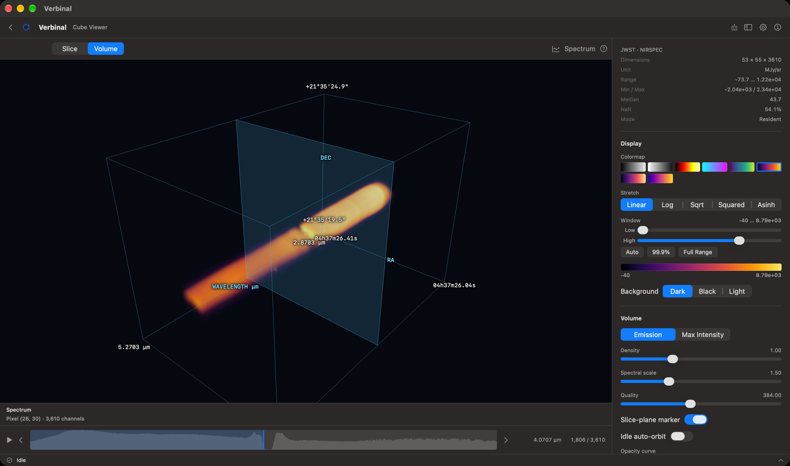
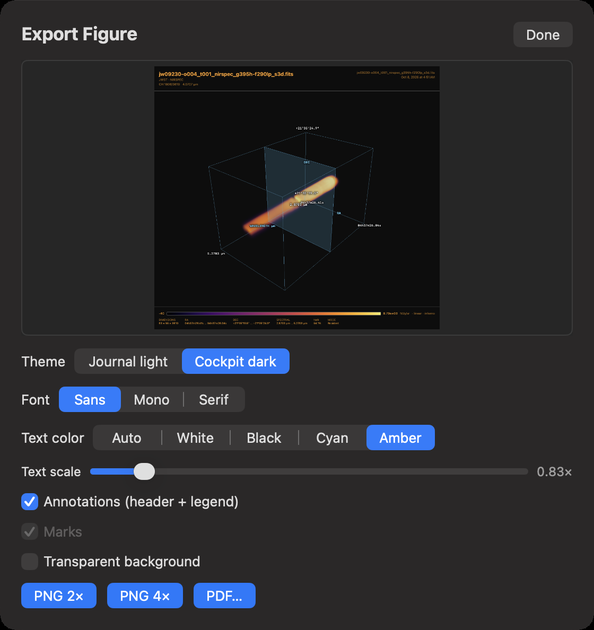
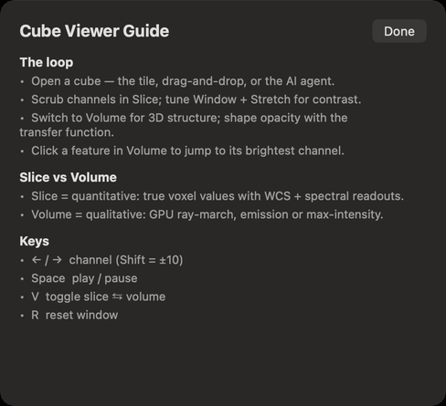

# Cube Viewer

The Cube Viewer explores FITS spectral cubes, such as radio data cubes or the cubes of an integral
field unit: as true-valued slices, one channel at a time, and as a 3D volume rendered on the GPU. It
works without signing in. Open it from its Home tile, or **Go ▸ Cube Viewer** (⌘4).

1. **Slice** and **Volume**: the two ways to see a cube (V switches between them).
2. **Spectrum**: shows or hides the spectrum inspector.
3. The guide: how to use the viewer, and its keys.
4. Play through the channels (Space), with the previous and next channel beside it.
5. **Auto**: a contrast window that fits the data.
6. **Export Figure…**: a figure of the slice or the volume.

## Opening a cube

- **Open Cube…** on the empty viewer, or drop a cube onto it.
- From [Research](03-research.md): **Open in Cube Viewer**.
- Opening a file with a third axis anywhere else (the FITS Viewer, the file browser, Storage) asks
  **Open as…**: choose **Cube Viewer (3D)**.

Each cube opens in a tab; the × on a tab closes it. A very large cube streams its slices from disk:
the information panel then says **Streamed**, and the spectrum probe needs a cube held in memory
(**Resident**).

## The information panel

At the top right: the telescope and instrument, the cube's **Dimensions** (x × y × channels), its
**Unit**, its value **Range**, **Min / Max**, **Median**, how much of it is blank (NaN), and its
**Mode** (resident or streamed).

## Slice: true values, channel by channel

Slice shows one channel at its native resolution, with sky coordinates.

- Move through the channels with the strip at the bottom, which draws the channel profile; click or
  drag in it to jump. ← and → step one channel (Shift: ten), Space plays and pauses. The wavelength
  and the channel number show at the right.
- Drag or scroll to pan, ⌘-scroll or pinch to zoom, and double-click to reset the view.
- Click a pixel to see its spectrum (**Spectrum @** …) across all channels. **Spectrum** shows the
  inspector under the image; the × closes the probe.

### Display

- **Colormap** and **Stretch**, as in the FITS Viewer.
- **Window**: the values shown, with the **Low** and **High** sliders, or **Auto**, **99.9%** and
  **Full Range**. R resets it. A colour bar shows the window.
- **Background**: **Dark**, **Black** or **Light**.

## Volume: the cube in 3D

Volume renders the whole cube as a box, with its RA, Dec and wavelength axes labelled.

- Drag to turn it, scroll or pinch to zoom. Click a feature to jump to its brightest channel.
- **Emission** blends the cube like glowing gas; **Max Intensity** shows the brightest value along each
  line of sight.
- **Density**, **Spectral scale** (how long the wavelength axis is drawn) and **Quality** (the detail
  of the rendering).
- **Slice-plane marker** shows where the current channel is in the box. **Idle auto-orbit** turns the
  box slowly when you are not touching it.
- **Opacity curve**: drag its points to choose which values are transparent and which glow.

On an Intel Mac, if the volume cannot be drawn, a banner says why instead of an empty view; Slice still
works.

## Marks

Marks work as in the [FITS Viewer](04-fits-viewer.md#marks), on the slice: **Draw**, a shape, a
colour, bold, the label size and the outline. A mark belongs to its channel; centring on a mark goes to
its channel. **Export** saves them as DS9 regions or JSON, and **Clear All** removes them.

## Figures

**Export Figure…** makes a figure of what you see, the slice or the volume, with the same choices as in
the FITS Viewer: **Theme**, **Font**, **Text color**, **Text scale**, **Annotations (header + legend)**,
**Marks** and **Transparent background**, then **PNG 2×**, **PNG 4×** or **PDF…**. Figures are saved in
your Downloads folder.

## The guide

The **?** button opens the **Cube Viewer Guide**: the usual way through a cube, the difference between
Slice and Volume, and the keys.

## What an assistant can do here

It can open cubes, switch between Slice and Volume, move through channels and play them, set the
colour map, stretch, window and background, turn the camera, set the volume's settings and opacity
curve, read the spectrum at any pixel and the channel profile, draw and export marks, and export
figures.
