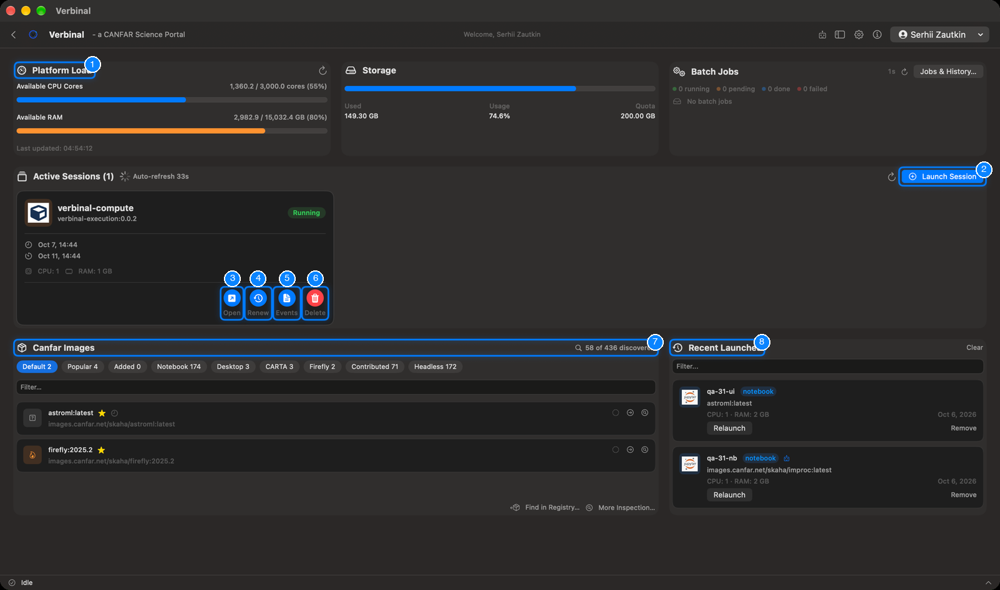
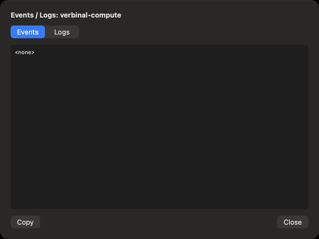
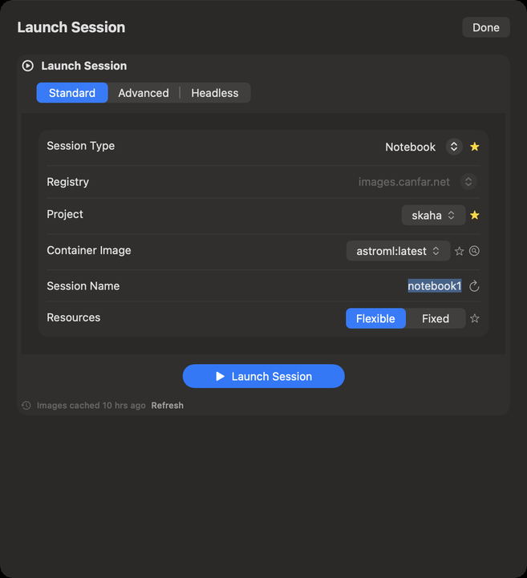
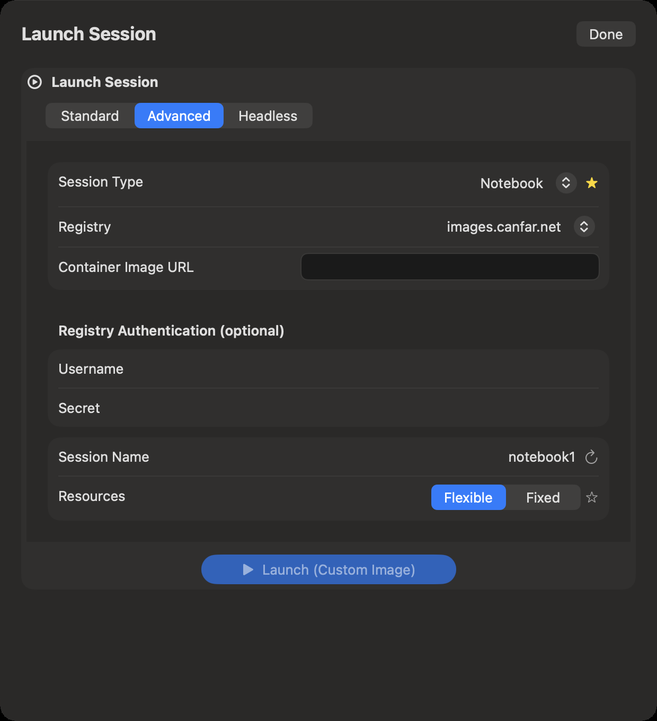

# Portal: sessions

Portal is your desk on the CANFAR science platform: the platform's load, your storage, your sessions
(Jupyter notebooks, desktops, CARTA, Firefly, and contributed applications), the images they run, and
your batch jobs. It needs you to be signed in. Open it from its Home tile, or **Go ▸ Portal** (⌘5).

1. **Platform Load**: the CPU cores and memory free on CANFAR now.
2. **Launch Session**: the launch form.
3. **Open**: a running session, in your browser.
4. **Renew**: extends a session's lifetime.
5. **Events**: what the platform did with the session, and its logs.
6. **Delete**: stops the session and deletes it.
7. **Canfar Images**: the images you can launch.
8. **Recent Launches**: what you launched before, to launch again.

## The cards at the top

- **Platform Load**: **Available CPU Cores** and **Available RAM** across CANFAR, how many instances
  run, and when it was updated. Its button refreshes it.
- **Storage**: how much of your VOSpace quota you use (**Used**, **Usage**, **Quota**). It warns
  **Storage nearly full**. See [Storage](09-storage.md).
- **Batch Jobs**: how many of your jobs are running, pending, completed or failed, refreshed every
  45 seconds. **Jobs & History…** opens them: see [Batch jobs](07-batch-jobs.md).

## Your sessions

**Active Sessions** lists your sessions, refreshed by itself (it counts down to the next refresh), or
now with its refresh button. Each card shows:

- the session's name, its image, and its status (pending, running, failed…);
- when it started and when it expires;
- its CPU and RAM, and GPU when it has one: what it was given, or, for a flexible session (**FLEX**),
  what it is using now (**in use**).

Its buttons:

- **Open** opens the session in your browser.
- **Renew** extends its lifetime.
- **Events** shows **Events / Logs**: the platform's events for the session (scheduling, pulling the
  image, errors), and the container's **Logs**, with **Copy**.
- **Delete** stops the session and deletes it, after asking. Unsaved work in it is lost.

Verbinal sends a notification when a session you launched is ready, or fails to start.

## Launching a session

1. Click **Launch Session**.
2. **Session Type**: Notebook, Desktop, CARTA, Firefly or Contributed.
3. **Project** and **Container Image**: the image to run. A long list opens with a **Search** field to
   narrow it.
4. **Session Name**: Verbinal suggests one; the button beside it suggests another.
5. **Resources**: **Flexible**, where CANFAR gives the session what it can, or **Fixed**, where you
   choose the **CPU Cores**, the **RAM (GB)** and, when CANFAR offers them, the **GPUs**.
6. Click **Launch Session**.

A progress window follows the launch and closes by itself when the session is running; the session
then appears in **Active Sessions**. If it fails, the window says why.

- The star beside a field makes its value your default for the next launch (**Set as default …**);
  click it again to clear it. **Settings ▸ Portal** has the same defaults.
- The form says when the list of images was fetched (**Images cached** …); **Refresh** fetches it again.
- The magnifying glass beside **Container Image** opens [Image Discovery](08-image-discovery.md), to
  find an image by what it has installed.
- If a launch would replace an entry of **Recent Launches** with the same name, Verbinal asks:
  **Replace** or **Skip**.

### A custom image

The **Advanced** tab launches an image by its full name: the **Container Image URL**, and, for a
private image, its **Registry Authentication (optional)** (**Username** and **Secret**). Then
**Launch (Custom Image)**.

The **Headless** tab launches batch jobs: see [Batch jobs](07-batch-jobs.md).

## Images

The **Canfar Images** card lists the images you can launch, by session type: the chips at the top
(**Default**, **Popular**, **Added**, then each type) filter them, with how many each holds, and
**Filter…** finds one by name.

- A star marks your default image for that session type, and a clock one you launched recently.
- The buttons on a row use the image in the launch form, or show what it has installed.
- The count at the top right (… **of** … **discovered**) and **More Inspection…** open
  [Image Discovery](08-image-discovery.md); **Find in Registry…** adds an image the catalogue does not
  list.

## Recent launches

**Recent Launches** keeps what you launched: name, type, image, resources and date. **Relaunch**
launches it again as it was; **Remove** removes it from the list; **Filter…** finds one; **Clear**
empties the list.

## What an assistant can do here

It can read the platform load, your sessions and their events and logs, the images and your recent
launches; open the launch form and fill it; launch, renew and open sessions; and delete them, which
waits for you unless you allowed it. It launches only with an image from the list.
