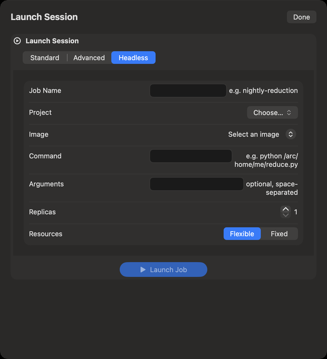
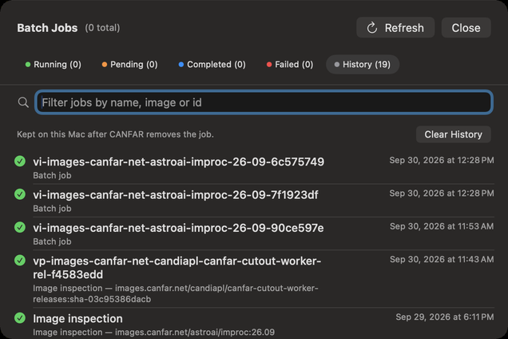

# Portal: batch jobs

A batch job (a *headless* session) runs one command in a container on CANFAR, with no window, and
ends: reducing a night of data, running a pipeline, many copies of a script in parallel. You start it,
leave, and read what it printed when it is done. Batch jobs need you to be signed in, and use your
CANFAR allocation.

## Launching a batch job

1. In Portal, click **Launch Session**, then the **Headless** tab.
2. **Job Name**: a name to find it by, such as `nightly-reduction`.
3. **Project** and **Image**: an image built to run batch jobs. If none is listed, your account has no
   batch images; ask CADC support.
4. **Command**: what the container runs, such as `python /arc/home/me/reduce.py`. It is required.
5. **Arguments**: optional, separated by spaces, passed as one string that CANFAR splits.
6. **Replicas**: how many copies run in parallel. Each copy gets `REPLICA_ID` and `REPLICA_COUNT` in its
   environment, to share the work.
7. **Resources**: **Flexible** or **Fixed**, as for a session.
8. Click **Launch Job** (or **Launch** … **Replicas**).

Your VOSpace home is at `/arc/home/<your username>` inside the container: read your data and write
your results there.

## Following your jobs

The **Batch Jobs** card in Portal counts your jobs: running, pending, completed and failed. It
refreshes every 45 seconds, and its button refreshes it now. **Jobs & History…** opens the list.

- The tabs: **Running**, **Pending**, **Completed**, **Failed** and **History**, each with its count.
- **Filter jobs by name, image or id** narrows every tab.
- With thousands of jobs, the list shows them a page at a time (**Showing** … **of** …); **Show**
  … **More** adds the next.
- Each job shows its name, image and time. Its info button shows the **Job details**: name, type,
  identity, image, status, container, the **Resources Requested**, and its **Timing**.
- **View Events & Logs**: what the platform did with the job, and what it printed.
- **Delete** removes a finished job from the list; for a running job, **Stop and Delete** kills its
  container at once, after asking, and unsaved work in it is lost.
- **Refresh** (⌘R) reads the jobs again from CANFAR now.

Verbinal sends a notification when a job you started completes or fails, and when a batch of them has
ended.

The probe jobs of [Image Discovery](08-image-discovery.md) appear here too, as image inspections.

## History

CANFAR removes finished jobs after a while. Verbinal keeps them in **History**, on this Mac, with how
each ended, so you can still find a job after CANFAR has forgotten it. **Clear History** empties it.

## What an assistant can do here

It can list your jobs and their history, read a job's details, events and logs, launch jobs (with a
Python script, or a command), and stop or delete them, which waits for you unless you allowed it.
Starting jobs uses your allocation, and is a kind of change you can set to **Ask me**.
