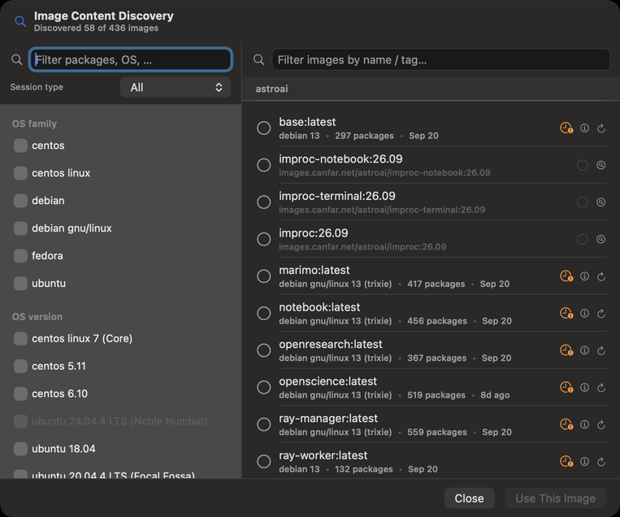
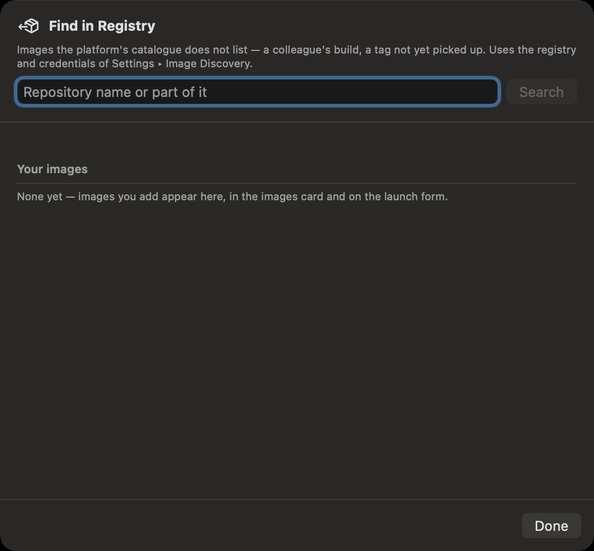

# Image Discovery and the registry

CANFAR runs your sessions and jobs in container images, and an image does not say from outside what it
has installed. Image Discovery looks inside: it runs a small probe job in an image, lists its Python, R,
system and OS packages, and keeps the list on your Mac, so you can find the image that has what you
need before you launch it. The registry search adds images the platform's catalogue does not list.
Both need you to be signed in.

## Finding the image that has your packages

Open **Image Content Discovery** with **Go ▸ Image Discovery…** (⌘8), the magnifying glass beside
**Container Image** in the launch form, or the images card in Portal (the **discovered** count, or
**More Inspection…**). The header says how many of the catalogue's images have been looked into.

1. On the left, **Filter packages, OS, …** finds a package by name. Choose values to filter by: the
   **Session type**, the **OS family**, the **OS version**, and packages by kind (Python, R, system).
   A value no remaining image has is dimmed.
2. Your choices show as **Active filters** above the images; remove one with its ×, or all of them
   with **Clear All** (⌘⌫).
3. On the right, the images that have everything you chose, by project, with **Filter images by name /
   tag…**. Each says its OS, how many packages it has, and when it was probed.
4. Select an image and click **Use This Image** (↩): it goes into the launch form, and the window closes.

## Looking into an image

An image not yet looked into says **Not yet discovered**. Its buttons:

- **Discover packages** runs the probe: a small batch job on your CANFAR allocation, which takes a few
  minutes. The row says **Discovering…**; you can close the window, and the probe carries on.
- **Re-run discovery** probes it again, after the image has been rebuilt.
- **Show manifest details** opens the **Image Content Manifest**: the image's identity, its OS, and every
  package with its version. **Copy as JSON** copies it; **Reveal in Finder** shows the file kept on your
  Mac.

A probe that failed says why. **Show failure details** shows the whole message (**Copy**, ⇧⌘C);
**View probe logs** shows the probe job's **Logs** and **Events** (**Refresh**, ⌘R); **Dismiss error**
hides it without probing again, and **Clear** … **Error** at the top hides them all. A probe that is
late keeps **checking in background**, and the row updates by itself when its result arrives.

Private images need your registry credentials: see **Settings ▸ Image Discovery**, which also holds the
inspector image the probes run with, and the cache of what has been looked into
([Settings](14-settings.md#image-discovery)).

## Images the catalogue does not list

A colleague's new build, or a tag CANFAR's catalogue has not picked up yet, is in the registry but not
in the list. **Find in Registry…**, on the images card in Portal, finds it:

1. Type a **Repository name or part of it**, and click **Search**.
2. Under **Found for** …, click **Add** on the image you want.
3. It is now in **Your images**, in the **Added** chip of the images card, and in the launch form.
   **Remove** takes it out of your list; the image itself is untouched.

The search uses the registry and the credentials of **Settings ▸ Image Discovery**.

## What an assistant can do here

It can find images by the packages they contain, read an image's packages and versions, read probe
failures and logs, search the registry, and add or remove images in your list. Probing an image runs a
job on your allocation; it is a kind of change you can set to **Ask me**.
