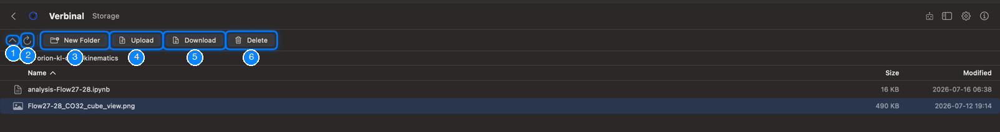
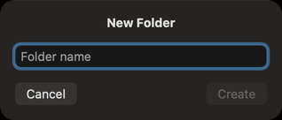

# Storage (VOSpace)

Storage is your CANFAR storage (VOSpace), the same space your sessions and batch jobs see at
`/arc/home/<your username>`. Browse it, upload and download files, make folders, and keep your private
files private. It needs you to be signed in. Open it from its Home tile, or **Go ▸ Storage** (⌘6).

1. Go up one folder.
2. **Refresh** (⌘R) reads the folder again.
3. **New Folder** (⇧⌘N).
4. **Upload** a file from your Mac into this folder.
5. **Download** the selected file to your Mac.
6. **Delete** the selected file or folder (⌘⌫).

## Files and folders

Storage opens at your home folder. The path under the toolbar shows where you are; click a part of it
to go back there. Double-click a folder to open it.

The list has the **Name**, **Size** and **Modified** date of each item; click a column's title to sort
by it.

Right-click an item for:

- **Open**: a folder, to see inside.
- **Download**: saves a file to your Mac, where you choose.
- **Open in FITS Viewer**: downloads a FITS file and opens it (a cube asks first whether to open it as
  an image or a cube).
- **Copy Path**: the item's path in your storage.
- **Make Private**: for a public file that usually holds secrets (see below).
- **Delete**.

The **Storage** card in [Portal](06-portal-sessions.md) shows how much of your quota you use.

## Uploading and downloading

- **Upload** chooses a file on your Mac and puts it in the folder you are in. You can also drag files
  from the Finder onto the list.
- **Download** saves the selected file where you choose.

A transfer shows its progress at the bottom of the list, with a button to cancel it. A transfer that
fails says why, with **Dismiss**.

## New folders and deleting

**New Folder** asks for the **Folder name**; **Create** makes it in the folder you are in.

**Delete** asks first. A folder is deleted with everything in it, and the progress shows as it goes.
This cannot be undone.

## Files that should not be public

Some files usually hold secrets: access tokens, keys, credentials and shell settings, such as `.token`,
`.netrc`, `.ssh`, `.config`, `.vnc` or `.bashrc`. When one of them can be read by anyone, Storage marks
it with a shield (**Public — anyone can read it, and files like this usually hold secrets**), and a
banner at the top names them. **Make Private** on one, or **Make All Private** on the banner, makes them
readable by you alone.

Changing who else may read or write your files is done on the CANFAR website, or through an assistant,
which waits for your approval for such a change.

## What an assistant can do here

It can list and read your files, create folders, upload files and text, download files, open FITS files
in the viewers, show you a folder, and change who may read or write a file. Deleting, replacing a file
and sharing wait for you unless you allowed them; see
[What an assistant may do without asking](12-ai-assistant.md#what-an-assistant-may-do-without-asking).
