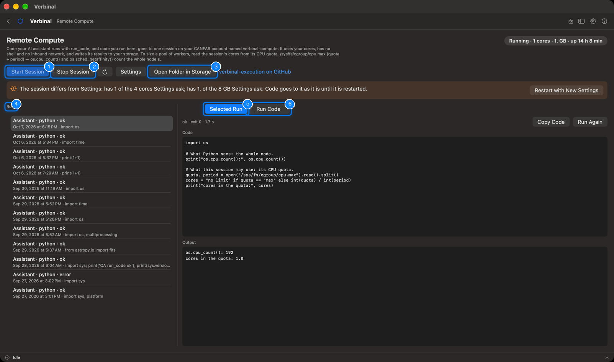
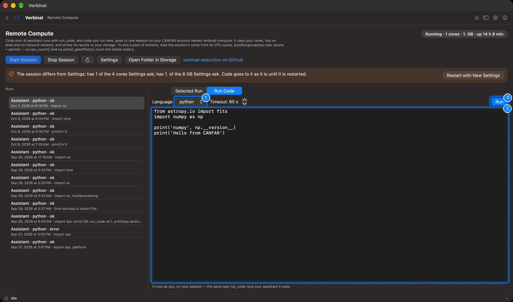

# Remote Compute

Remote Compute runs Python or Bash on CANFAR, in one session on your own account named
`verbinal-compute`, and keeps every run with its output. You run code there from this screen, and your
AI assistant runs its code there with its `run_code` tool. The session uses your cores, has no shell and
no inbound network, and writes its results to your storage. It needs you to be signed in; open it from
its Home tile.

1. **Start Session** starts the compute session.
2. **Stop Session** stops it.
3. **Open Folder in Storage**: the folder the session reads requests from and writes results to.
4. **Runs**: every run, newest first.
5. **Selected Run**: the code of the run you chose, and what came back.
6. **Run Code**: run your own code.

## Setting it up

Remote Compute needs a compute image, chosen once:

1. Get the watcher image: build [verbinal-execution](https://github.com/szautkin/verbinal-execution) from
   its repository, and push it to your project on `images.canfar.net`.
2. In **Settings ▸ AI Compute**, set the **Compute image**, the **Cores** and **RAM (GB)** it runs with,
   and a registry login if the image is private (see [Settings](14-settings.md#ai-compute)).
3. Come back to Remote Compute and click **Start Session**. The session takes a minute or two to come
   up.

Until an image is set, the screen says **Not set up** and shows these steps, with **Open Settings** and
**Open the Repository**.

## The session

The status at the top right says where the session is: **Stopped**, **Starting**, **Running** (with its
cores, memory and how long it has been up), **Stopping**, **Failed**, or **Not ready**: the session
exists but its image cannot be pulled, with the reason and a way to stop it.

- **Stop Session** asks first: stopping deletes the session and anything running in it. Code sent but
  not yet run stays in the inbox and runs when the session starts again.
- **Refresh** reads the session's state again; **Settings** opens **Settings ▸ AI Compute**.
- When the running session is not the size **Settings ▸ AI Compute** asks for, a banner says so; code
  still goes to the session as it is. **Restart with New Settings** stops it and starts one with the
  settings.

To size a pool of workers in your code, read the session's cores from its CPU quota,
`/sys/fs/cgroup/cpu.max` (quota ÷ period): `os.cpu_count()` counts the whole node's.

## Running code

1. **Language**: python or bash. Beside it, the timeout, in seconds.
2. Type the code in the box.
3. Click **Run** (⌘↩).

It runs as you, on your session, the same way `run_code` runs your assistant's code. The run then
appears at the top of **Runs**.

## Runs

Each run in the list says who sent it (**You** or **Assistant**), its language, and how it ended:
**running**, **ok**, **error**, **timed out**, **no result**, or **not sent**. Select one to see, under
**Selected Run**:

- its status, exit code and how long it took;
- its **Code**, its **Output** and its **Errors** (**output cut short** when it was too long);
- **Copy Code**, and **Run Again** to send the same code once more.

A run does not depend on Verbinal staying open: it carries on while you sign out or quit, and its result
is taken when Verbinal can read it again.

## What an assistant can do here

It can read the session's state and the runs, start the session, run code and read its output, show you
a run, and put code in the **Run Code** box for you to run. Running code uses your allocation, as
**Use your CANFAR allocation: sessions and compute**; stopping the session is
**Stop running work on CANFAR**, which waits for you by default. The compute image and its size stay
yours to set.
