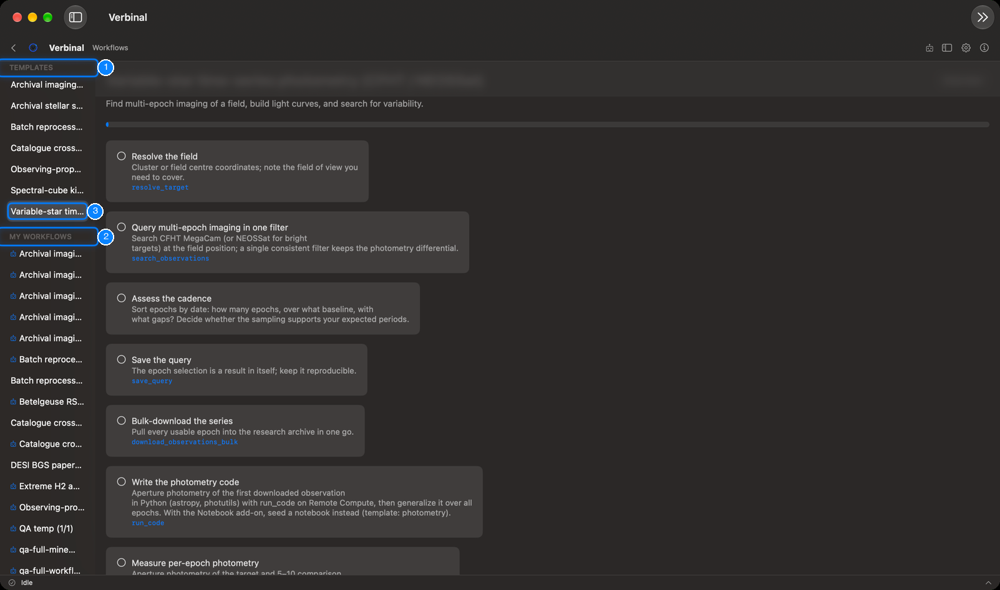

# Workflows

A workflow is a research protocol as a checklist: the steps of a piece of work, in order, each with what
to do and the part of Verbinal that does it. Verbinal comes with templates for common work; copy one to
follow it, or write your own. Workflows are kept on this Mac and work without signing in. Open them
from their Home tile, or **Go ▸ Workflows**.



1. **TEMPLATES**: the protocols that come with Verbinal.
2. **MY WORKFLOWS**: your copies, and the workflows you wrote.
3. The selected workflow: its title, description, progress and steps.

## Following a workflow

The templates cover archival imaging reconnaissance (CFHT MegaCam), stellar spectroscopy (DAO Plaskett,
CFHT ESPaDOnS), batch reprocessing on CANFAR, a VizieR × CADC catalogue cross-match, observing-proposal
due diligence, the kinematics of a molecular cloud from a spectral cube (JCMT), and variable-star
time-series photometry.

1. Select a template on the left to read its steps.
2. Click **Use this workflow** at the bottom. Verbinal copies it into **MY WORKFLOWS**, where it is
   yours to follow.
3. Work through the steps. Click a step to check it off; the bar at the top shows how far you are, and
   the list shows it beside the name (3/9).

Each step says what to do. Below it, in blue, is the tool an AI assistant would use for that step,
which also tells you where in Verbinal to do it yourself. A step can name an add-on, such as the
notebook add-on; without it, the step says what to use instead.

**Overview** at the top leaves the workflow and shows the list again.

## Writing your own

Choose **New Workflow** in the toolbar (in the » menu when the window is narrow). A workflow is plain
Markdown, as the editor reminds you:

```text
# Title
> One-line description

## Steps
- [ ] **Step title** — what to do
    Tool: search_observations
    View: search
    Note: anything to remember
```

- `# Title`: the workflow's name. Without one, it is saved as "Untitled workflow".
- `> …`: a one-line description.
- `## Steps`, then one `- [ ]` line per step: the title in bold, then what to do.
- Under a step, indented and optional: `Tool:`, `View:` and `Note:`.

The editor warns when the title or the steps are missing. **Save** keeps it in **MY WORKFLOWS**.

Your own workflows have **Edit**, to change their text, and **Delete**, which asks first and cannot be
undone. Templates cannot be changed; copy one and edit the copy.

A workflow an AI assistant made carries the **Created by AI agent** badge.

## What an assistant can do here

It can list and read workflows, copy a template, write and update workflows, check off steps as the work
is done, and delete them, which waits for you unless you allowed it. Workflow templates name the tools
it uses at each step.
