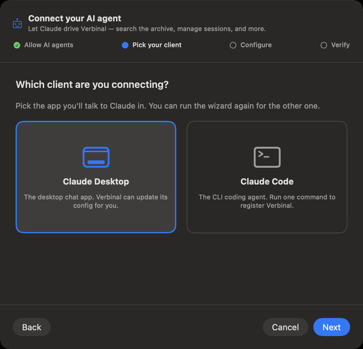
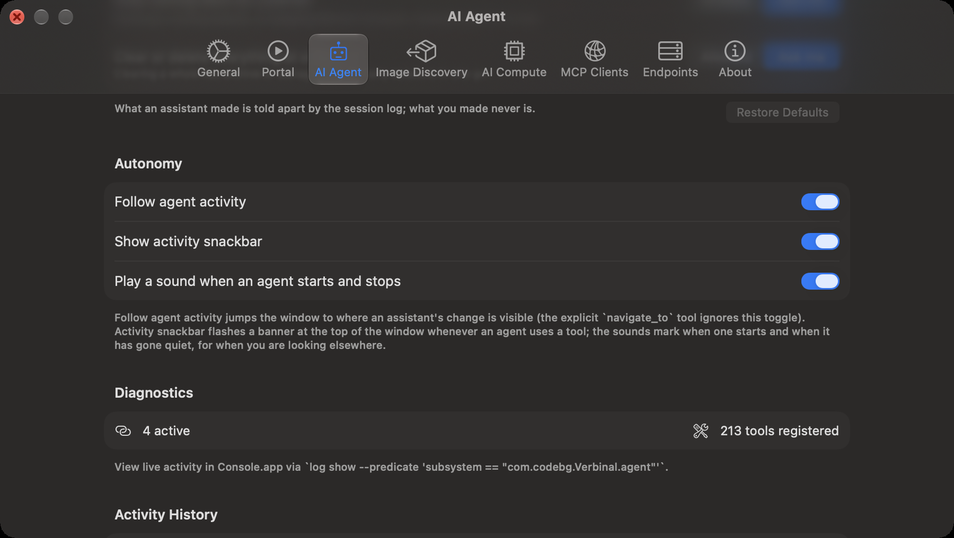
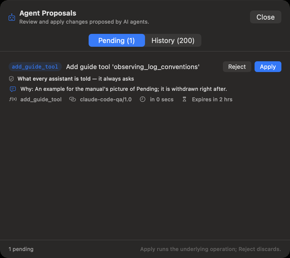
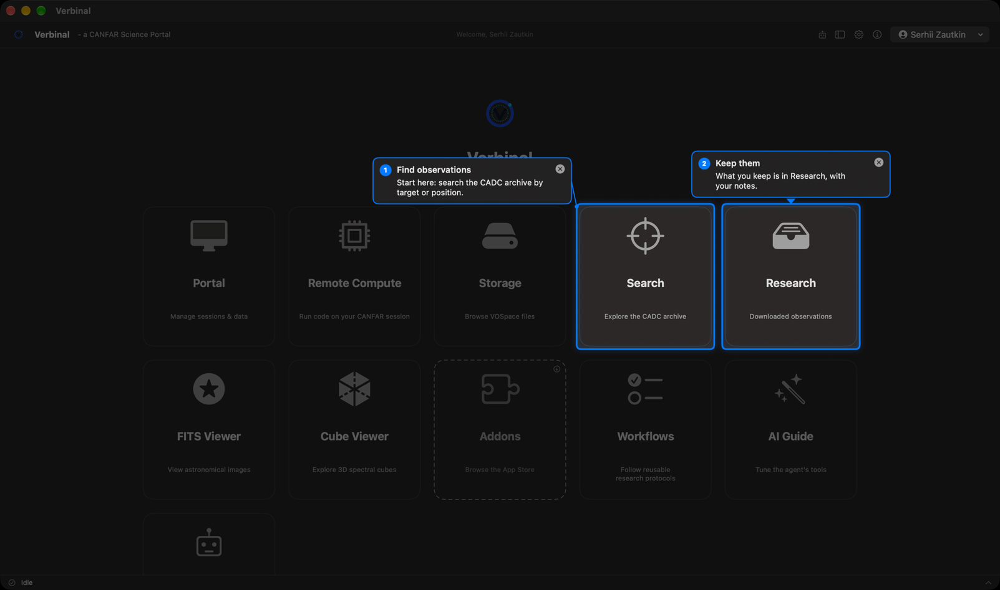
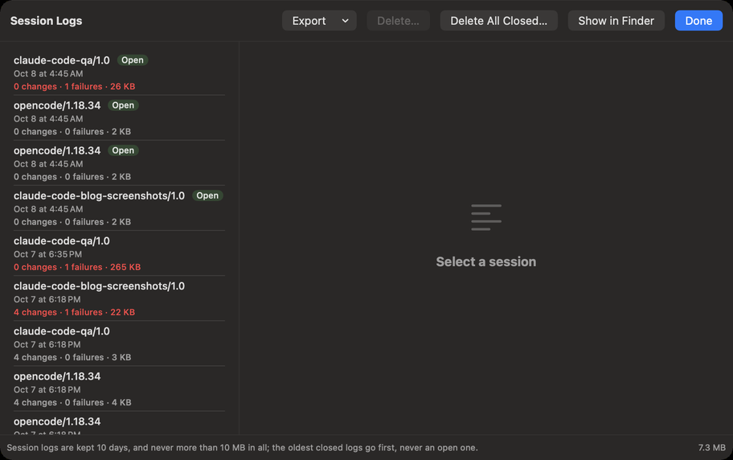

# Working with an AI assistant

An AI assistant, such as Claude, can work in Verbinal with you: search the archive, download and open
observations, read your sessions and storage, run code on CANFAR, and show you around the window.
It does this through the **Model Context Protocol (MCP)**, which Verbinal speaks. You decide whether
an assistant may connect, what it may do without asking, and you can read everything it did.

## What stays private

- **Off until you turn it on.** No assistant can reach Verbinal until you turn on
  **Allow external AI agents** in **Settings ▸ AI Agent**.
- **Nothing on the network.** Turning it on starts an MCP server that only programs on this Mac, run
  by you, can reach. No port is opened and nothing is exposed to the network.
- **Your password is never shared.** Signing in stays yours; an assistant cannot sign in, sign out,
  or read your password.
- **Your assistant is its own program.** What it sends to its own service (for Claude, Anthropic) is
  between you and that service. Verbinal only answers what the assistant asks.

## Connecting an assistant



Click the **AI Assistant** tile on Home, or choose **Help ▸ Connect an AI Agent…**. The setup,
**Connect your AI agent**, has four steps:

1. **Allow AI agents**: turn on **Allow external AI agents**.
2. **Pick your client**: **Claude Desktop** or **Claude Code**. For another client, see
   [Other clients](#other-clients).
3. **Configure**: as below, for the client you picked.
4. **Verify**: **Run self-test** checks that Verbinal's server answers. The final proof is in your
   client: quit it completely, open it again, and check that Verbinal's tools are listed.

### Claude Desktop

**Configure Claude Desktop** asks once for access to Claude's settings folder, then adds the
`verbinal-canfar` entry to its configuration, pointing at this copy of Verbinal. It changes only that
entry and keeps a backup (`.bak`) first. Restart Claude Desktop afterwards. **Copy Snippet**,
**Reveal Config** and **Open Claude** are there if you prefer to edit the file yourself.

### Claude Code

Claude Code keeps its servers in a file that also holds its sign-in, so Verbinal does not edit it.
**Copy** the command the setup shows and run it in Terminal. It looks like this:

```sh
claude mcp add --transport stdio --scope user verbinal-canfar -- '/Applications/Verbinal.app/Contents/MacOS/Verbinal' 'mcp'
```

Or paste the JSON snippet (**Copy JSON Snippet**) into the top-level `mcpServers` of `~/.claude.json`.
Restart Claude Code afterwards.

### Other clients

Any assistant that can start a local MCP server works the same way: name `verbinal-canfar`, command
`/Applications/Verbinal.app/Contents/MacOS/Verbinal`, argument `mcp`. There is no port, URL or key.
[AGENTS.md](https://github.com/szautkin/canfar-macos/blob/main/AGENTS.md) has the exact settings for Codex, Cursor, Gemini CLI, Windsurf and
VS Code; you can give that file to your assistant and let it set itself up.
**Settings ▸ MCP Clients** shows the exact command for this Mac and copies it (**Copy Command**).

### Checking the connection

Verbinal must be running, with **Allow external AI agents** on. While Verbinal is closed, the
assistant still connects, and each of its tools answers that Verbinal is not running; once you open
Verbinal, it finds it by itself.

If an assistant cannot connect, **Settings ▸ MCP Clients ▸ Diagnostics** checks each link: the
server, its listener, the shared container, the socket, the tools and Claude Desktop's
configuration, with a button to fix what it can. See also [Troubleshooting](16-troubleshooting.md).

## Allowing a session

Every time an assistant connects, it must start a session, and Verbinal asks you first, in a window:
**An assistant wants to start a session**.

- **Client**, **Connection** and **Asked**: which program asks, over MCP, and when.
- **How the assistant presents itself**: who it says it is, its model, and its purpose, in its own
  words. Verbinal cannot check them.
- **Instructions for this session**: what the assistant must follow for the whole session, up to 250
  words. The box starts with your **Session Instructions**; change them for this session only, or
  **Reset** them.
- **Allow** starts the session; **Deny** refuses it. The window waits as long as the assistant waits.

Until you allow it, the assistant can only ask Verbinal to describe itself. The session lasts while
the assistant stays connected; after Verbinal or the assistant restarts, it asks again.

Your default instructions are in **Settings ▸ AI Agent ▸ Session Instructions**. Out of the box they
read: *"Use only Verbinal and its tools for this work: no other apps, and no network connections
outside Verbinal. Ask before anything destructive."* The assistant is told to follow them, and the
session log keeps them, but Verbinal cannot stop an assistant from using its other tools or
connections outside Verbinal.

## What an assistant may do without asking



Every change an assistant can make is of one kind. In **Settings ▸ AI Agent**, under
**What an assistant may do without asking**, you set each kind to **Allowed** (the change applies at
once, with its reason in the session log) or **Ask me** (it waits in Pending until you apply it).

| Kind | What it covers | Out of the box |
|---|---|---|
| **Notes and saved things on this Mac** | Notes, ratings, saved queries, workflows, bookmarks, Research records | Allowed |
| **Files saved on this Mac** | Downloads, cutouts, figures and exports, as new files, never over one | Allowed |
| **Add to your CANFAR storage** | New files and folders in your VOSpace | Allowed |
| **Use your CANFAR allocation: sessions and compute** | Launching and renewing sessions; Remote Compute and the code it runs | Allowed |
| **Use your CANFAR allocation: batch jobs and image probes** | Batch jobs, and the probe jobs that find what an image has installed | Allowed |
| **Sharing: who may read or write your files** | Who may read or write your VOSpace files and folders | Ask me |
| **What every assistant is told** | Guide tools and tool descriptions every later assistant reads | **Always asks** |

Under **What removes, replaces or stops**:

| Kind | What it covers | Out of the box |
|---|---|---|
| **Remove what an assistant made** | Anything an assistant made, as the session log records it, never yours | Allowed |
| **Remove notes and saved things on this Mac** | Saved queries, recent searches, workflows, bookmarks, image list entries, probe errors | Ask me |
| **Remove files on this Mac** | Downloaded files and their Research records | Ask me |
| **Remove or replace in your CANFAR storage** | Deleting from your VOSpace, or uploading over a file there | Ask me |
| **Stop running work on CANFAR** | Deleting a running session, or stopping Remote Compute: unsaved work in it is lost | Ask me |
| **Clear or delete everything at once** | Clearing a whole list, archive or storage area, or many sessions in one go | Ask me |

What an assistant made is told apart by the session log; what you made never is. **Restore Defaults**
puts every kind back as above. Changes to **What every assistant is told** always wait for you.

## Pending: changes waiting for you



When a change waits, the robot button in the toolbar shows a red count. Click it to open
**Agent Proposals**:

- **Pending** lists what waits. Each change says what it is, why it waits (**it always asks**,
  **you ask to approve this kind**, or **proposed before you allowed it**), the assistant's reason
  (**Why:**), which client proposed it, and when it expires: three hours after it was proposed.
- **Apply** runs the change; **Reject** discards it.
- **History** lists what happened: **Applied by you**, **Auto-applied**, **Applied in the background**,
  what was rejected, and what the assistant opened, closed or showed.

## Watching an assistant work

In **Settings ▸ AI Agent ▸ Autonomy**:

- **Follow agent activity** (on): when an assistant's change applies, the window goes where you can
  see it: a saved query to Search, notes and downloads to Research, VOSpace changes to Storage,
  sessions to Portal.
- **Show activity snackbar** (on): a banner at the top of the window, **AI agent is working…**, while
  an assistant uses its tools. Its × hides it.
- **Play a sound when an agent starts and stops** (off): for when you are looking elsewhere.

An assistant gets an answer within 45 seconds. Longer work, such as a big download or a job, carries
on in the activity bar at the bottom of the window, started by **Your assistant**.

What an assistant made carries a small badge, **Created by AI agent**, with the client's name: in
Research, Workflows, saved queries, recent searches, FITS bookmarks and recent launches.

## Hints: what your assistant shows you



To show you something, an assistant puts **hints** on the window: a ring round a control, a bubble
with its words beside it, numbers for a tour, and the rest of the window dimmed.

- Hints never press anything. An assistant can also select an entry of a list, or open a folded
  section, a panel, a menu or a sheet, as your click would; what to choose inside stays yours, and a
  file panel waits for you.
- The × on a hint closes it; **Esc** closes them all. With many hints, a **Hints** list holds their
  words, with **Close all hints**.
- They go away by themselves: a bubble after 8 seconds and a ring after 15, unless the assistant keeps
  them up longer (up to two minutes, or until you close them), and when you change screen.

Hints are not the marks on an image: marks are data, kept with the file (see
[FITS Viewer](04-fits-viewer.md#marks)).

## The session log



Verbinal keeps a log of each assistant's session: each change, who made it and why, the app's
decisions, every request to CADC and CANFAR, and failures with what they mean. It keeps what happened,
not your data: no passwords, file contents, queries or paths.

Open it from **Settings ▸ AI Agent ▸ Session Logs ▸ Show Session Logs…**:

- The list on the left has one entry per session: the client, **Open** while it is connected, when
  it started, and how many changes and failures it had.
- Select one to read it. **Show** filters it: **All**, **Changes**, **Failures**, **Decisions**,
  **Calls**. Open an entry to see its requests: which service, what the answer meant, and how long it
  took.
- **Export** saves a session as text (**Export as Text…**) or as JSON Lines (**Export as JSON Lines…**).
- **Delete…** and **Delete All Closed…** delete logs; an open session keeps its own. This cannot be
  undone. **Show in Finder** shows where they are kept.

Logs are kept 10 days, and never more than 10 MB in all; the oldest closed logs go first, never an
open one. An assistant reads its own log too, to explain what was slow or failed.

Lower in **Settings ▸ AI Agent**, **Diagnostics** says how many assistants are connected and how many
tools they have, **Recent Activity** lists the last calls (only what they were and how they ended,
never their arguments), and **Activity History** keeps a short summary of each change, with **Clear**.

## What an assistant can and cannot do

An assistant has about two hundred tools: everything you can do on every screen in this manual. It
can see the window as you do, read what each control is, and point at it. Each chapter ends with what
an assistant can do on that screen.

Some things stay yours, on purpose:

- Signing in and out, and your password.
- **Settings**: an assistant can read your endpoints and Remote Compute settings, but not change any
  setting, the compute image or registry credentials included.
- Choosing inside a menu, a sheet or a file panel it opened; and right-click menus.
- Your housekeeping: **Clear Finished** in the activity list, and **Clear History** in Batch Jobs.
- What every later assistant is told (the [AI Guide](13-ai-guide.md)): it can propose, and it always
  waits for you.
- Running code: only on CANFAR, with the image you chose in **Settings ▸ AI Compute**
  (see [Remote Compute](10-remote-compute.md)).

## Stopping an assistant

- **Deny** a session it asks for.
- **Reject** what waits in Pending.
- Turn off **Allow external AI agents** in **Settings ▸ AI Agent**: the server stops, and no assistant
  can reach Verbinal until you turn it on again.
- Or quit the assistant's own app.
