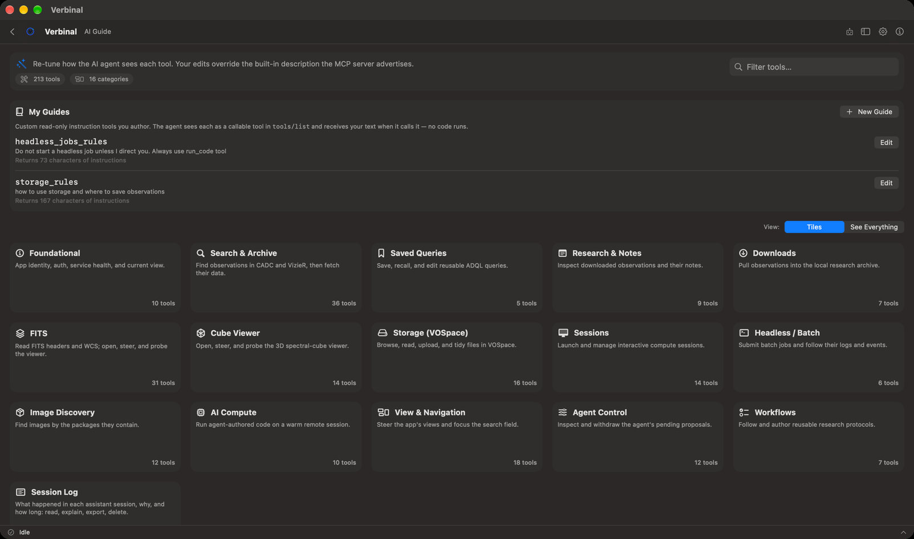

# AI Guide

The AI Guide is what every AI assistant is told when it connects to Verbinal: your own standing rules,
and the description of each of Verbinal's tools. It is yours to shape. Open it from its Home tile, or
**Go ▸ AI Guide** (⌘7).

## Your guides: standing rules for every assistant

**My Guides** are short texts you write once and every assistant reads. Each appears to an assistant
as a tool of its own; when the assistant calls it, it gets your text back. No code runs. Use them for
a rule ("Do not start a batch job unless I ask"), a convention ("Name folders by target"), or a
workflow you want followed.

Verbinal tells every assistant, first thing, to read **the person's standing rules**, and lists your
guides by name.

1. Click **New Guide**.
2. **Name**: letters, numbers, spaces or underscores. The sheet shows the name the assistant calls it
   by (**The agent calls this as** …).
3. **Description — what the agent reads in the tool list**: one line on what the guide is for, up to
   600 characters.
4. **Instructions — returned when the agent calls this tool**: the rule itself, up to 4,000
   characters. It is optional; without it, the description is returned.
5. Click **Save**.

Each guide in the list shows its description and how long its instructions are
(**Returns** … **characters of instructions**). **Edit** opens it again, with **Delete**.

## Tool descriptions

Below your guides, Verbinal's tools are grouped by area: search and the archive, saved queries,
Research, downloads, FITS, the Cube Viewer, storage, sessions, batch jobs, Image Discovery, Remote
Compute, the view and navigation, the assistant's own controls, workflows and the session log. The
header counts the tools, how many you have changed, and the areas.

- **View:** **Tiles** shows one tile per area; click a tile to open it. **See Everything** lists every
  tool at once.
- **Filter tools…** finds a tool by its name or words in its description.
- Each tool shows the description an assistant reads. **Edit** it, write **Your description** beside
  the **Built-in default**, and **Save**. Your words replace the built-in ones for every assistant from
  then on; the tool is marked **overridden**, and its area **has overrides**.
- **Clear Override** or **Reset to Default** brings back the built-in description.

Change a description when an assistant keeps misusing a tool, or to steer it ("prefer the smallest
size"). It changes what assistants are told, not what the tool does.

## When an assistant proposes a change here

An assistant can propose a new guide, a change to one, or a new description. Such a change is of the
kind **What every assistant is told**, and it always waits for you in Pending, whatever your other
settings: see [Pending](12-ai-assistant.md#pending-changes-waiting-for-you).

## Hiding the tile

If you do not use it, turn off **Show AI Guide on the launchpad** in **Settings ▸ MCP Clients**. Only
the tile goes; your guides and descriptions stay in force, and **Go ▸ AI Guide** still opens it.

## What an assistant can do here

It can read your guides and the tool descriptions, and propose changes to them; each waits for you.
