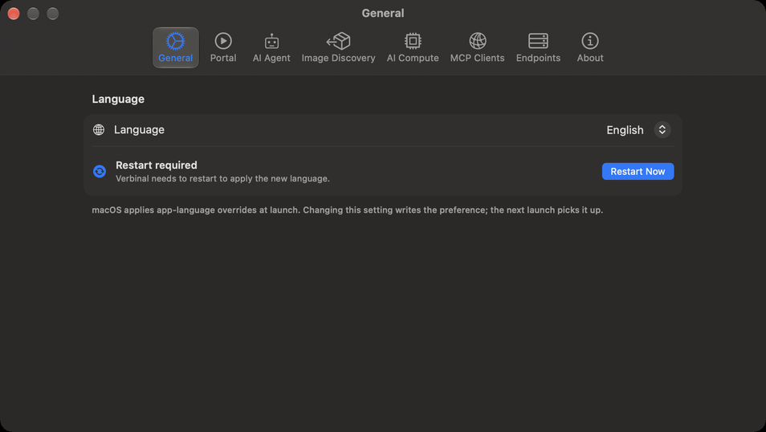
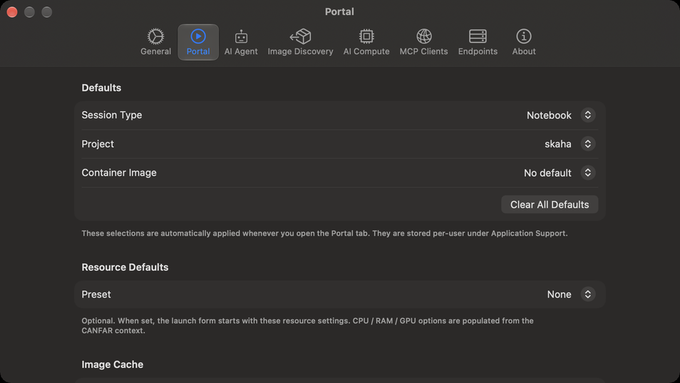
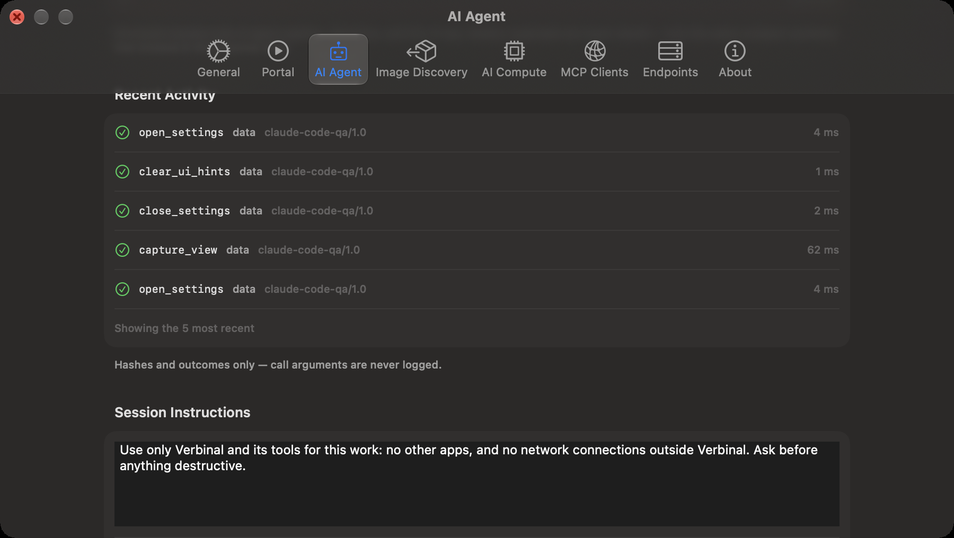
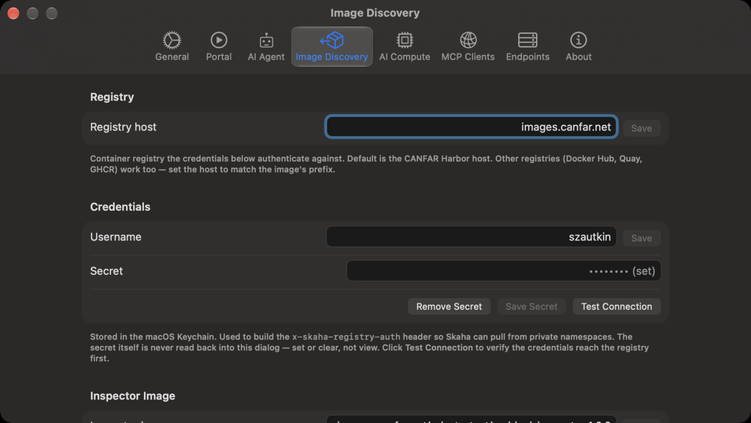
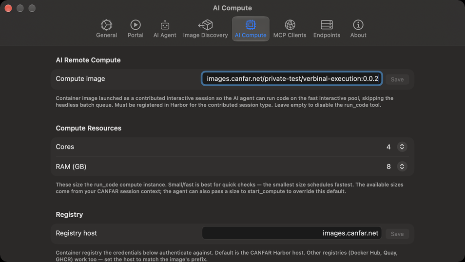
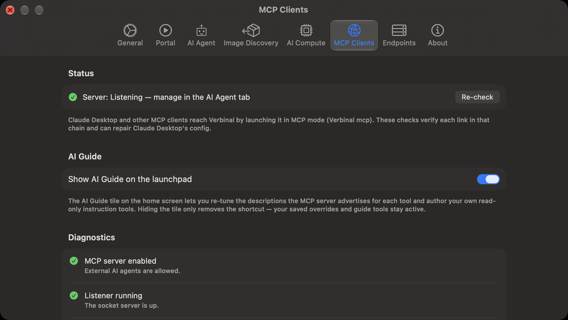
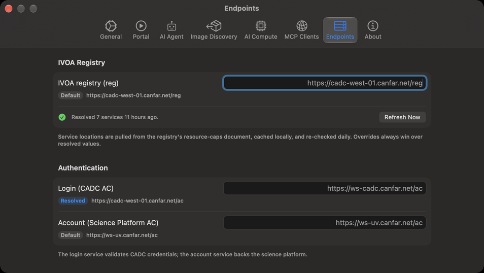
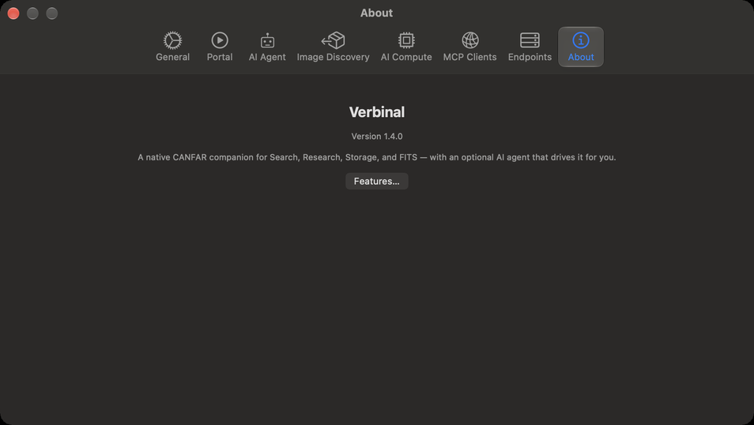

# Settings

Open Settings with ⌘, or the gear button in the toolbar. It has eight sections; each is described here
with every setting in it. Settings are yours alone: an AI assistant can read some of them, never change
them.

## General

| Setting | What it does |
|---|---|
| **Language** | **System** follows your Mac; or choose **English** or **Français**. Verbinal shows **Restart required**: click **Restart Now** to apply it. |

## Portal

The defaults the launch form starts with (see [Portal: sessions](06-portal-sessions.md)). Sign in to
change them; they are kept for your account on this Mac.

| Setting | What it does |
|---|---|
| **Defaults** ▸ **Session Type** | The type the form opens on, from the types CANFAR offers (Notebook, Desktop and so on), or **No default**. |
| **Defaults** ▸ **Project** | The image project the form opens on, or **No default**. |
| **Defaults** ▸ **Container Image** | The image the form selects, or **No default**. |
| **Clear All Defaults** | Forgets the defaults above for this account. |
| **Resource Defaults** ▸ **Preset** | **None**, **Flexible** or **Fixed**. With **Fixed**, choose **Cores** and **RAM (GB)**, and **GPUs** when CANFAR offers them. The sizes offered come from CANFAR. |
| **Image Cache** | When the list of images was fetched (**Cached** …). **Refresh Now** fetches the image catalogue again; **Clear Cache** deletes it, and the next time Portal opens it is fetched again. |

## AI Agent

How AI assistants reach Verbinal and what they may do. [Working with an AI assistant](12-ai-assistant.md)
explains each part.

| Setting | What it does |
|---|---|
| **MCP Server** ▸ **Allow external AI agents** | Off until you turn it on. On, it starts the local MCP server; the line below says **Listening**, with where. |
| **What an assistant may do without asking** | For each kind of change, **Allowed** or **Ask me**. **What every assistant is told** is **Always asks**. |
| **What removes, replaces or stops** | The same, for the kinds that remove or stop something. **Restore Defaults** puts every kind back. |
| **Autonomy** ▸ **Follow agent activity** | The window goes where an assistant's change shows. On. |
| **Autonomy** ▸ **Show activity snackbar** | A banner at the top of the window while an assistant works. On. |
| **Autonomy** ▸ **Play a sound when an agent starts and stops** | Off. |
| **Diagnostics** | How many assistants are connected, and how many tools are registered. |
| **Activity History** | A short summary of each change and view an assistant made; **Clear** empties it. |
| **Recent Activity** | The last five calls: what each was and how it ended, never its arguments. |
| **Session Instructions** | What every new session's approval window starts with, up to 250 words; **Reset** restores Verbinal's own. |
| **Session Logs** ▸ **Show Session Logs…** | Every assistant session, what happened and why. |

The kinds and **Autonomy** show while **Allow external AI agents** is on, and the sections from **Diagnostics** to **Recent Activity** while the server runs.

## Image Discovery

What [Image Discovery](08-image-discovery.md) needs to look inside private images.

| Setting | What it does |
|---|---|
| **Registry** ▸ **Registry host** | The container registry your credentials are for. By default, CANFAR's (`images.canfar.net`); Docker Hub, Quay or GHCR work too, with the host that matches the image's name. **Save**. |
| **Credentials** ▸ **Username** | Your registry user name, usually your CADC username. **Save**. |
| **Credentials** ▸ **Secret** | Your registry secret: for CANFAR's registry, the **CLI secret** of your Harbor user profile, not your CADC password. **Save Secret** keeps it in the macOS Keychain; it is never shown again, only replaced or removed (**Remove Secret**). |
| **Test Connection** | Checks the credentials with the registry. **Connection rejected** most often means a CADC password was used instead of the Harbor CLI secret. |
| **Inspector Image** | The image that runs the probe jobs. Leave it empty for Verbinal's own. |
| **Image Discovery Cache** | How many images have been looked into. **Clear** forgets them all; probes still running carry on. |
| **Reset to Defaults** | Clears the registry host, username, secret and inspector image; what is cached stays. |

## AI Compute

The session [Remote Compute](10-remote-compute.md) runs code in.

| Setting | What it does |
|---|---|
| **AI Remote Compute** ▸ **Compute image** | The container image Remote Compute launches as a contributed session, for example `images.canfar.net/<project>/verbinal-execution:<version>`. It must be registered in CANFAR's registry for the contributed session type. Empty, Remote Compute is off. **Save**. |
| **Compute Resources** ▸ **Cores**, **RAM (GB)** | The size of that session. The smallest starts fastest; the sizes offered come from CANFAR. |
| **Registry** and **Credentials** | As in Image Discovery: the registry the compute image is pulled from, and your username and secret for it. |
| **Reset to Defaults** | Clears the compute image, the registry host, the username and the secret. |

## MCP Clients

How each assistant program reaches Verbinal.

| Setting | What it does |
|---|---|
| **Status** | Whether the server is listening; it is turned on and off in AI Agent. **Re-check** reads it again. |
| **AI Guide** ▸ **Show AI Guide on the launchpad** | Shows or hides the AI Guide tile on Home. Your guides stay in force either way. |
| **Diagnostics** | Checks each link between an assistant and Verbinal when you open the tab, each with a fix where there is one. |
| **MCP Server Self-Test** | **Run MCP Server Check** checks that the server answers. The final proof is restarting your client and seeing Verbinal's tools. |
| **Claude Desktop Configuration** | **Configure Claude Desktop** adds Verbinal to Claude Desktop's configuration in one click. **Grant Access…**, **Update Config**, **Copy Snippet**, **Reveal Config** and **Open Claude** do it by hand. Restart Claude Desktop afterwards. |
| **Claude Code** | Whether Claude Code is installed. **Copy Command** copies the `claude mcp add` command for this Mac; **Copy JSON Snippet** copies the entry to paste into `~/.claude.json`. |

## Endpoints

The addresses of the CADC and CANFAR services Verbinal talks to. You rarely need to change them.

| Setting | What it does |
|---|---|
| **IVOA Registry** ▸ **IVOA registry (reg)** | Where Verbinal looks up the other services. It checks again every day; **Refresh Now** does it now, and the line below says how many services it found, and when. |
| **Authentication** | **Login (CADC AC)** and **Account (Science Platform AC)**: signing in, and your platform account. |
| **Science Platform** | **Science Platform (Skaha)**, which runs sessions and jobs, and **Storage (VOSpace nodes)**. |
| **Archive & Data** | **Archive (TAP / DataLink)**, for search, metadata and downloads, and **External web (browser)**. |
| **Reset All to Defaults** | Removes every address you typed. |
| **Test Connections** | Asks each service whether it is available, and how fast it answers. |

Each address shows where its value comes from: **Default**, **Resolved** (from the registry), or the one
you typed, which always wins; **Clear override** removes yours. Addresses apply when Verbinal starts:
after a change, **Restart required** offers **Restart Now**.

## About

Verbinal's version, and **Features…**, which opens **What Verbinal Can Do**.
