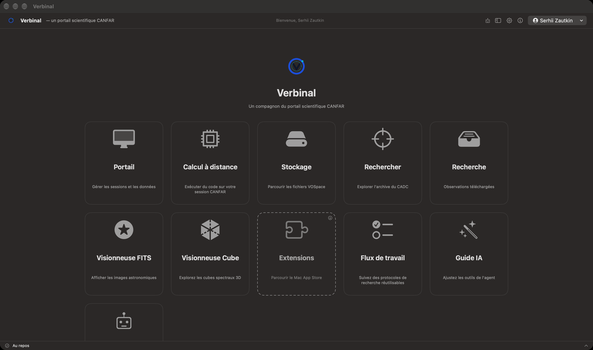
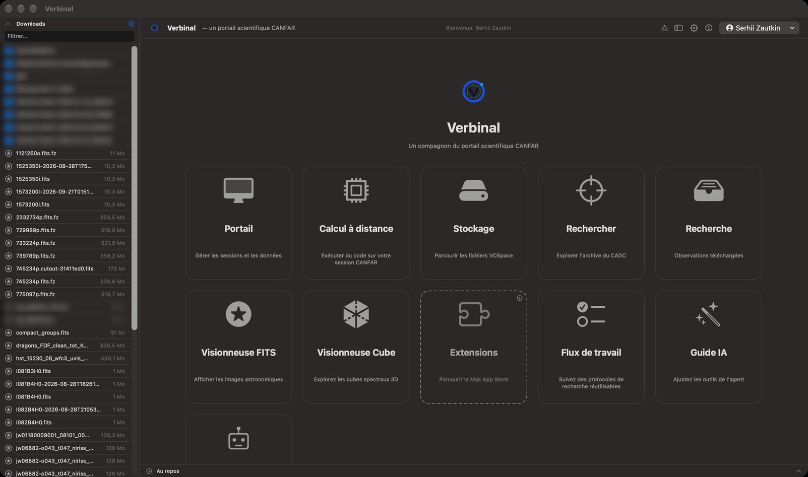
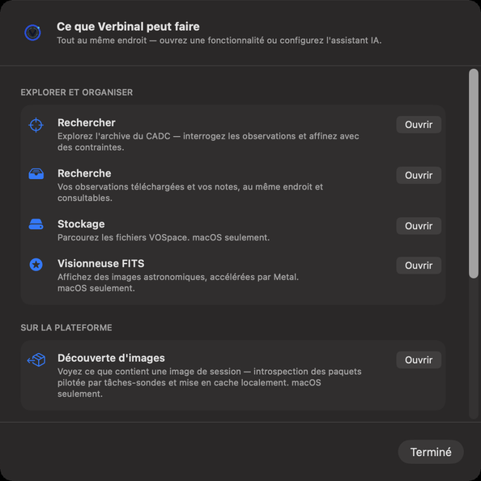
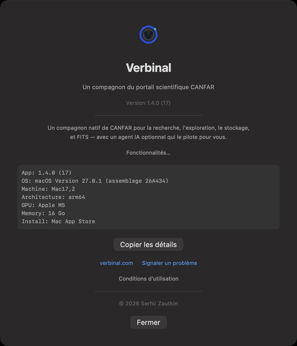

# Premiers pas

Verbinal est une app Mac pour les astronomes qui travaillent avec le Centre canadien de données
astronomiques (CADC) et la plateforme scientifique CANFAR. Dans une seule fenêtre, vous cherchez dans
l’archive, gardez et lisez vos observations, examinez des images FITS et des cubes de données, gérez
votre stockage VOSpace, et lancez sessions, tâches en lot et code sur CANFAR. Ce chapitre installe
l’app, suit le premier lancement et fait le tour de la fenêtre.

## Ce qu’il vous faut

- Un Mac sous **macOS 14 (Sonoma) ou plus récent**, avec une puce Apple ou un processeur Intel.
- Pour **Portail**, **Stockage** et **Calcul à distance** : un compte CADC et, pour les sessions et
  les tâches sur CANFAR, un compte qui a accès à la plateforme scientifique CANFAR. Voir
  [canfar.net](https://www.canfar.net/).
- Rien d’autre pour **Rechercher**, **Recherche**, la **Visionneuse FITS**, la **Visionneuse Cube**,
  **Flux de travail** et le **Guide IA** : ils fonctionnent sans connexion.

## Installer Verbinal

Verbinal est gratuit.

- **Mac App Store** (recommandé) : [Verbinal sur le Mac App Store](https://apps.apple.com/ca/app/verbinal/id6761290036).
  Le Store le tient à jour.
- **GitHub** : chaque version sur [GitHub Releases](https://github.com/szautkin/canfar-macos/releases)
  contient `Verbinal-macOS.dmg`, `Verbinal-macOS.zip` et `checksums-sha256.txt`. Cette version n’est
  pas signée : ouvrez l’image disque, glissez **Verbinal** dans **Applications** et, la première fois,
  cliquez sur l’app en maintenant la touche Contrôle et choisissez **Ouvrir**.

## Le premier lancement

1. **Les conditions d’utilisation.** Lisez-les, cochez **J’ai lu et j’accepte les conditions
   d’utilisation…**, puis cliquez sur **J’accepte**. **Quitter** (⌘Q) ferme plutôt Verbinal. Vous ne
   les revoyez que si elles changent ; elles restent lisibles depuis **À propos de Verbinal** ▸
   **Conditions d’utilisation**.
2. **Bienvenue dans Verbinal.** Un court aperçu de l’app. **Configurer l'assistant IA** lance la
   configuration décrite dans [Travailler avec un assistant IA](12-ai-assistant.md#connecter-un-assistant) ;
   **Explorer par moi-même** la ferme. Elle s’affiche une fois, et de nouveau quand une nouvelle
   version a du nouveau à présenter.
3. **Les notifications.** macOS demande si Verbinal peut envoyer des notifications. Verbinal s’en sert
   pour vous dire quand une session est prête ou n’a pas pu démarrer, quand des tâches en lot se
   terminent ou échouent, et quand une exportation est terminée.

## Accueil

L’accueil est l’écran où Verbinal s’ouvre. Chaque tuile ouvre une partie de l’app :

| Tuile | Ce qu’elle ouvre | Connexion |
|---|---|---|
| **Portail** | Vos sessions CANFAR, le formulaire de lancement et les tâches en lot. [Chapitre 6](06-portal-sessions.md) | oui |
| **Calcul à distance** | Une session sur CANFAR qui exécute votre code. [Chapitre 10](10-remote-compute.md) | oui |
| **Stockage** | Vos fichiers VOSpace. [Chapitre 9](09-storage.md) | oui |
| **Rechercher** | L’archive du CADC. [Chapitre 2](02-search.md) | — |
| **Recherche** | Les observations que vous gardez, avec vos notes. [Chapitre 3](03-research.md) | — |
| **Visionneuse FITS** | Les images et spectres FITS. [Chapitre 4](04-fits-viewer.md) | — |
| **Visionneuse Cube** | Les cubes spectraux en 3D. [Chapitre 5](05-cube-viewer.md) | — |
| **Extensions** | Le Mac App Store, pour trouver des extensions de Verbinal | — |
| **Flux de travail** | Des protocoles de recherche pas à pas. [Chapitre 11](11-workflows.md) | — |
| **Guide IA** | Ce qui est dit à chaque assistant IA. [Chapitre 13](13-ai-guide.md) | — |
| **Assistant IA** | La configuration qui connecte un assistant IA. [Chapitre 12](12-ai-assistant.md) | — |

- Tant que vous n’êtes pas connecté, les tuiles qui demandent un compte indiquent **Verrouillé**.
  Cliquez sur l’une d’elles, connectez-vous, et Verbinal vous y conduit.
- Quand une extension comme Verbinal Pi (calepins) est installée, sa propre tuile remplace
  **Extensions**.
- Vous pouvez masquer la tuile **Guide IA** dans **Réglages ▸ Clients MCP** ; le Guide IA reste dans
  le menu **Aller**.
- Pour revenir à l’accueil de n’importe où, utilisez la flèche de retour en haut à gauche, ou
  **Aller ▸ Accueil** (⌘0).

## La fenêtre

Chaque écran a la même barre d’outils en haut et la barre d’activité en bas.

1. **Modifications en attente** : ce qu’un assistant IA a proposé et qui vous attend. Une pastille
   rouge les compte. Voir [En attente](12-ai-assistant.md#en-attente--les-modifications-qui-vous-attendent).
2. **Afficher le navigateur de fichiers** (⌘B) : les fichiers de ce Mac, dans un panneau à gauche.
3. **Réglages** (⌘,). Voir [Réglages](14-settings.md).
4. **À propos de Verbinal** : la version, et les détails pour un rapport de bogue.
5. **Votre compte CADC** : votre nom, avec votre courriel et votre institution dans son menu, et
   **Se déconnecter**. Quand vous n’êtes pas connecté, un bouton **Se connecter** se trouve à sa place.

Le menu du compte est sur l’accueil et dans Portail. Sur les autres écrans, la barre d’outils commence
par une flèche de retour (**Retour**) et le nom de l’écran.

### La barre d’activité

La ligne au bas de la fenêtre dit ce que fait Verbinal : **Au repos**, la tâche en cours, ou combien
il y en a. Une tâche qui a échoué s’affiche en rouge. Cliquez sur la ligne pour voir la liste
**Activité** : chaque tâche, qui l’a lancée (**Vous**, **Votre assistant** ou **Verbinal**), et ce
qu’elle fait ou pourquoi elle a échoué. **Effacer les terminées** retire de la liste celles qui sont
finies.

### Le navigateur de fichiers

Appuyez sur ⌘B, ou cliquez sur son bouton dans la barre d’outils, pour voir les fichiers de ce Mac.

- Il s’ouvre sur votre dossier **Downloads** (Téléchargements), où Verbinal enregistre ce que vous
  téléchargez. La flèche à côté du nom du dossier remonte au dossier parent.
- **Filtrer…** restreint la liste par nom. Le bouton en haut à droite n’affiche que les fichiers que
  Verbinal ouvre : FITS (`.fits`, `.fit`, `.fts`, `.fz`), calepins (`.ipynb`), Python (`.py`) et
  Markdown (`.md`).
- Cliquez sur un dossier pour l’ouvrir, et sur un fichier FITS pour l’ouvrir dans la Visionneuse FITS.
  Un fichier à trois axes demande d’abord s’il faut l’ouvrir comme image ou comme cube. Les autres
  fichiers s’ouvrent dans leur app Mac habituelle.
- Verbinal ne lit que les dossiers que vous lui permettez. Pour un dossier hors de Downloads, cliquez
  sur **Autoriser l’accès…** et choisissez-le.

## Se déplacer

Le menu **Aller** mène à chaque écran, d’où que vous soyez :

| Aller | Raccourci |
|---|---|
| **Accueil** | ⌘0 |
| **Rechercher** | ⌘1 |
| **Recherche** | ⌘2 |
| **Visionneuse FITS** | ⌘3 |
| **Visionneuse Cube** | ⌘4 |
| **Flux de travail** | — |
| **Portail** | ⌘5 |
| **Stockage** | ⌘6 |
| **Guide IA** | ⌘7 |
| **Découverte d'images…** | ⌘8 |

Le Calcul à distance s’ouvre depuis sa tuile de l’accueil. Tous les menus et raccourcis sont dans
[Raccourcis clavier et menus](a-shortcuts-and-menus.md).

## Se connecter et se déconnecter

1. Cliquez sur **Se connecter** dans la barre d’outils de l’accueil, ou sur une tuile **Verrouillé**.
2. Dans **Se connecter à CANFAR**, tapez votre **Nom d'utilisateur** et votre **Mot de passe** CADC.
3. Laissez **Se souvenir de moi** coché pour rester connecté : Verbinal garde alors votre mot de passe
   dans le trousseau macOS, sur ce Mac seulement, et vous reconnecte de lui-même quand votre session
   CADC expire. Décochez-le pour ne garder que la session : vous vous reconnecterez à son expiration.
4. Cliquez sur **Se connecter**.

Au démarrage, Verbinal vérifie votre session enregistrée pendant que l’accueil est déjà utilisable ;
les tuiles qui demandent un compte se déverrouillent quand la vérification est faite. Si le Mac est
hors ligne, la vérification attend le réseau.

Pour vous déconnecter, ouvrez le menu de votre compte (votre nom, en haut à droite de l’accueil ou de
Portail) et choisissez **Se déconnecter**.

## Langue

Verbinal parle anglais et français. Pour choisir, ouvrez **Réglages ▸ Général ▸ Langue** : **Système**
suit votre Mac, ou choisissez **Anglais** ou **Français**. macOS applique la langue d’une app à son
démarrage ; Verbinal affiche donc **Redémarrage requis** : cliquez sur **Redémarrer maintenant**.

## L’aide, et ce que Verbinal peut faire

Le menu **Aide** contient :

- **Ce que Verbinal peut faire…** : un aperçu de ses principales fonctions, chacune avec un bouton
  pour l’ouvrir.
- **Connecter un agent IA…** : la configuration de l’assistant, comme l’ouvre la tuile **Assistant IA**.
- **Aide Verbinal** (⌘?) : la page de Verbinal sur GitHub, qui mène à ce manuel.
- **Signaler un problème** : un nouveau ticket sur GitHub, dans votre navigateur.

**À propos de Verbinal** (le bouton ⓘ, ou le menu **Verbinal**) montre la version et les détails
qu’un rapport de bogue demande : l’app, macOS, le Mac, son architecture, son GPU et sa mémoire, et
d’où Verbinal a été installé. **Copier les détails** les copie. **Signaler un problème** ouvre un
nouveau ticket sur GitHub, et **Conditions d’utilisation** montre les conditions que vous avez
acceptées.

## Ce qu’un assistant peut faire ici

Un assistant IA peut passer d’un écran à l’autre, ouvrir et fermer le navigateur de fichiers et les
feuilles, et lire la barre d’activité, comme vous. Se connecter et se déconnecter restent à vous :
voir [Travailler avec un assistant IA](12-ai-assistant.md).
