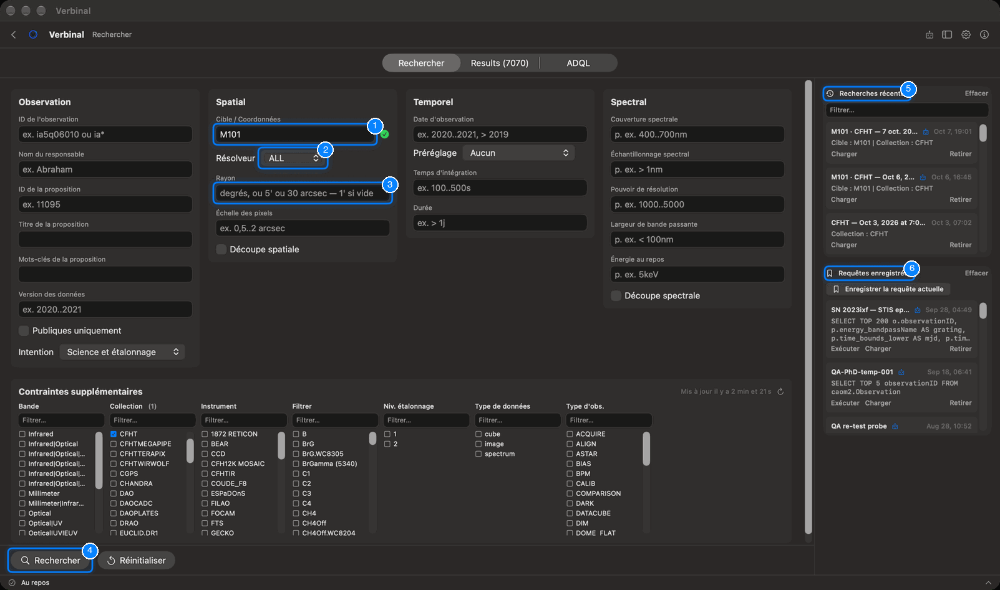
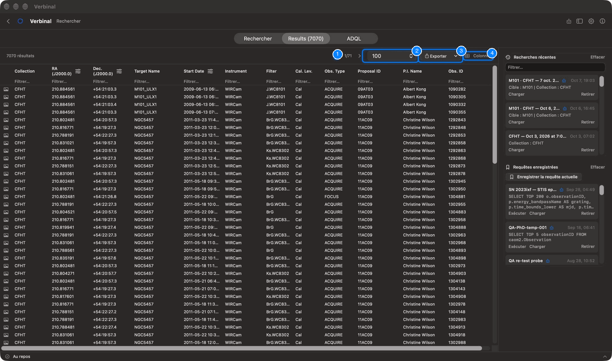
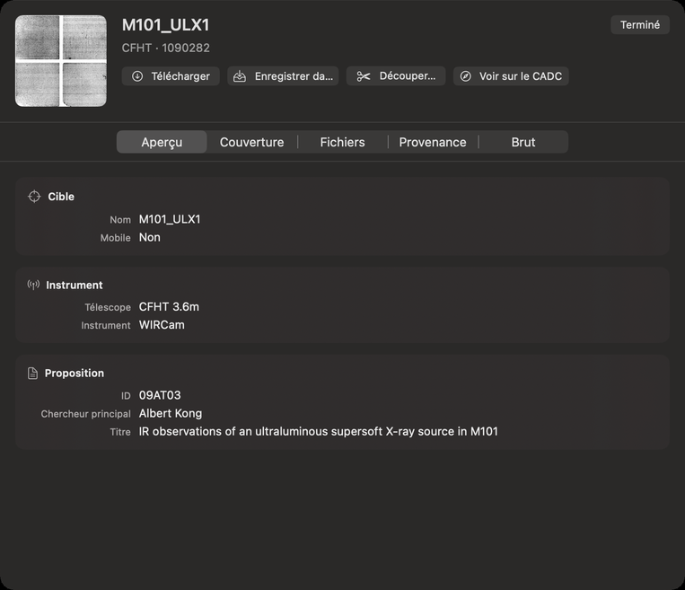
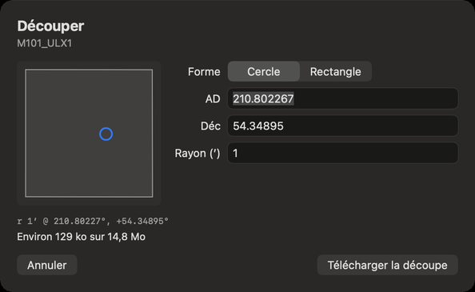
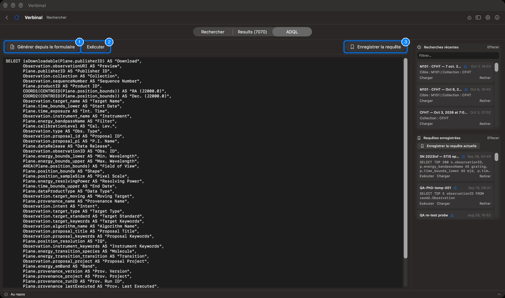

# Rechercher dans l’archive du CADC

Rechercher trouve des observations dans l’archive du CADC : par cible ou par position, par date, par
longueur d’onde, par collection et par instrument, ou avec votre propre requête ADQL. Cela fonctionne
sans connexion ; connectez-vous pour voir les données propriétaires auxquelles vous avez accès.
Ouvrez-le depuis sa tuile de l’accueil, ou par **Aller ▸ Rechercher** (⌘1).

L’écran a trois onglets en haut, **Rechercher**, **Résultats** et **ADQL**, et un panneau latéral à
droite avec vos recherches récentes et vos requêtes enregistrées.

## Le formulaire de recherche

1. **Cible / Coordonnées** : un nom (`M31`, `NGC 5457`, `SN 2023ixf`) ou une position
   (`10.68 41.27`). Pendant que vous tapez un nom, Verbinal le résout et affiche
   **Résolu : A.D. …, Déc. …** avec une coche.
2. **Résolveur** : le service qui transforme les noms en positions : **ALL** (par défaut), **SIMBAD**,
   **NED**, **VIZIER**, ou **NONE** pour chercher le nom tel qu’il est écrit dans l’archive.
3. **Rayon** : le cône autour de la cible, en degrés, ou en `5'` ou `30 arcsec`. Vide, il vaut 1′. Un
   rayon tapé après la cible (`M101 0.2deg`) l’emporte.
4. **Rechercher** (⌘↩) lance la recherche ; **Réinitialiser**, à côté, vide tous les champs et filtres.
5. **Recherches récentes** : chaque recherche lancée, à recharger.
6. **Requêtes enregistrées** : les requêtes que vous avez enregistrées, à exécuter ou à charger.

Le formulaire a quatre groupes, et **Contraintes supplémentaires** en dessous. Ne remplissez que ce qui
vous sert ; les plages s’écrivent `a..b`, et `>` ou `<` fixent une seule borne.

| Groupe | Champs |
|---|---|
| **Observation** | **ID de l'observation** (`*` comme joker), **Nom du responsable**, **ID de la proposition**, **Titre de la proposition**, **Mots-clés de la proposition**, **Version des données**, **Publiques uniquement**, et **Intention** : **Science et étalonnage**, **Science uniquement** ou **Étalonnage uniquement**. |
| **Spatial** | **Cible / Coordonnées**, **Résolveur**, **Rayon**, **Échelle des pixels** (`0.5..2 arcsec`), et **Découpe spatiale**. |
| **Temporel** | **Date d'observation** (`2020..2021`, `> 2019`), **Préréglage** (**Dernières 24 heures**, **Semaine dernière**, **Mois dernier**), **Temps d'intégration** (`100..500s`), **Durée** (`> 1d`). |
| **Spectral** | **Couverture spectrale** (`400..700nm` ; unités nm, um, mm, cm, m, Hz, A, eV), **Échantillonnage spectral**, **Pouvoir de résolution**, **Largeur de bande passante**, **Énergie au repos** (de eV à GeV), et **Découpe spectrale**. |

**Découpe spatiale** et **Découpe spectrale** font qu’un téléchargement depuis ces résultats ne
rapporte que la partie d’un fichier dans le cercle de la recherche, ou ses longueurs d’onde, découpée
par le CADC. Voir [Découpes](#découpes).

### Contraintes supplémentaires : le train de données

Sous le formulaire, sept listes restreignent la recherche d’après ce que contient l’archive : **Bande**,
**Collection**, **Instrument**, **Filtrer** (le filtre), **Niv. étalonnage**, **Type de données** et
**Type d'obs.** Cochez les valeurs voulues ; chaque liste ne montre alors que ce qui va avec vos choix à
sa gauche (choisissez une collection, et les instruments sont ceux de cette collection). Chaque liste a
sa propre case **Filtrer…**. Les listes viennent du CADC et sont gardées sur votre Mac ; la ligne
au-dessus dit quand elles ont été mises à jour, et son bouton les récupère à nouveau.

### Pendant une recherche

Une recherche prend d’habitude quelques secondes. Pendant ce temps, le bouton affiche
**En attente du CADC** avec les secondes écoulées ; **Annuler** l’arrête.

## Les résultats

L’onglet **Résultats** indique combien d’observations correspondent, une page à la fois.

1. **Page précédente** et **Page suivante** (⌘[ et ⌘]), avec le numéro de page.
2. **Lignes par page** : 50, 100, 500, ou **Tout**, jusqu’au nombre indiqué.
3. **Exporter** (⇧⌘E) : les lignes telles que vous les voyez (**Vue actuelle** : **CSV (filtré)**,
   **TSV (filtré)**), ou toute la requête à nouveau depuis le CADC (**Requête complète (serveur)** :
   **CSV**, **TSV**, **VOTable**). Vous choisissez où enregistrer le fichier.
4. **Colonnes** : quelles colonnes s’affichent. **Tout afficher**, **Tout masquer**, **Réinitialiser**,
   ou cochez-les une à une ; **Filtrer les colonnes** en trouve une par son nom.

Dans le tableau :

- Cliquez sur l’en-tête d’une colonne pour trier ; cliquez de nouveau pour inverser.
- L’icône à côté d’un en-tête change son unité : l’ascension droite en heures ou en degrés, la
  déclinaison en degrés-minutes-secondes ou en degrés, les dates en calendrier ou en MJD, les longueurs
  d’onde dans l’unité choisie.
- La rangée **Filtrer…** sous les en-têtes (⌘F) restreint les lignes selon n’importe quelle colonne. Le
  compte se lit alors « … sur … résultats ».
- Survolez l’icône d’appareil photo en début de ligne pour voir l’aperçu de l’observation.
- Double-cliquez sur une ligne pour ouvrir son détail.
- Clic droit sur une ligne : **Ouvrir le détail**, **Ouvrir sur le CADC…**, **Télécharger le fichier…**
  (dans votre navigateur), **Enregistrer dans Recherche**, **Copier les détails**, **Copier la ligne** et
  **Copier la page**. Clic droit sur une valeur pour la copier, ou pour restreindre la recherche à cette
  valeur (**Restreindre la recherche à** …).

Quand une recherche atteint la limite de lignes du CADC, le compte le dit : il peut exister d’autres
lignes. Restreignez la recherche pour les voir.

## Le détail d’une observation

Le détail montre l’aperçu de l’observation, sa cible et sa collection, et cinq onglets :

| Onglet | Ce qu’il montre |
|---|---|
| **Aperçu** | La **Cible** (nom, type, décalage vers le rouge, mobile, standard, mots-clés), l’**Instrument** et le **Télescope**, et la **Proposition** (ID, chercheur principal, projet, titre). |
| **Couverture** | Pour chaque plan : polarisation, pixels, résolution, échelle des pixels, empreinte, plage de longueurs d’onde, filtre, bande, pouvoir de résolution, et la période couverte. |
| **Fichiers** | Chaque fichier de l’observation, chacun avec son propre **Télécharger**. |
| **Provenance** | Comment elle a été produite : pipeline, version, producteur, exécution, entrées, et qualité (magnitude limite, arrière-plan, sources). |
| **Brut** | Toutes les colonnes du résultat, **Toutes les colonnes**. |

Ses boutons :

- **Télécharger** récupère le fichier de l’observation, demande où l’enregistrer, et garde
  l’observation dans Recherche. Ensuite, il devient **Télécharger à nouveau**. Avec une découpe cochée
  dans le formulaire, il devient **Télécharger la découpe**.
- **Enregistrer dans Recherche** garde l’observation dans Recherche sans son fichier : pour les notes, et
  pour la télécharger plus tard. Une fois gardée, il devient **Dans Recherche**.
- **Découper…** ouvre l’éditeur de découpe.
- **Voir sur le CADC** ouvre la page de l’observation sur le site du CADC.

Certaines métadonnées d’observations propriétaires ne s’affichent que si vous êtes connecté.

## Découpes

Une découpe est la partie d’un fichier dont vous avez besoin, découpée par le CADC : vous ne téléchargez
qu’une fraction du fichier. **Découper…** dans le détail d’une observation ouvre l’éditeur :

- **Fichier** : lequel des fichiers de l’observation découper, s’il y en a plusieurs. Le dessin montre
  l’empreinte du fichier et la région à découper.
- **Forme** : **Cercle**, avec son **Rayon (′)**, ou **Rectangle**, avec sa **Largeur (′)** et sa
  **Hauteur (′)**, centré sur **AD** et **Déc** (en degrés, ou `hh:mm:ss` et `±dd:mm:ss`).
- **Images** : les extensions à découper. Aucune cochée découpe toutes les images où tombe la région.
- **Découper aussi** : des fichiers compagnons, comme les poids, découpés sur les mêmes pixels et
  enregistrés à côté de la découpe.
- **Plus courte (nm)** et **Plus longue (nm)** : pour un cube, les longueurs d’onde à garder.

L’éditeur indique la taille approximative de la découpe. **Télécharger la découpe** la récupère, demande
où l’enregistrer, et la garde dans Recherche avec un lien vers son observation d’origine.

## L’éditeur ADQL

L’ADQL est le langage de requête de l’archive. L’onglet **ADQL** vous laisse écrire une requête
vous-même, ou partir du formulaire.

1. **Générer depuis le formulaire** écrit la recherche du formulaire en ADQL, à modifier.
2. **Exécuter** (⇧⌘↩) la lance ; les résultats vont dans l’onglet **Résultats**.
3. **Enregistrer la requête** la garde dans **Requêtes enregistrées**.

Verbinal vérifie la requête pendant la saisie, d’après les tables et colonnes de l’archive, et liste les
problèmes en dessous ; cliquez sur un problème pour le sélectionner dans la requête. **Exécuter** attend
qu’ils soient corrigés.

## Recherches récentes et requêtes enregistrées

Le panneau latéral garde vos recherches.

- **Recherches récentes** : chaque recherche lancée, avec ce qu’elle demandait. **Charger** la remet dans
  le formulaire, ou dans l’éditeur ADQL si elle a été lancée de là ; **Retirer** la supprime ;
  double-cliquez sur un nom pour le renommer. **Filtrer…** en trouve une ; **Effacer** vide la liste.
- **Requêtes enregistrées** : **Enregistrer la requête actuelle** garde la requête courante sous un nom.
  Chacune a **Exécuter**, **Charger** et **Retirer** ; **Effacer** les supprime toutes.

Ce qu’un assistant IA a créé dans ces listes porte la pastille **Créé par l'agent IA**.

## Ce qu’un assistant peut faire ici

Tout ce qui est sur cet écran : remplir le formulaire et lancer la recherche, lire les résultats tels que
vous les voyez, trier, filtrer, changer les unités et les colonnes, ouvrir les détails, exporter, écrire
et vérifier de l’ADQL, enregistrer des requêtes, découper et télécharger. Il peut aussi chercher dans
les catalogues VizieR du CDS, que l’app elle-même n’offre que comme résolveur de noms.
