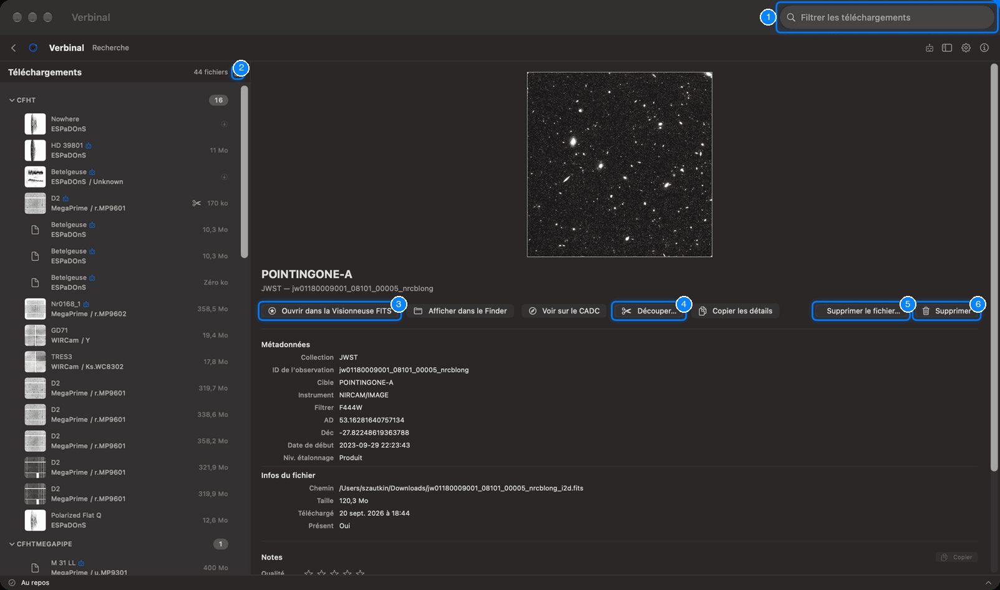
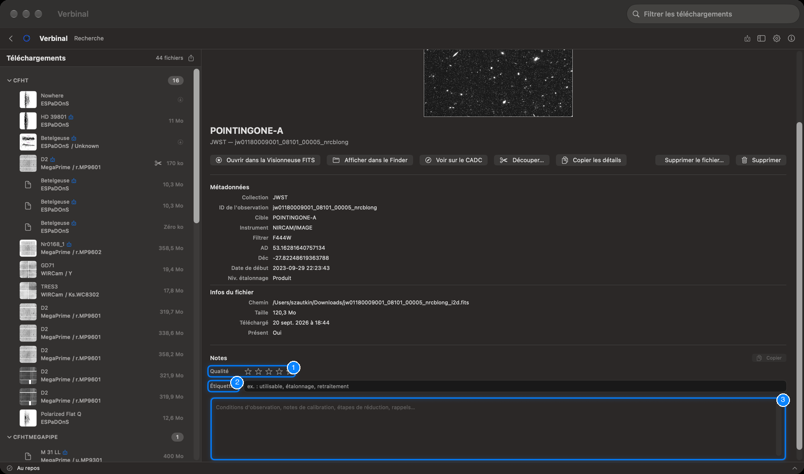
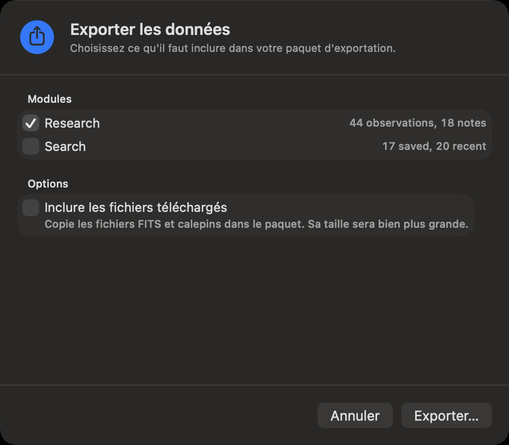

# Recherche : vos observations

Recherche est l’endroit où vivent, sur ce Mac, les observations que vous gardez : celles que vous avez
téléchargées, celles que vous avez enregistrées sans leur fichier, et vos découpes, chacune avec vos
notes, vos étiquettes et votre note de qualité. Cela fonctionne sans connexion. Ouvrez-la depuis sa
tuile de l’accueil, ou par **Aller ▸ Recherche** (⌘2).

1. **Filtrer les téléchargements** : trouve une observation par sa cible, sa collection, son instrument
   ou son ID d’observation, et par les mots de vos notes et étiquettes.
2. Le bouton d’exportation à côté du compte : [Tout exporter](#tout-exporter).
3. **Ouvrir dans la Visionneuse FITS** : le fichier de l’observation, dans la visionneuse qui lui
   convient.
4. **Découper…** : une partie de l’observation, comme dans Rechercher.
5. **Supprimer le fichier…** : supprime le fichier et garde l’observation.
6. **Supprimer** : retire l’observation de Recherche.

## Faire entrer des observations dans Recherche

Depuis [Rechercher](02-search.md), dans le détail d’une observation ou le menu du clic droit d’un
résultat :

- **Télécharger** récupère le fichier, demande où l’enregistrer, et garde ici l’observation avec lui.
- **Enregistrer dans Recherche** garde l’observation sans son fichier, pour des notes maintenant et un
  téléchargement plus tard.
- **Télécharger la découpe** garde ici la découpe, liée à son observation d’origine.

## La liste

La liste de gauche regroupe vos observations par collection, avec le nombre que chacune contient. Chaque
ligne montre l’aperçu, la cible, l’instrument et le filtre, et la taille du fichier. Des ciseaux
signalent une découpe ; une flèche, une observation gardée sans son fichier. Le compte en haut dit
combien il y en a.

Clic droit sur une ligne : **Ouvrir le fichier**, **Afficher dans le Finder**, **Télécharger**,
**Copier les détails** et **Supprimer**.

Vos observations apparaissent aussi dans Spotlight, sur le Mac : cherchez-y une cible, une collection ou
un instrument, et choisir un résultat ouvre Verbinal.

## Une observation

Sélectionnez une ligne pour voir l’observation : son aperçu, sa cible, sa collection et son ID
d’observation, puis :

- **Métadonnées** : **Collection**, **ID de l'observation**, **Cible**, **Instrument**, **Filtrer**
  (le filtre), **AD**, **Déc**, **Date de début**, **Niv. étalonnage**.
- **Infos du fichier** : le **Chemin** du fichier, sa **Taille**, quand il a été **Téléchargé**, et s’il
  est **Présent**. Pour une observation gardée sans son fichier, **Fichier** indique **Non téléchargé**.

Ses boutons :

| Bouton | Ce qu’il fait |
|---|---|
| **Ouvrir dans la Visionneuse FITS** | Ouvre le fichier dans la [Visionneuse FITS](04-fits-viewer.md). Pour un cube, il devient **Ouvrir dans la visionneuse de cubes** ; pour un fichier qui n’est pas FITS, **Ouvrir le fichier** l’ouvre dans son app habituelle. |
| **Afficher dans le Finder** | Montre le fichier dans le Finder. |
| **Voir sur le CADC** | La page de l’observation sur le site du CADC. |
| **Découper…** | L’[éditeur de découpe](02-search.md#découpes). |
| **Copier les détails** | Copie l’ID, la position, l’instrument et la date de l’observation en texte. |
| **Télécharger** | Pour une observation gardée sans son fichier : le récupère dans cette même fiche, avec ses notes. |
| **Télécharger de nouveau** | Quand le fichier est absent, ne peut pas être ouvert, ou est vide : le récupère à nouveau. |
| **Supprimer le fichier…** | Supprime le fichier de ce Mac ; l’observation, ses détails et ses notes restent, et **Télécharger** le récupère de nouveau. |
| **Supprimer** | Retire l’observation de Recherche, et son fichier de votre disque. C’est irréversible. Vos notes sont gardées : si vous gardez de nouveau l’observation, elles reviennent. |

### Découpes

La fiche d’une découpe dit ce qu’elle est (**Découpe de** …) et la région qu’elle couvre.
**Observation d'origine** montre l’observation complète dont elle a été découpée, quand celle-ci est
aussi dans Recherche.

## Notes, étiquettes et qualité

Sous les détails, chaque observation a vos notes :

1. **Qualité** : une à cinq étoiles, d’**Inutilisable** à **Excellente** ; **Effacer** retire la note.
2. **Étiquettes** : des mots séparés par des virgules, comme `utilisable, étalonnage, retraitement`.
3. **Notes** : ce dont vous voulez vous souvenir : conditions d’observation, notes de calibration, étapes
   de réduction. Elles indiquent leur dernière modification et leur nombre de mots, et **Copier** les
   copie.

Les notes s’enregistrent pendant la saisie. Le filtre du haut les cherche aussi.

## Tout exporter

**Fichier ▸ Tout exporter…** (⇧⌘E), ou le bouton d’exportation de Recherche, ouvre
**Exporter les données** : un paquet de votre travail, à archiver, à partager, ou à donner à un
assistant IA.

1. Sous **Modules**, cochez ce qu’il faut inclure : **Research** (vos observations et vos notes) et
   **Search** (vos recherches enregistrées et récentes) ; ces deux noms restent en anglais dans l’app.
2. Sous **Options**, **Inclure les fichiers téléchargés** copie aussi les fichiers FITS et les calepins
   dans le paquet ; il devient bien plus gros.
3. Cliquez sur **Exporter…**, choisissez un dossier, et cliquez sur **Exporter ici**. Verbinal y crée un
   dossier nommé d’après la date et l’heure.

Le paquet commence par un `README.md` et un `manifest.json` qui décrivent son contenu. Une fois fini,
**Exportation terminée** propose **Afficher dans le Finder**, **Copier le chemin**, **Partager…** et,
si vous êtes connecté, **Téléverser dans VOSpace**, qui place une copie compressée dans le dossier
`Verbinal-Exports` de votre stockage. Une notification signale la fin d’une exportation.

## Ce qu’un assistant peut faire ici

Il peut lister et lire vos observations et vos notes, écrire des notes, des étiquettes et des notes de
qualité (jusqu’à 50 à la fois), ouvrir des fichiers dans les visionneuses, télécharger ce que vous avez
gardé sans fichier, découper et exporter. Supprimer un fichier ou une observation vous attend, sauf si
vous avez autorisé ce type de modification.
