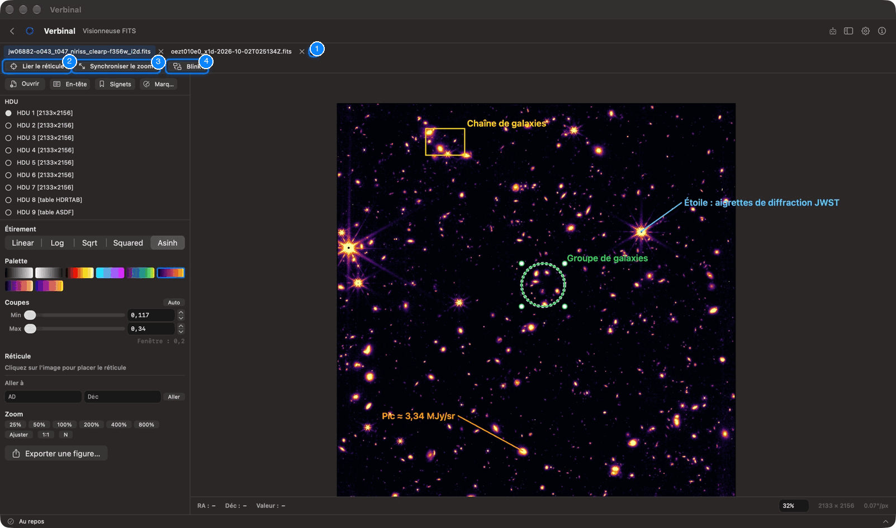
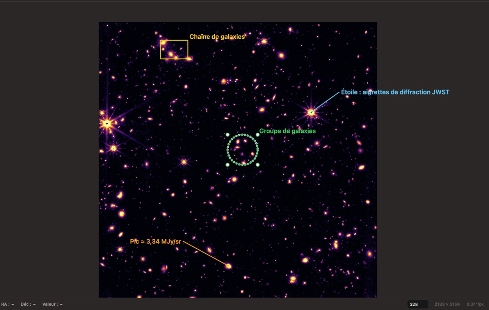
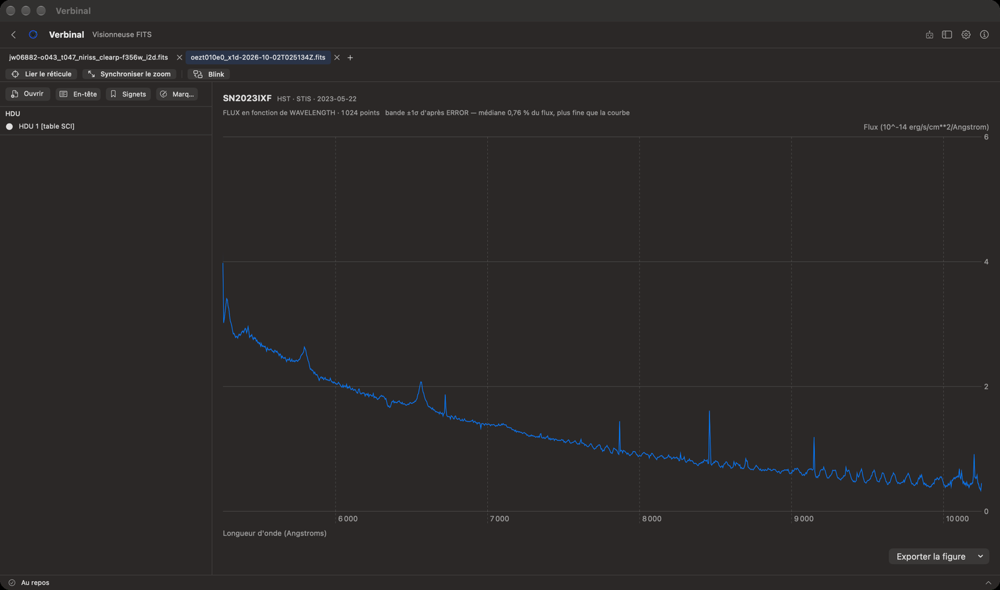
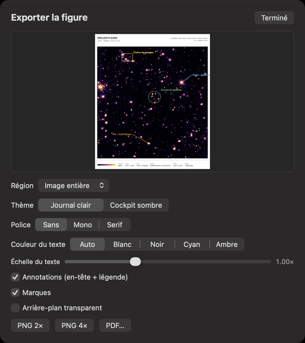

# Visionneuse FITS

La Visionneuse FITS affiche les images et les spectres FITS, rapidement, avec les coordonnées célestes
(WCS) de chaque pixel. Elle lit les images simples, les fichiers à plusieurs extensions, les fichiers
compressés (`.fz`) et les tables qui contiennent un spectre. Elle fonctionne sans connexion.
Ouvrez-la depuis sa tuile de l’accueil, ou par **Aller ▸ Visionneuse FITS** (⌘3).

1. Les onglets, un par fichier, et **Nouvel onglet** (⌘T).
2. **Lier le réticule** : le réticule suit la même position céleste dans chaque onglet.
3. **Synchroniser le zoom** : chaque onglet montre la même portion de ciel.
4. **Blink** : alterne deux onglets.

En dessous, le panneau latéral contient les extensions du fichier, les réglages d’affichage, et les
boutons **Ouvrir**, **En-tête**, **Signets** et **Marques**. L’image occupe le reste, avec une barre
en dessous.

## Ouvrir un fichier

- **Ouvrir** (ou **Ouvrir un fichier FITS…** dans un onglet vide) choisit un fichier sur votre Mac.
- Glissez un fichier FITS sur la visionneuse.
- Sans fichier ouvert, la visionneuse liste les fichiers ouverts récemment (**OUVERTS RÉCEMMENT**) ;
  cliquez sur l’un d’eux pour le rouvrir.
- Depuis [Recherche](03-research.md) (**Ouvrir dans la Visionneuse FITS**), depuis
  [Stockage](09-storage.md), ou depuis le
  [navigateur de fichiers](01-getting-started.md#le-navigateur-de-fichiers).

Un fichier à trois axes, comme un cube spectral, demande d’abord : **Ouvrir comme…**
**Visionneuse FITS (2D)** ou **Visionneuse Cube (3D)** (voir [Visionneuse Cube](05-cube-viewer.md)).

Chaque fichier s’ouvre dans un onglet. ⌘T ouvre un onglet vide ; ⌘W, ou le × d’un onglet, le ferme.

## L’affichage

Le panneau latéral, de haut en bas :

- **HDU** : les extensions du fichier, avec la taille de chaque image ou le nom de chaque table.
  Cliquez sur l’une pour l’afficher.
- **Étirement** : comment les valeurs deviennent de la luminosité : **Linear**, **Log**, **Sqrt**,
  **Squared** ou **Asinh** (ces noms restent en anglais).
- **Palette** : **Grayscale**, **Inverted**, **Heat**, **Cool**, **Viridis**, **Inferno**, **Magma**
  ou **Plasma**.
- **Coupes** : les valeurs affichées du noir au blanc, avec les curseurs ou les champs **Min** et
  **Max**. **Auto** les règle d’un peu sous le fond jusqu’au début du pour cent le plus brillant.
- **Réticule**, **Aller à** et **Zoom** : voir plus bas.
- **Exporter une figure…** : voir [Figures](#figures).

Un fichier sans WCS standard affiche **WCS approximatif** : ses coordonnées sont estimées et peuvent
être imprécises. Une image dont tous les pixels ont la même valeur affiche une plage de 0 à 1.

## Se déplacer dans l’image

- **Zoom** : de **25%** à **800%**, **Ajuster** (l’image entière), **1:1** (un pixel de l’image par
  pixel d’écran), et **N** (**Nord en haut** : tourne l’image pour mettre le nord en haut et l’est à
  gauche, en la gardant entière). Le menu **Présentation** contient **Agrandir** (⌘+), **Réduire**
  (⌘−), **Taille réelle** (⌥⌘1) et **Ajuster à la fenêtre** (⌥⌘0). Pincez ou faites défiler sur le
  trackpad pour zoomer et vous déplacer, ou tapez un pourcentage dans le champ de zoom en bas à droite
  et appuyez sur Retour.
- La barre sous l’image montre **RA**, **Déc** et la **Valeur** du pixel sous le pointeur, ainsi que la
  taille de l’image et l’échelle des pixels.

### Le réticule

Cliquez sur l’image pour placer le réticule. Le panneau montre alors son **RA**, sa **Déc** et sa
valeur :

- **Copier** copie les coordonnées.
- **Effacer** (Échap) retire le réticule.
- **Rechercher ici** (⇧⌘L) cherche dans l’archive du CADC à cette position, dans
  [Rechercher](02-search.md). Il faut un WCS.

**Aller à** place le réticule sur une position que vous tapez : **AD** et **Déc**, en degrés ou en
sexagésimal, puis **Aller**. Une position hors de l’image le signale.

### L’en-tête et les informations de l’image

**En-tête** montre, dans le panneau latéral, un résumé de l’image (**Dimensions**,
**Plage de pixels**, **WCS**, **Échelle**, **Centre**, **Orientation**, **Champ de vue**) et toutes les
cartes de l’en-tête, avec **Filtrer les mots-clés…** pour en trouver une.

### Signets

**Signets** garde les positions où vous voulez revenir. Placez le réticule, tapez un
**Libellé (facultatif)**, et enregistrez-le. Chaque signet a **Aller à** et **Supprimer**.

## Comparer des images

Avec deux onglets ou plus :

- **Lier le réticule** : placer le réticule dans un onglet le met à la même position céleste dans les
  autres, grâce à leur WCS. Si un onglet n’a pas de WCS exact, ou montre une autre partie du ciel, une
  note le dit.
- **Synchroniser le zoom** : chaque onglet montre la même taille angulaire de ciel.
- **Blink** (⇧⌘B) : alterne l’onglet courant avec un autre. **Pause** et **Reprendre** (Espace),
  **A** et **B** pour afficher l’une des deux (← et →), un curseur pour l’intervalle (de 0,5 à
  5 secondes), et **Arrêter** (Échap). Les images sans WCS alternent sans être alignées.

## Marques

Les marques sont vos annotations sur une image : cercles, rectangles, légendes avec un trait, et texte.
Verbinal les garde pour chaque fichier (et chaque extension) sur ce Mac ; rouvrez le fichier et elles
sont là.

Ouvrez **Marques** dans le panneau latéral :

1. Activez **Dessiner**, choisissez une **Forme** (**Cercle**, **Rectangle**, **Légende** ou
   **Texte**), puis cliquez ou faites glisser sur l’image.
2. Faites glisser la forme pour la déplacer, une poignée pour la redimensionner ; double-cliquez pour
   la renommer.
3. Mettez en forme la marque sélectionnée : **Couleur**, gras (**G**), taille du libellé, et épaisseur
   du contour.

Le panneau liste toutes les marques, avec **Filtrer les marques…**. **Exporter** les enregistre en
**Régions DS9…** ou en **JSON…** ; **Tout effacer** les retire toutes de cette image, après
confirmation.

Clic droit sur une marque : **Modifier le libellé**, **Copier la position**,
**Centrer sur la marque**, **Rechercher ici**, **Exporter une figure autour de la marque…**,
**Exporter les marques en régions DS9…**, **Exporter les marques en JSON…** et
**Supprimer la marque** (⌫).

## Spectres

Une table qui contient un spectre, comme un fichier HST `x1d`, s’ouvre en graphique : le flux en
fonction de la longueur d’onde, avec leurs unités, et une bande ±1σ d’après la colonne d’erreur
quand il y en a une. Les fichiers à plusieurs ordres les tracent tous. **Exporter la figure**
enregistre le graphique en **PNG 2×**, **PNG 4×** ou **PDF…**.

## Figures

**Exporter une figure…** produit une figure de publication de l’image, avec un aperçu :

| Réglage | Choix |
|---|---|
| **Région** | **Image entière**, **Vue à l'écran**, ou **Autour de** une marque |
| **Thème** | **Journal clair** ou **Cockpit sombre** |
| **Police** | **Sans**, **Mono** ou **Serif** |
| **Couleur du texte** | **Auto**, **Blanc**, **Noir**, **Cyan** ou **Ambre** |
| **Échelle du texte** | Un curseur |
| **Annotations (en-tête + légende)** | Un en-tête et une légende sur la figure |
| **Marques** | Vos marques sur la figure |
| **Arrière-plan transparent** | Pour une figure posée sur autre chose |

Puis **PNG 2×**, **PNG 4×** ou **PDF…**. Les figures sont enregistrées dans votre dossier
Téléchargements, sous un nom qui porte la date et l’heure.

## Ce qu’un assistant peut faire ici

Il peut ouvrir des fichiers, changer d’onglet et d’extension, régler l’étirement, la palette, les
coupes et le zoom, mettre le nord en haut, aller à une position, lire les valeurs des pixels et
l’en-tête, enregistrer des signets, alterner et lier les onglets, chercher au réticule, dessiner,
modifier et exporter des marques, lire les spectres, et exporter des figures. Il voit l’image comme
vous.
