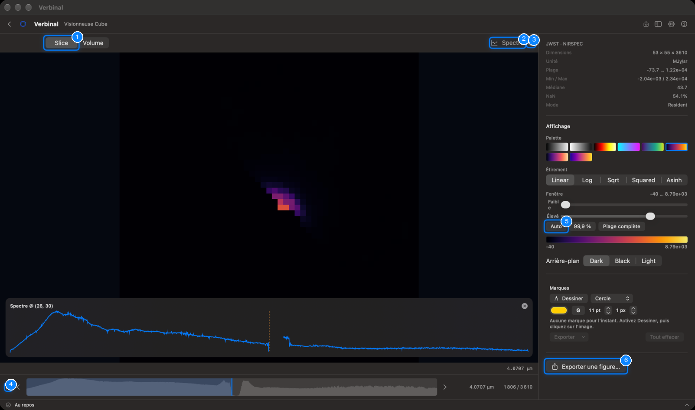
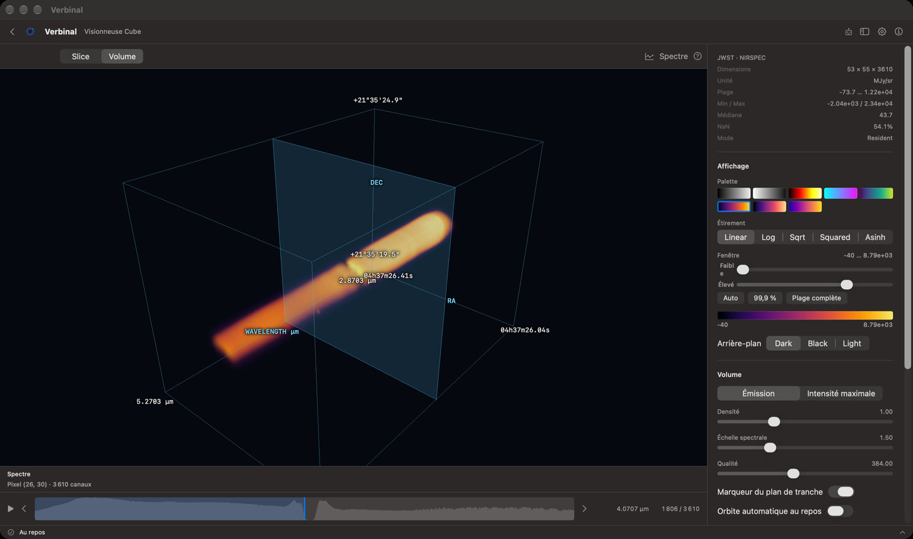
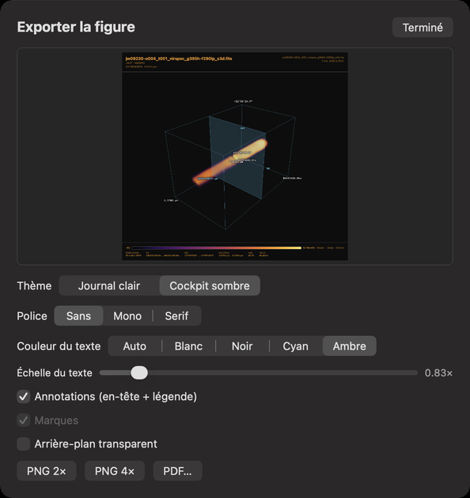
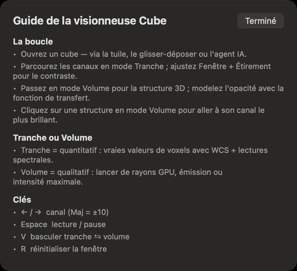

# Visionneuse Cube

La Visionneuse Cube explore les cubes spectraux FITS, comme les cubes radio ou ceux d’une unité de champ
intégral : en tranches aux vraies valeurs, un canal à la fois, et en volume 3D rendu par le GPU. Elle
fonctionne sans connexion. Ouvrez-la depuis sa tuile de l’accueil, ou par
**Aller ▸ Visionneuse Cube** (⌘4).

1. **Slice** et **Volume** : les deux façons de voir un cube (V passe de l’une à l’autre ; ces noms
   restent en anglais dans l’app).
2. **Spectre** : affiche ou masque l’inspecteur de spectre.
3. Le guide : comment se servir de la visionneuse, et ses touches.
4. Parcourir les canaux (Espace), avec le canal précédent et le suivant à côté.
5. **Auto** : une fenêtre de contraste adaptée aux données.
6. **Exporter une figure…** : une figure de la tranche ou du volume.

## Ouvrir un cube

- **Ouvrir un cube…** dans la visionneuse vide, ou déposez-y un cube.
- Depuis [Recherche](03-research.md) : **Ouvrir dans la visionneuse de cubes**.
- Ouvrir ailleurs un fichier à trois axes (la Visionneuse FITS, le navigateur de fichiers, Stockage)
  demande **Ouvrir comme…** : choisissez **Visionneuse Cube (3D)**.

Chaque cube s’ouvre dans un onglet ; le × d’un onglet le ferme. Un très gros cube lit ses tranches
depuis le disque : le panneau d’informations indique alors **Streamed**, et la sonde de spectre
demande un cube tenu en mémoire (**Resident**).

## Le panneau d’informations

En haut à droite : le télescope et l’instrument, les **Dimensions** du cube (x × y × canaux), son
**Unité**, sa **Plage** de valeurs, **Min / Max**, **Médiane**, la part de valeurs vides (NaN), et son
**Mode** (en mémoire ou lu depuis le disque).

## Slice : les vraies valeurs, canal par canal

Slice montre un canal à sa résolution d’origine, avec les coordonnées célestes.

- Parcourez les canaux avec la bande du bas, qui trace le profil des canaux ; cliquez ou faites glisser
  dedans pour y sauter. ← et → avancent d’un canal (Maj : dix), Espace lance et met en pause. La
  longueur d’onde et le numéro du canal s’affichent à droite.
- Faites glisser ou défiler pour vous déplacer, ⌘-défilement ou pincement pour zoomer, et
  double-cliquez pour réinitialiser la vue.
- Cliquez sur un pixel pour voir son spectre (**Spectre @** …) sur tous les canaux. **Spectre** affiche
  l’inspecteur sous l’image ; le × ferme la sonde.

### Affichage

- **Palette** et **Étirement**, comme dans la Visionneuse FITS.
- **Fenêtre** : les valeurs affichées, avec les curseurs **Faible** et **Élevé**, ou **Auto**,
  **99,9 %** et **Plage complète**. R la réinitialise. Une barre de couleurs montre la fenêtre.
- **Arrière-plan** : **Dark**, **Black** ou **Light** (sombre, noir ou clair).

## Volume : le cube en 3D

Volume rend tout le cube sous la forme d’une boîte, avec ses axes RA, Dec et longueur d’onde nommés.

- Faites glisser pour la tourner, défilez ou pincez pour zoomer. Cliquez sur une structure pour aller à
  son canal le plus brillant.
- **Émission** fond le cube comme un gaz lumineux ; **Intensité maximale** montre la valeur la plus
  brillante le long de chaque ligne de visée.
- **Densité**, **Échelle spectrale** (la longueur de l’axe des longueurs d’onde) et **Qualité** (le
  détail du rendu).
- **Marqueur du plan de tranche** montre où se trouve le canal courant dans la boîte.
  **Orbite automatique au repos** fait tourner lentement la boîte quand vous n’y touchez pas.
- **Courbe d'opacité** : faites glisser ses points pour choisir quelles valeurs sont transparentes et
  lesquelles brillent.

Sur un Mac Intel, si le volume ne peut pas être dessiné, une bannière dit pourquoi au lieu d’une vue
vide ; Slice fonctionne toujours.

## Marques

Les marques fonctionnent comme dans la [Visionneuse FITS](04-fits-viewer.md#marques), sur la tranche :
**Dessiner**, une forme, une couleur, le gras, la taille du libellé et le contour. Une marque appartient
à son canal ; centrer sur une marque va à son canal. **Exporter** les enregistre en régions DS9 ou en
JSON, et **Tout effacer** les retire.

## Figures

**Exporter une figure…** produit une figure de ce que vous voyez, la tranche ou le volume, avec les
mêmes choix que dans la Visionneuse FITS : **Thème**, **Police**, **Couleur du texte**,
**Échelle du texte**, **Annotations (en-tête + légende)**, **Marques** et **Arrière-plan transparent**,
puis **PNG 2×**, **PNG 4×** ou **PDF…**. Les figures sont enregistrées dans votre dossier
Téléchargements.

## Le guide

Le bouton **?** ouvre le **Guide de la visionneuse Cube** : le parcours habituel d’un cube, la
différence entre Slice et Volume, et les touches.

## Ce qu’un assistant peut faire ici

Il peut ouvrir des cubes, passer de Slice à Volume, parcourir et faire défiler les canaux, régler la
palette, l’étirement, la fenêtre et l’arrière-plan, tourner la caméra, régler le volume et sa courbe
d’opacité, lire le spectre de n’importe quel pixel et le profil des canaux, dessiner et exporter des
marques, et exporter des figures.
