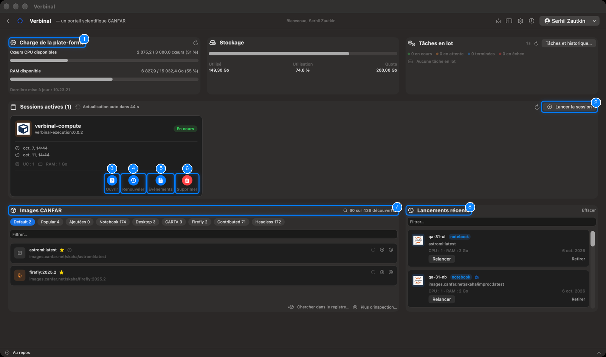
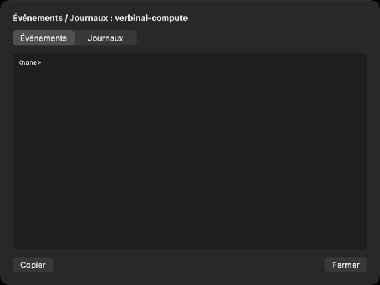
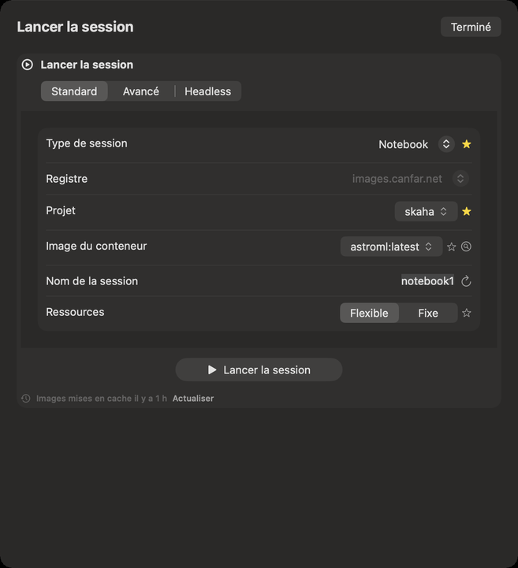
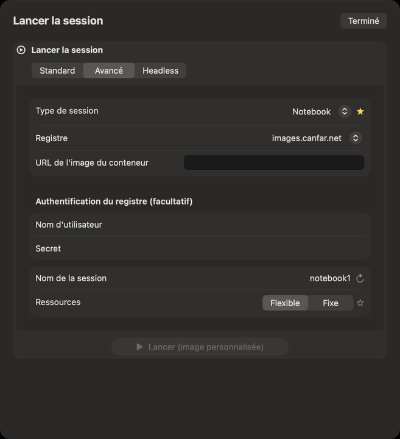

# Portail : les sessions

Portail est votre bureau sur la plateforme scientifique CANFAR : la charge de la plateforme, votre
stockage, vos sessions (calepins Jupyter, bureaux, CARTA, Firefly et applications contribuées), les
images qu’elles exécutent, et vos tâches en lot. Il faut être connecté. Ouvrez-le depuis sa tuile de
l’accueil, ou par **Aller ▸ Portail** (⌘5).

1. **Charge de la plate-forme** : les cœurs de processeur et la mémoire libres sur CANFAR en ce moment.
2. **Lancer la session** : le formulaire de lancement.
3. **Ouvrir** : une session en cours, dans votre navigateur.
4. **Renouveler** : prolonge la durée de vie d’une session.
5. **Événements** : ce que la plateforme a fait de la session, et ses journaux.
6. **Supprimer** : arrête la session et la supprime.
7. **Images CANFAR** : les images que vous pouvez lancer.
8. **Lancements récents** : ce que vous avez lancé, à relancer.

## Les cartes du haut

- **Charge de la plate-forme** : **Cœurs CPU disponibles** et **RAM disponible** sur CANFAR, combien
  d’instances tournent, et quand c’était mis à jour. Son bouton l’actualise.
- **Stockage** : la part de votre quota VOSpace utilisée (**Utilisé**, **Utilisation**, **Quota**). Il
  avertit **Stockage presque plein**. Voir [Stockage](09-storage.md).
- **Tâches en lot** : combien de vos tâches sont en cours, en attente, terminées ou en échec, actualisé
  toutes les 45 secondes. **Tâches et historique…** les ouvre : voir
  [Tâches en lot](07-batch-jobs.md).

## Vos sessions

**Sessions actives** liste vos sessions, actualisées d’elles-mêmes (un compte à rebours mène à la
prochaine actualisation), ou tout de suite avec son bouton d’actualisation. Chaque carte montre :

- le nom de la session, son image, et son état (en attente, en cours, en échec…) ;
- quand elle a démarré et quand elle expire ;
- son processeur (**UC**) et sa RAM, et le GPU quand elle en a un : ce qui lui a été attribué, ou,
  pour une session flexible (**FLEX**), ce qu’elle utilise en ce moment (**utilisé**).

Ses boutons :

- **Ouvrir** ouvre la session dans votre navigateur.
- **Renouveler** prolonge sa durée de vie.
- **Événements** montre **Événements / Journaux** : les événements de la plateforme pour la session
  (ordonnancement, téléchargement de l’image, erreurs), et les **Journaux** du conteneur, avec
  **Copier**.
- **Supprimer** arrête la session et la supprime, après confirmation. Le travail non enregistré qu’elle
  contient est perdu.

Verbinal envoie une notification quand une session que vous avez lancée est prête, ou n’a pas pu
démarrer.

## Lancer une session

1. Cliquez sur **Lancer la session**.
2. **Type de session** : Notebook, Desktop, CARTA, Firefly ou Contributed.
3. **Projet** et **Image du conteneur** : l’image à exécuter. Une longue liste s’ouvre avec un champ
   **Rechercher** pour la restreindre.
4. **Nom de la session** : Verbinal en propose un ; le bouton à côté en propose un autre.
5. **Ressources** : **Flexible**, où CANFAR donne à la session ce qu’il peut, ou **Fixe**, où vous
   choisissez les **Cœurs CPU**, la **Mémoire (Go)** et, quand CANFAR en propose, les **GPU**.
6. Cliquez sur **Lancer la session**.

Une fenêtre de progression suit le lancement et se ferme d’elle-même quand la session tourne ; la
session apparaît alors dans **Sessions actives**. En cas d’échec, la fenêtre dit pourquoi.

- L’étoile à côté d’un champ fait de sa valeur votre valeur par défaut pour le prochain lancement
  (**Définir comme … par défaut**) ; cliquez de nouveau pour l’effacer. **Réglages ▸ Portail** contient
  les mêmes valeurs par défaut.
- Le formulaire dit quand la liste des images a été récupérée (**Images mises en cache** …) ;
  **Actualiser** la récupère à nouveau.
- La loupe à côté de **Image du conteneur** ouvre la [Découverte d’images](08-image-discovery.md), pour
  trouver une image d’après ce qu’elle contient.
- Si un lancement devait remplacer une entrée des **Lancements récents** de même nom, Verbinal
  demande : **Remplacer** ou **Ignorer**.

### Une image personnalisée

L’onglet **Avancé** lance une image par son nom complet : l’**URL de l'image du conteneur**, et, pour
une image privée, son **Authentification du registre (facultatif)** (**Nom d'utilisateur** et
**Secret**). Puis **Lancer (image personnalisée)**.

L’onglet **Headless** lance des tâches en lot : voir [Tâches en lot](07-batch-jobs.md).

## Images

La carte **Images CANFAR** liste les images que vous pouvez lancer, par type de session : les puces du
haut (**Default**, **Popular**, **Ajoutées**, puis chaque type) les filtrent, avec leur nombre, et
**Filtrer…** en trouve une par son nom.

- Une étoile marque votre image par défaut pour ce type de session, et une horloge celle que vous avez
  lancée récemment.
- Les boutons d’une ligne utilisent l’image dans le formulaire de lancement, ou montrent ce qu’elle
  contient.
- Le compte en haut à droite (… **sur** … **découvertes**) et **Plus d'inspection…** ouvrent la
  [Découverte d’images](08-image-discovery.md) ; **Chercher dans le registre…** ajoute une image que le
  catalogue ne liste pas.

## Lancements récents

**Lancements récents** garde ce que vous avez lancé : nom, type, image, ressources et date.
**Relancer** le relance tel quel ; **Retirer** le retire de la liste ; **Filtrer…** en trouve un ;
**Effacer** vide la liste.

## Ce qu’un assistant peut faire ici

Il peut lire la charge de la plateforme, vos sessions avec leurs événements et journaux, les images et
vos lancements récents ; ouvrir le formulaire de lancement et le remplir ; lancer, renouveler et ouvrir
des sessions ; et les supprimer, ce qui vous attend sauf si vous l’avez autorisé. Il ne lance qu’avec
une image de la liste.
