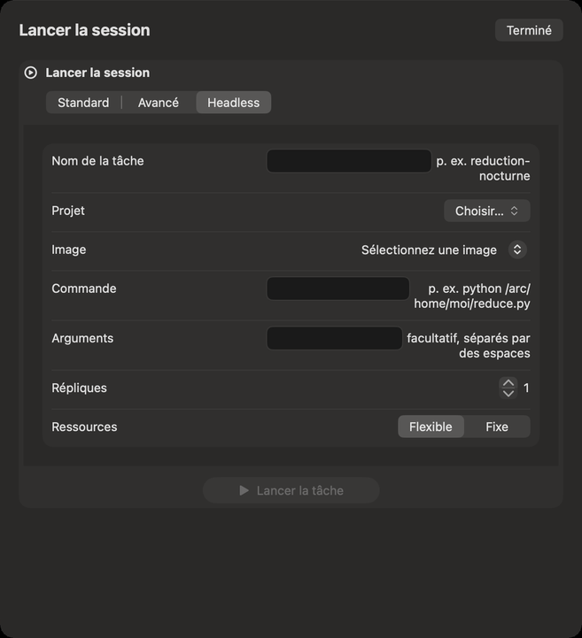
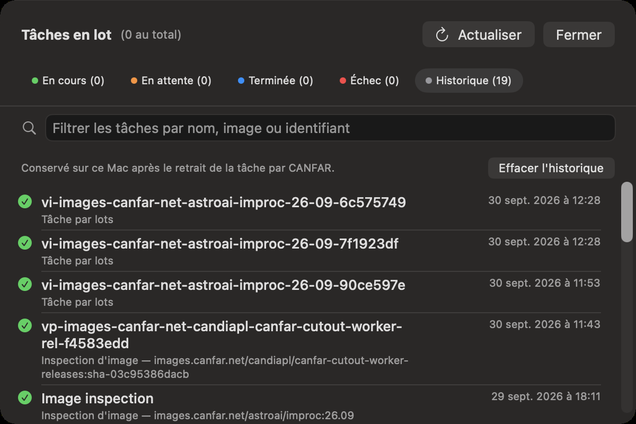

# Portail : les tâches en lot

Une tâche en lot (une session *headless*, sans interface) exécute une seule commande dans un conteneur
sur CANFAR, sans fenêtre, puis se termine : réduire une nuit de données, faire tourner un pipeline,
lancer plusieurs copies d’un script en parallèle. Vous la lancez, vous partez, et vous lisez ce qu’elle
a écrit une fois finie. Les tâches en lot demandent d’être connecté et utilisent votre allocation
CANFAR.

## Lancer une tâche en lot

1. Dans Portail, cliquez sur **Lancer la session**, puis sur l’onglet **Headless**.
2. **Nom de la tâche** : un nom pour la retrouver, comme `reduction-nocturne`.
3. **Projet** et **Image** : une image faite pour les tâches en lot. S’il n’y en a aucune, votre compte
   n’a pas d’image de traitement par lots ; demandez au soutien du CADC.
4. **Commande** : ce qu’exécute le conteneur, comme `python /arc/home/moi/reduce.py`. Elle est
   obligatoire.
5. **Arguments** : facultatifs, séparés par des espaces, passés en une seule chaîne que CANFAR découpe.
6. **Répliques** : combien de copies tournent en parallèle. Chaque copie reçoit `REPLICA_ID` et
   `REPLICA_COUNT` dans son environnement, pour se partager le travail.
7. **Ressources** : **Flexible** ou **Fixe**, comme pour une session.
8. Cliquez sur **Lancer la tâche** (ou **Lancer** … **répliques**).

Votre dossier VOSpace se trouve dans `/arc/home/<votre nom d’utilisateur>` à l’intérieur du conteneur :
lisez-y vos données et écrivez-y vos résultats.

## Suivre vos tâches

La carte **Tâches en lot** de Portail compte vos tâches : en cours, en attente, terminées et en échec.
Elle s’actualise toutes les 45 secondes, et son bouton l’actualise tout de suite.
**Tâches et historique…** ouvre la liste.

- Les onglets : **En cours**, **En attente**, **Terminée**, **Échec** et **Historique**, chacun avec son
  compte.
- **Filtrer les tâches par nom, image ou identifiant** restreint chaque onglet.
- Avec des milliers de tâches, la liste les montre par pages (… **affichées sur** …) ;
  **Afficher** … **de plus** ajoute la suivante.
- Chaque tâche montre son nom, son image et son heure. Son bouton d’information montre les
  **Détails de la tâche** : nom, type, identité, image, état, conteneur, les **Ressources demandées**,
  et ses **Horaires**.
- **Afficher événements et journaux** : ce que la plateforme a fait de la tâche, et ce qu’elle a écrit.
- **Supprimer** retire une tâche finie de la liste ; pour une tâche en cours, **Arrêter et supprimer**
  arrête son conteneur aussitôt, après confirmation, et le travail non enregistré est perdu.
- **Actualiser** (⌘R) relit les tâches depuis CANFAR tout de suite.

Verbinal envoie une notification quand une tâche que vous avez lancée se termine ou échoue, et quand
un lot de tâches est fini.

Les tâches de sonde de la [Découverte d’images](08-image-discovery.md) apparaissent aussi ici, comme
inspections d’images.

## Historique

CANFAR retire les tâches finies au bout d’un moment. Verbinal les garde dans **Historique**, sur ce Mac,
avec la façon dont chacune s’est terminée : vous retrouvez une tâche même après que CANFAR l’a oubliée.
**Effacer l'historique** le vide.

## Ce qu’un assistant peut faire ici

Il peut lister vos tâches et leur historique, lire les détails, événements et journaux d’une tâche,
lancer des tâches (avec un script Python, ou une commande), et les arrêter ou les supprimer, ce qui vous
attend sauf si vous l’avez autorisé. Lancer des tâches utilise votre allocation, et c’est un type de
modification que vous pouvez régler sur **Me demander**.
