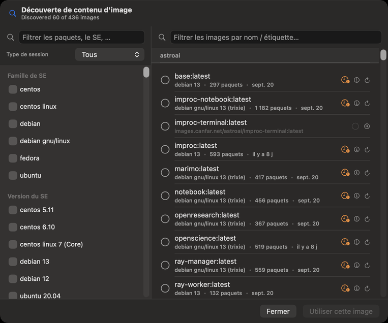
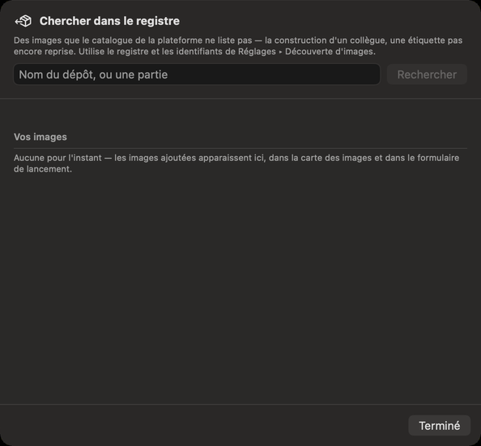

# Découverte d’images et registre

CANFAR exécute vos sessions et vos tâches dans des images de conteneur, et une image ne dit pas, de
l’extérieur, ce qu’elle contient. La Découverte d’images regarde à l’intérieur : elle lance une petite
tâche de sonde dans une image, liste ses paquets Python, R, système et du SE, et garde la liste sur votre
Mac ; vous trouvez ainsi l’image qui a ce qu’il vous faut avant de la lancer. La recherche dans le
registre ajoute des images que le catalogue de la plateforme ne liste pas. Il faut être connecté pour
l’une et l’autre.

## Trouver l’image qui a vos paquets

Ouvrez **Découverte de contenu d'image** par **Aller ▸ Découverte d'images…** (⌘8), la loupe à côté de
**Image du conteneur** dans le formulaire de lancement, ou la carte des images de Portail (le compte
**découvertes**, ou **Plus d'inspection…**). L’en-tête dit combien d’images du catalogue ont été
examinées.

1. À gauche, **Filtrer les paquets, le SE, …** trouve un paquet par son nom. Choisissez des valeurs pour
   filtrer : le **Type de session**, la **Famille de SE**, la **Version du SE**, et les paquets par sorte
   (Python, R, système). Une valeur qu’aucune image restante n’a est grisée.
2. Vos choix s’affichent comme **Filtres actifs** au-dessus des images ; retirez-en un avec son ×, ou
   tous avec **Tout effacer** (⌘⌫).
3. À droite, les images qui ont tout ce que vous avez choisi, par projet, avec
   **Filtrer les images par nom / étiquette…**. Chacune indique son SE, son nombre de paquets, et quand
   elle a été sondée.
4. Sélectionnez une image et cliquez sur **Utiliser cette image** (↩) : elle va dans le formulaire de
   lancement, et la fenêtre se ferme.

## Regarder dans une image

Une image pas encore examinée indique **Pas encore découvert**. Ses boutons :

- **Découvrir les paquets** lance la sonde : une petite tâche en lot sur votre allocation CANFAR, qui
  prend quelques minutes. La ligne indique **Découverte en cours…** ; vous pouvez fermer la fenêtre, la
  sonde continue.
- **Relancer la découverte** sonde l’image de nouveau, après sa reconstruction.
- **Afficher les détails du manifeste** ouvre le **Manifeste du contenu d'image** : l’identité de
  l’image, son SE, et chaque paquet avec sa version. **Copier en JSON** le copie ; **Afficher dans le
  Finder** montre le fichier gardé sur votre Mac.

Une sonde qui a échoué dit pourquoi. **Afficher les détails de l'échec** montre le message entier
(**Copier**, ⇧⌘C) ; **Voir les journaux de la sonde** montre les **Journaux** et les **Événements** de la
tâche de sonde (**Actualiser**, ⌘R) ; **Masquer l'erreur** la cache sans relancer la sonde, et
**Effacer** … **erreur** en haut les cache toutes. Une sonde en retard reste en
**vérification en arrière-plan**, et la ligne se met à jour d’elle-même quand le résultat arrive.

Les images privées demandent vos identifiants de registre : voir **Réglages ▸ Découverte d'images**,
qui contient aussi l’image d’inspection avec laquelle tournent les sondes, et le cache de ce qui a été
examiné ([Réglages](14-settings.md#découverte-dimages)).

## Les images que le catalogue ne liste pas

La nouvelle construction d’un collègue, ou une étiquette que le catalogue de CANFAR n’a pas encore
reprise, est dans le registre mais pas dans la liste. **Chercher dans le registre…**, sur la carte des
images de Portail, la trouve :

1. Tapez un **Nom du dépôt, ou une partie**, et cliquez sur **Rechercher**.
2. Sous **Trouvées pour** …, cliquez sur **Ajouter** sur l’image voulue.
3. Elle est maintenant dans **Vos images**, dans la puce **Ajoutées** de la carte des images, et dans le
   formulaire de lancement. **Retirer** la retire de votre liste ; l’image elle-même reste intacte.

La recherche utilise le registre et les identifiants de **Réglages ▸ Découverte d'images**.

## Ce qu’un assistant peut faire ici

Il peut trouver des images d’après les paquets qu’elles contiennent, lire les paquets d’une image et
leurs versions, lire les échecs et les journaux des sondes, chercher dans le registre, et ajouter ou
retirer des images de votre liste. Sonder une image lance une tâche sur votre allocation ; c’est un type
de modification que vous pouvez régler sur **Me demander**.
