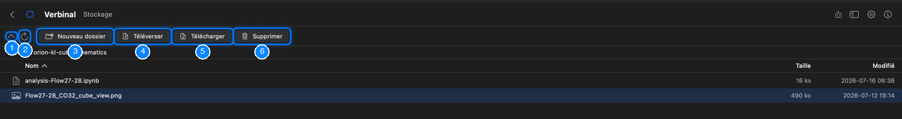
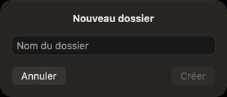

# Stockage (VOSpace)

Stockage est votre espace de stockage CANFAR (VOSpace), le même que vos sessions et vos tâches en lot
voient sous `/arc/home/<votre nom d’utilisateur>`. Parcourez-le, téléversez et téléchargez des fichiers,
créez des dossiers, et gardez privés vos fichiers privés. Il faut être connecté. Ouvrez-le depuis sa
tuile de l’accueil, ou par **Aller ▸ Stockage** (⌘6).

1. Remonter d’un dossier.
2. **Actualiser** (⌘R) relit le dossier.
3. **Nouveau dossier** (⇧⌘N).
4. **Téléverser** un fichier de votre Mac dans ce dossier.
5. **Télécharger** le fichier sélectionné sur votre Mac.
6. **Supprimer** le fichier ou le dossier sélectionné (⌘⌫).

## Fichiers et dossiers

Stockage s’ouvre sur votre dossier personnel. Le chemin sous la barre d’outils montre où vous êtes ;
cliquez sur l’une de ses parties pour y revenir. Double-cliquez sur un dossier pour l’ouvrir.

La liste montre le **Nom**, la **Taille** et la date de modification (**Modifié**) de chaque élément ;
cliquez sur le titre d’une colonne pour trier.

Clic droit sur un élément :

- **Ouvrir** : un dossier, pour voir dedans.
- **Télécharger** : enregistre un fichier sur votre Mac, où vous voulez.
- **Ouvrir dans la Visionneuse FITS** : télécharge un fichier FITS et l’ouvre (un cube demande d’abord
  s’il faut l’ouvrir comme image ou comme cube).
- **Copier le chemin** : le chemin de l’élément dans votre stockage.
- **Rendre privé** : pour un fichier public qui contient souvent des secrets (voir plus bas).
- **Supprimer**.

La carte **Stockage** de [Portail](06-portal-sessions.md) montre la part de votre quota utilisée.

## Téléverser et télécharger

- **Téléverser** choisit un fichier sur votre Mac et le place dans le dossier où vous êtes. Vous pouvez
  aussi glisser des fichiers depuis le Finder sur la liste.
- **Télécharger** enregistre le fichier sélectionné où vous voulez.

Un transfert montre sa progression au bas de la liste, avec un bouton pour l’annuler. Un transfert qui
échoue dit pourquoi, avec **Ignorer**.

## Nouveaux dossiers et suppression

**Nouveau dossier** demande le **Nom du dossier** ; **Créer** le crée dans le dossier où vous êtes.

**Supprimer** demande d’abord confirmation. Un dossier est supprimé avec tout son contenu, et la
progression s’affiche au fur et à mesure. C’est irréversible.

## Les fichiers qui ne devraient pas être publics

Certains fichiers contiennent souvent des secrets : jetons d’accès, clés, identifiants et réglages du
shell, comme `.token`, `.netrc`, `.ssh`, `.config`, `.vnc` ou `.bashrc`. Quand l’un d’eux est lisible
par tous, Stockage le marque d’un bouclier (**Public — tout le monde peut le lire, et ce genre de
fichier contient souvent des secrets**), et une bannière en haut les nomme. **Rendre privé** sur l’un
d’eux, ou **Tout rendre privé** sur la bannière, les rend lisibles par vous seul.

Changer qui d’autre peut lire ou écrire vos fichiers se fait sur le site de CANFAR, ou par un assistant,
dont la demande attend alors votre approbation.

## Ce qu’un assistant peut faire ici

Il peut lister et lire vos fichiers, créer des dossiers, téléverser des fichiers et du texte, télécharger
des fichiers, ouvrir des fichiers FITS dans les visionneuses, vous montrer un dossier, et changer qui
peut lire ou écrire un fichier. Supprimer, remplacer un fichier et partager vous attendent sauf si vous
les avez autorisés ; voir
[Ce qu’un assistant peut faire sans demander](12-ai-assistant.md#ce-quun-assistant-peut-faire-sans-demander).
