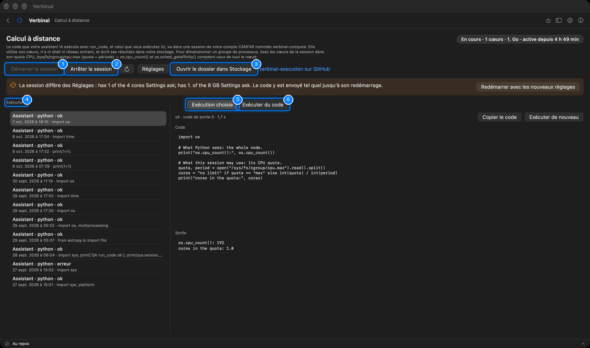
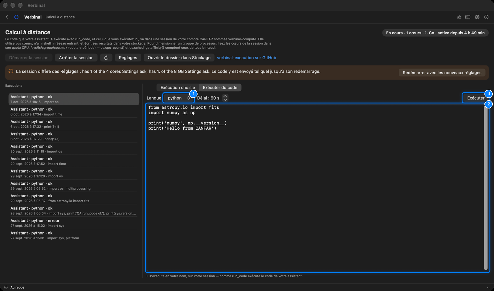

# Calcul à distance

Le Calcul à distance exécute du Python ou du Bash sur CANFAR, dans une seule session de votre propre
compte nommée `verbinal-compute`, et garde chaque exécution avec sa sortie. Vous y exécutez du code
depuis cet écran, et votre assistant IA y exécute le sien avec son outil `run_code`. La session utilise
vos cœurs, n’a ni shell ni réseau entrant, et écrit ses résultats dans votre stockage. Il faut être
connecté ; ouvrez-le depuis sa tuile de l’accueil.

1. **Démarrer la session** démarre la session de calcul.
2. **Arrêter la session** l’arrête.
3. **Ouvrir le dossier dans Stockage** : le dossier où la session lit les demandes et écrit les
   résultats.
4. **Exécutions** : chaque exécution, la plus récente en premier.
5. **Exécution choisie** : le code de l’exécution choisie, et ce qui en est revenu.
6. **Exécuter du code** : exécuter votre propre code.

## La configuration

Le Calcul à distance a besoin d’une image de calcul, choisie une fois :

1. Obtenez l’image de surveillance : construisez
   [verbinal-execution](https://github.com/szautkin/verbinal-execution) depuis son dépôt, et poussez-la
   dans votre projet sur `images.canfar.net`.
2. Dans **Réglages ▸ Calcul IA**, définissez l’**Image de calcul**, les **Cœurs** et la **RAM (Go)**
   avec lesquels elle tourne, et un identifiant de registre si l’image est privée (voir
   [Réglages](14-settings.md#calcul-ia)).
3. Revenez au Calcul à distance et cliquez sur **Démarrer la session**. La session met une minute ou deux
   à démarrer.

Tant qu’aucune image n’est définie, l’écran indique **Non configuré** et montre ces étapes, avec
**Ouvrir les réglages** et **Ouvrir le dépôt**.

## La session

L’état en haut à droite dit où en est la session : **Arrêtée**, **Démarrage**, **En cours** (avec ses
cœurs, sa mémoire et depuis quand elle tourne), **Arrêt en cours**, **Échec**, ou **Pas prêt** : la
session existe mais son image ne peut pas être tirée, avec la raison et un moyen de l’arrêter.

- **Arrêter la session** demande confirmation : l’arrêt supprime la session et tout ce qui s’y exécute.
  Le code envoyé mais pas encore exécuté reste dans la boîte de réception et s’exécute au prochain
  démarrage.
- **Actualiser** relit l’état de la session ; **Réglages** ouvre **Réglages ▸ Calcul IA**.
- Quand la session en cours n’a pas la taille que demande **Réglages ▸ Calcul IA**, une bannière le dit ;
  le code va quand même à la session telle quelle. **Redémarrer avec les nouveaux réglages** l’arrête et
  en démarre une avec les réglages.

Pour dimensionner un groupe de processus dans votre code, lisez les cœurs de la session dans son quota
CPU, `/sys/fs/cgroup/cpu.max` (quota ÷ période) : `os.cpu_count()` compte ceux de tout le nœud.

## Exécuter du code

1. **Langue** : python ou bash. À côté, le délai, en secondes.
2. Tapez le code dans la zone.
3. Cliquez sur **Exécuter** (⌘↩).

Il s’exécute en votre nom, sur votre session, comme `run_code` exécute le code de votre assistant.
L’exécution apparaît ensuite en tête des **Exécutions**.

## Les exécutions

Chaque exécution de la liste dit qui l’a envoyée (**Vous** ou **Assistant**), son langage, et comment
elle a fini : **en cours**, **ok**, **erreur**, **délai dépassé**, **aucun résultat** ou **non envoyé**.
Sélectionnez-en une pour voir, sous **Exécution choisie** :

- son état, son code de sortie et sa durée ;
- son **Code**, sa **Sortie** et ses **Erreurs** (**sortie tronquée** quand elle était trop longue) ;
- **Copier le code**, et **Exécuter de nouveau** pour renvoyer le même code.

Une exécution ne dépend pas de Verbinal ouvert : elle continue pendant que vous vous déconnectez ou
quittez, et son résultat est récupéré quand Verbinal peut de nouveau le lire.

## Ce qu’un assistant peut faire ici

Il peut lire l’état de la session et les exécutions, démarrer la session, exécuter du code et lire sa
sortie, vous montrer une exécution, et mettre du code dans la zone **Exécuter du code** pour que vous
l’exécutiez. Exécuter du code utilise votre allocation, au titre de
**Utiliser votre allocation CANFAR : sessions et calcul** ; arrêter la session relève de
**Arrêter un travail en cours sur CANFAR**, qui vous attend par défaut. L’image de calcul et sa taille
restent à vous de les régler.
