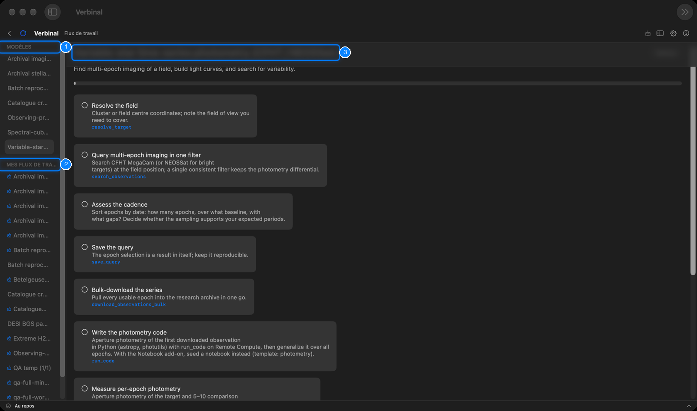

# Flux de travail

Un flux de travail est un protocole de recherche sous forme de liste de contrôle : les étapes d’un
travail, dans l’ordre, chacune avec ce qu’il faut faire et la partie de Verbinal qui le fait. Verbinal
fournit des modèles pour les travaux courants ; copiez-en un pour le suivre, ou écrivez le vôtre. Les flux
de travail sont gardés sur ce Mac et fonctionnent sans connexion. Ouvrez-les depuis leur tuile de
l’accueil, ou par **Aller ▸ Flux de travail**.



1. **MODÈLES** : les protocoles fournis avec Verbinal.
2. **MES FLUX DE TRAVAIL** : vos copies, et les flux que vous avez écrits.
3. Le flux sélectionné : son titre, sa description, sa progression et ses étapes.

## Suivre un flux de travail

Les modèles couvrent la reconnaissance d’images d’archive (CFHT MegaCam), la spectroscopie stellaire
(DAO Plaskett, CFHT ESPaDOnS), le retraitement par lots sur CANFAR, un croisement de catalogues VizieR ×
CADC, la vérification préalable d’une proposition d’observation, la cinématique d’un nuage moléculaire à
partir d’un cube spectral (JCMT), et la photométrie de séries temporelles d’étoiles variables. Leur texte
est en anglais.

1. Sélectionnez un modèle à gauche pour lire ses étapes.
2. Cliquez sur **Utiliser ce flux de travail** en bas. Verbinal le copie dans
   **MES FLUX DE TRAVAIL**, où il est à vous de le suivre.
3. Avancez dans les étapes. Cliquez sur une étape pour la cocher ; la barre du haut montre où vous en
   êtes, et la liste l’indique à côté du nom (3/9).

Chaque étape dit quoi faire. En dessous, en bleu, figure l’outil qu’un assistant IA utiliserait pour
cette étape, ce qui vous indique aussi où le faire vous-même dans Verbinal. Une étape peut nommer une
extension, comme l’extension de calepins ; sans elle, l’étape dit quoi utiliser à la place.

**Aperçu**, en haut, quitte le flux et montre de nouveau la liste.

## Écrire le vôtre

Choisissez **Nouveau flux de travail** dans la barre d’outils (dans le menu » quand la fenêtre est
étroite). Un flux de travail est du Markdown simple, comme le rappelle l’éditeur :

```text
# Titre
> Description en une ligne

## Steps
- [ ] **Titre d’étape** — ce qu’il faut faire
    Tool: search_observations
    View: search
    Note: ce dont il faut se souvenir
```

- `# Titre` : le nom du flux. Sans titre, il est enregistré sous « Untitled workflow ».
- `> …` : une description en une ligne.
- `## Steps`, puis une ligne `- [ ]` par étape : le titre en gras, puis ce qu’il faut faire.
- Sous une étape, en retrait et facultatifs : `Tool:`, `View:` et `Note:`.

L’éditeur avertit quand le titre ou les étapes manquent. **Enregistrer** le garde dans
**MES FLUX DE TRAVAIL**.

Vos propres flux ont **Modifier**, pour changer leur texte, et **Supprimer**, qui demande confirmation et
est irréversible. Les modèles ne peuvent pas être modifiés ; copiez-en un et modifiez la copie.

Un flux créé par un assistant IA porte la pastille **Créé par l'agent IA**.

## Ce qu’un assistant peut faire ici

Il peut lister et lire les flux de travail, copier un modèle, écrire et mettre à jour des flux, cocher
les étapes à mesure que le travail avance, et les supprimer, ce qui vous attend sauf si vous l’avez
autorisé. Les modèles nomment les outils qu’il utilise à chaque étape.
