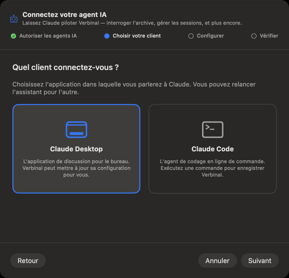
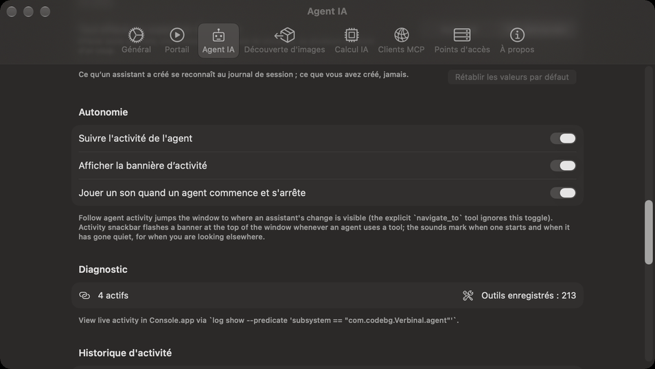
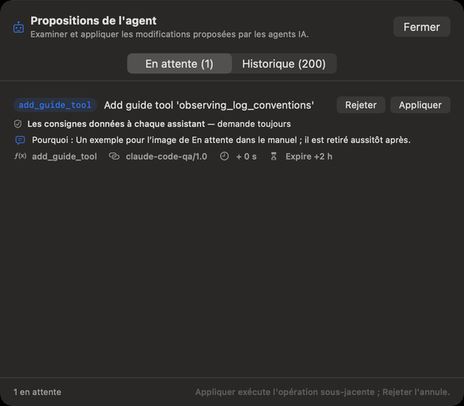
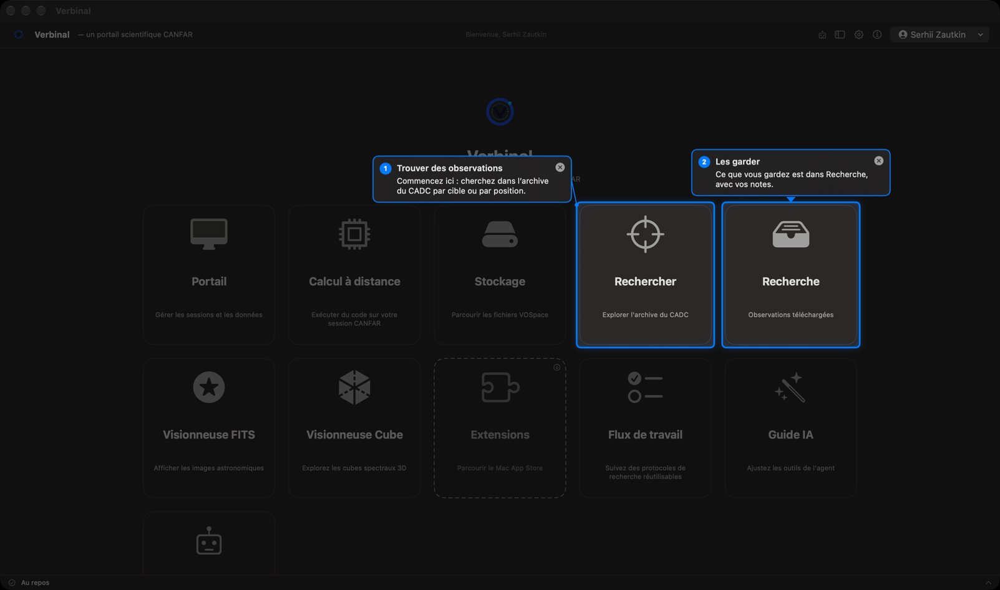
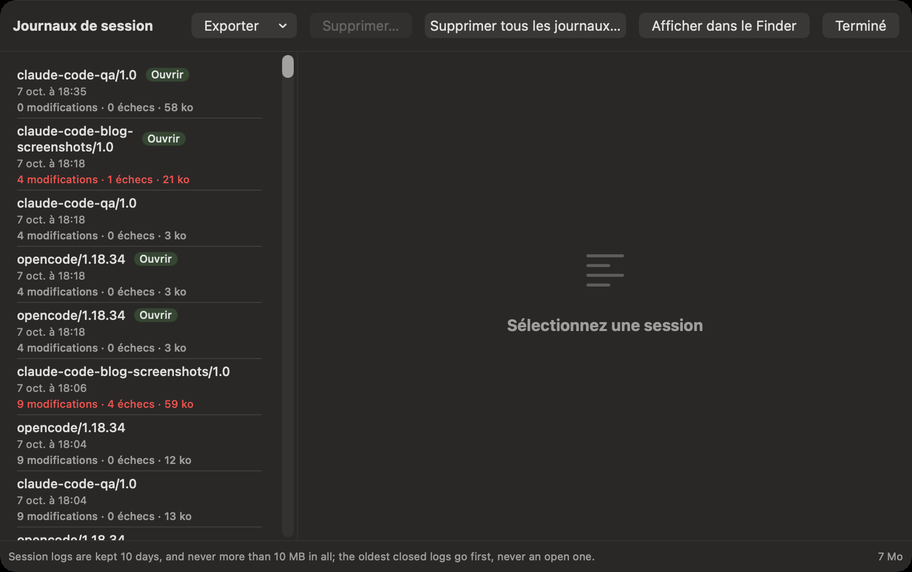

# Travailler avec un assistant IA

Un assistant IA, comme Claude, peut travailler dans Verbinal avec vous : chercher dans l’archive,
télécharger et ouvrir des observations, lire vos sessions et votre stockage, exécuter du code sur
CANFAR, et vous faire visiter la fenêtre. Il le fait par le **Model Context Protocol (MCP)**, que
Verbinal parle. Vous décidez si un assistant peut se connecter et ce qu’il peut faire sans demander,
et vous pouvez lire tout ce qu’il a fait.

## Ce qui reste privé

- **Désactivé tant que vous ne l’activez pas.** Aucun assistant ne peut joindre Verbinal avant que
  vous activiez **Autoriser les agents IA externes** dans **Réglages ▸ Agent IA**.
- **Rien sur le réseau.** L’activer démarre un serveur MCP que seuls les programmes de ce Mac, lancés
  par vous, peuvent joindre. Aucun port n’est ouvert et rien n’est exposé au réseau.
- **Votre mot de passe n’est jamais partagé.** La connexion reste à vous ; un assistant ne peut ni se
  connecter, ni se déconnecter, ni lire votre mot de passe.
- **Votre assistant est un programme distinct.** Ce qu’il envoie à son propre service (pour Claude,
  Anthropic) regarde vous et ce service. Verbinal ne fait que répondre à ce que l’assistant demande.

## Connecter un assistant



Cliquez sur la tuile **Assistant IA** de l’accueil, ou choisissez **Aide ▸ Connecter un agent IA…**.
La configuration, **Connectez votre agent IA**, compte quatre étapes :

1. **Autoriser les agents IA** : activez **Autoriser les agents IA externes**.
2. **Choisir votre client** : **Claude Desktop** ou **Claude Code**. Pour un autre client, voir
   [Autres clients](#autres-clients).
3. **Configurer** : comme ci-dessous, pour le client choisi.
4. **Vérifier** : **Lancer l'autotest** vérifie que le serveur de Verbinal répond. La preuve finale
   est dans votre client : quittez-le complètement, rouvrez-le, et vérifiez que les outils de Verbinal
   y figurent.

### Claude Desktop

**Configurer Claude Desktop** demande une fois l’accès au dossier de réglages de Claude, puis ajoute
l’entrée `verbinal-canfar` à sa configuration, pointée vers cet exemplaire de Verbinal. Seule cette
entrée change, et une sauvegarde (`.bak`) est d’abord écrite. Redémarrez ensuite Claude Desktop.
**Copier l'extrait**, **Afficher la config** et **Ouvrir Claude** sont là si vous préférez modifier le
fichier vous-même.

### Claude Code

Claude Code garde ses serveurs dans un fichier qui contient aussi sa connexion ; Verbinal ne le modifie
donc pas. **Copier** la commande affichée et exécutez-la dans Terminal. Elle ressemble à ceci :

```sh
claude mcp add --transport stdio --scope user verbinal-canfar -- '/Applications/Verbinal.app/Contents/MacOS/Verbinal' 'mcp'
```

Ou collez l’extrait JSON (**Copier l'extrait JSON**) dans le `mcpServers` de premier niveau de
`~/.claude.json`. Redémarrez ensuite Claude Code.

### Autres clients

Tout assistant capable de lancer un serveur MCP local fonctionne de la même façon : nom
`verbinal-canfar`, commande `/Applications/Verbinal.app/Contents/MacOS/Verbinal`, argument `mcp`. Il n’y
a ni port, ni URL, ni clé. [AGENTS.md](https://github.com/szautkin/canfar-macos/blob/main/AGENTS.md) donne les réglages exacts pour Codex,
Cursor, Gemini CLI, Windsurf et VS Code ; vous pouvez donner ce fichier à votre assistant pour qu’il se
configure lui-même. **Réglages ▸ Clients MCP** affiche la commande exacte pour ce Mac et la copie
(**Copier la commande**).

### Vérifier la connexion

Verbinal doit être ouvert, avec **Autoriser les agents IA externes** activé. Quand Verbinal est fermé,
l’assistant se connecte quand même, et chacun de ses outils répond que Verbinal n’est pas ouvert ; dès
que vous ouvrez Verbinal, il le retrouve de lui-même.

Si un assistant ne se connecte pas, **Réglages ▸ Clients MCP ▸ Diagnostic** vérifie chaque maillon : le
serveur, son écoute, le conteneur partagé, la prise (socket), les outils et la configuration de Claude
Desktop, avec un bouton pour réparer ce qui peut l’être. Voir aussi [Dépannage](16-troubleshooting.md).

## Autoriser une session

Chaque fois qu’un assistant se connecte, il doit ouvrir une session, et Verbinal vous le demande d’abord
dans une fenêtre : **Un assistant veut ouvrir une session**.

- **Client**, **Connexion** et **Demandé** : quel programme demande, par MCP, et quand.
- **Comment l’assistant se présente** : qui il dit être, son modèle et son but, dans ses propres mots.
  Verbinal ne peut pas les vérifier.
- **Instructions pour cette session** : ce que l’assistant doit suivre pendant toute la session,
  jusqu’à 250 mots. La zone part de vos **Instructions de session** ; modifiez-les pour cette session
  seulement, ou **Réinitialiser**.
- **Autoriser** ouvre la session ; **Refuser** la refuse. La fenêtre attend aussi longtemps que
  l’assistant attend.

Tant que vous ne l’autorisez pas, l’assistant peut seulement demander à Verbinal de se décrire. La
session dure tant que l’assistant reste connecté ; après un redémarrage de Verbinal ou de l’assistant,
il redemande.

Vos instructions par défaut sont dans **Réglages ▸ Agent IA ▸ Instructions de session**. Au départ,
elles disent : *« Use only Verbinal and its tools for this work: no other apps, and no network
connections outside Verbinal. Ask before anything destructive. »* (n’utiliser que Verbinal et ses
outils, sans autre app ni connexion réseau hors de Verbinal, et demander avant toute action
destructive). L’assistant doit les suivre et le journal de session les conserve, mais Verbinal ne peut
pas empêcher un assistant d’utiliser ses autres outils ou des connexions hors de Verbinal.

## Ce qu’un assistant peut faire sans demander



Chaque modification qu’un assistant peut faire est d’un certain type. Dans **Réglages ▸ Agent IA**, sous
**Ce qu’un assistant peut faire sans demander**, vous réglez chaque type sur **Autorisé** (la
modification s’applique aussitôt, avec sa raison dans le journal de session) ou **Me demander** (elle
attend dans En attente jusqu’à ce que vous l’appliquiez).

| Type | Ce qu’il couvre | Au départ |
|---|---|---|
| **Notes et éléments enregistrés sur ce Mac** | Notes, évaluations, requêtes enregistrées, protocoles, signets, fiches de Recherche | Autorisé |
| **Fichiers enregistrés sur ce Mac** | Téléchargements, découpes, figures et exportations, en nouveaux fichiers — jamais par-dessus un fichier | Autorisé |
| **Ajouter à votre stockage CANFAR** | Nouveaux fichiers et dossiers dans votre VOSpace | Autorisé |
| **Utiliser votre allocation CANFAR : sessions et calcul** | Lancer et renouveler des sessions ; le calcul à distance et le code qu’il exécute | Autorisé |
| **Utiliser votre allocation CANFAR : tâches en lot et sondes d’images** | Tâches en lot, et les tâches de sonde qui trouvent ce qu’une image a installé | Autorisé |
| **Partage : qui peut lire ou écrire vos fichiers** | Qui peut lire ou écrire vos fichiers et dossiers VOSpace | Me demander |
| **Les consignes données à chaque assistant** | Outils guides et descriptions d’outils que lit chaque assistant suivant | **Demande toujours** |

Sous **Ce qui supprime, remplace ou arrête** :

| Type | Ce qu’il couvre | Au départ |
|---|---|---|
| **Supprimer ce qu’un assistant a créé** | Tout ce qu’un assistant a créé, tel que le journal de session l’enregistre — jamais ce qui est à vous | Autorisé |
| **Supprimer des notes et éléments enregistrés sur ce Mac** | Requêtes enregistrées, recherches récentes, protocoles, signets, entrées de la liste d’images, erreurs de sonde | Me demander |
| **Supprimer des fichiers sur ce Mac** | Fichiers téléchargés et leurs fiches de Recherche | Me demander |
| **Supprimer ou remplacer dans votre stockage CANFAR** | Supprimer de votre VOSpace, ou téléverser par-dessus un fichier | Me demander |
| **Arrêter un travail en cours sur CANFAR** | Supprimer une session en cours, ou arrêter le calcul à distance : le travail non enregistré est perdu | Me demander |
| **Tout effacer ou supprimer d’un coup** | Effacer toute une liste, une archive ou un espace de stockage, ou plusieurs sessions d’un coup | Me demander |

Ce qu’un assistant a créé se reconnaît au journal de session ; ce que vous avez créé, jamais.
**Rétablir les valeurs par défaut** remet chaque type comme ci-dessus. Les modifications des
**Les consignes données à chaque assistant** vous attendent toujours.

## En attente : les modifications qui vous attendent



Quand une modification attend, le bouton robot de la barre d’outils affiche un compte en rouge.
Cliquez dessus pour ouvrir **Propositions de l'agent** :

- **En attente** liste ce qui attend. Chaque modification dit ce qu’elle est, pourquoi elle attend
  (**demande toujours**, **vous demandez à approuver ce type** ou **proposée avant que vous
  l’autorisiez**), la raison de l’assistant (**Pourquoi :**), le client qui l’a proposée, et quand
  elle expire : trois heures après avoir été proposée.
- **Appliquer** exécute la modification ; **Rejeter** l’abandonne.
- **Historique** liste ce qui s’est passé : **Appliqué par vous**, **Appliqué automatiquement**,
  **Appliqué en arrière-plan**, ce qui a été rejeté, et ce que l’assistant a ouvert, fermé ou montré.

## Regarder un assistant travailler

Dans **Réglages ▸ Agent IA ▸ Autonomie** :

- **Suivre l'activité de l'agent** (activé) : quand une modification d’un assistant s’applique, la
  fenêtre va là où vous pouvez la voir : une requête enregistrée dans Rechercher, les notes et
  téléchargements dans Recherche, les modifications VOSpace dans Stockage, les sessions dans Portail.
- **Afficher la bannière d’activité** (activé) : une bannière en haut de la fenêtre,
  **L'agent IA travaille…**, pendant qu’un assistant utilise ses outils. Son × la masque.
- **Jouer un son quand un agent commence et s'arrête** (désactivé) : pour quand vous regardez ailleurs.

Un assistant reçoit une réponse en 45 secondes au plus. Un travail plus long, comme un gros
téléchargement ou une tâche, continue dans la barre d’activité au bas de la fenêtre, lancé par
**Votre assistant**.

Ce qu’un assistant a créé porte une petite pastille, **Créé par l'agent IA**, avec le nom du client :
dans Recherche, Flux de travail, les requêtes enregistrées, les recherches récentes, les signets FITS
et les lancements récents.

## Indications : ce que votre assistant vous montre



Pour vous montrer quelque chose, un assistant pose des **indications** sur la fenêtre : un anneau
autour d’un contrôle, une bulle avec ses mots à côté, des numéros pour une visite, et le reste de la
fenêtre assombri.

- Les indications n’appuient jamais sur rien. Un assistant peut aussi sélectionner une entrée d’une
  liste, ou ouvrir une section repliée, un panneau, un menu ou une feuille, comme le ferait votre clic ;
  le choix à l’intérieur reste à vous, et un panneau de fichiers vous attend.
- Le × d’une indication la ferme ; **Échap** les ferme toutes. Quand elles sont nombreuses, une liste
  **Indications** reprend leurs mots, avec **Fermer toutes les indications**.
- Elles disparaissent d’elles-mêmes : une bulle après 8 secondes et un anneau après 15, sauf si
  l’assistant les garde plus longtemps (jusqu’à deux minutes, ou jusqu’à ce que vous les fermiez), et
  quand vous changez d’écran.

Les indications ne sont pas les marques d’une image : les marques sont des données, gardées avec le
fichier (voir [Visionneuse FITS](04-fits-viewer.md#marques)).

## Le journal de session



Verbinal tient un journal de la session de chaque assistant : chaque modification, qui l’a faite et
pourquoi, les décisions de l’app, chaque requête au CADC et à CANFAR, et les échecs avec leur sens. Il
garde ce qui s’est passé, pas vos données : ni mots de passe, ni contenu de fichiers, ni requêtes, ni
chemins.

Ouvrez-le depuis **Réglages ▸ Agent IA ▸ Journaux de session ▸ Afficher les journaux de session…** :

- La liste de gauche a une entrée par session : le client, **Ouvrir** (le badge d’une session en
  cours), son début, et combien de modifications et d’échecs elle a eus.
- Sélectionnez-en une pour la lire. **Afficher** la filtre : **Tous**, **Modifications**, **Échecs**,
  **Décisions**, **Appels**. Ouvrez une entrée pour voir ses requêtes : quel service, ce que la réponse
  voulait dire, et combien de temps elle a pris.
- **Exporter** enregistre une session en texte (**Exporter en texte…**) ou en JSON Lines
  (**Exporter en JSON Lines…**).
- **Supprimer…** et **Supprimer tous les journaux fermés…** suppriment des journaux ; une session
  ouverte garde le sien. C’est irréversible. **Afficher dans le Finder** montre où ils sont gardés.

Les journaux sont gardés 10 jours, et jamais plus de 10 Mo au total ; les plus anciens journaux fermés
partent d’abord, jamais un journal ouvert. Un assistant lit aussi son propre journal, pour expliquer ce
qui a été lent ou a échoué.

Plus bas dans **Réglages ▸ Agent IA**, **Diagnostic** indique combien d’assistants sont connectés et
combien d’outils ils ont, **Activité récente** liste les derniers appels (seulement ce qu’ils étaient
et comment ils ont fini, jamais leurs arguments), et **Historique d'activité** garde un court résumé de
chaque modification, avec **Effacer**.

## Ce qu’un assistant peut faire, et ce qu’il ne peut pas faire

Un assistant dispose d’environ deux cents outils : tout ce que vous pouvez faire sur chaque écran de ce
manuel. Il voit la fenêtre comme vous, lit ce qu’est chaque contrôle et peut le montrer. Chaque chapitre
se termine par ce qu’un assistant peut faire sur cet écran.

Certaines choses restent à vous, exprès :

- Se connecter et se déconnecter, et votre mot de passe.
- Les **Réglages** : un assistant peut lire vos points d’accès et vos réglages de calcul à distance,
  mais ne peut changer aucun réglage, ni l’image de calcul ni les identifiants du registre.
- Choisir dans un menu, une feuille ou un panneau de fichiers qu’il a ouvert ; et les menus contextuels
  (clic droit).
- Votre ménage : **Effacer les terminées** dans la liste d’activité, et **Effacer l'historique** dans
  les tâches en lot.
- Ce qui est dit à chaque assistant suivant (le [Guide IA](13-ai-guide.md)) : il peut le proposer, et
  cela vous attend toujours.
- Exécuter du code : seulement sur CANFAR, avec l’image que vous avez choisie dans **Réglages ▸ Calcul
  IA** (voir [Calcul à distance](10-remote-compute.md)).

## Arrêter un assistant

- **Refuser** une session qu’il demande.
- **Rejeter** ce qui attend dans En attente.
- Désactiver **Autoriser les agents IA externes** dans **Réglages ▸ Agent IA** : le serveur s’arrête,
  et aucun assistant ne peut joindre Verbinal avant que vous le réactiviez.
- Ou quitter l’app de l’assistant elle-même.
