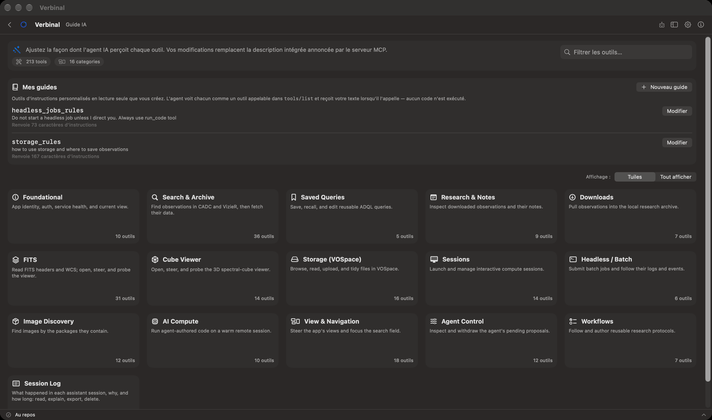

# Guide IA

Le Guide IA est ce qui est dit à chaque assistant IA quand il se connecte à Verbinal : vos propres
consignes permanentes, et la description de chacun des outils de Verbinal. À vous de le façonner.
Ouvrez-le depuis sa tuile de l’accueil, ou par **Aller ▸ Guide IA** (⌘7).

## Vos guides : des consignes permanentes pour chaque assistant

**Mes guides** sont de courts textes que vous écrivez une fois et que chaque assistant lit. Chacun
apparaît à un assistant comme un outil à part entière ; quand l’assistant l’appelle, il reçoit votre
texte. Aucun code n’est exécuté. Servez-vous-en pour une règle (« Ne lance pas de tâche en lot sans ma
demande »), une convention (« Nomme les dossiers d’après la cible »), ou un protocole à suivre.

Verbinal dit à chaque assistant, en tout premier, de lire **les consignes permanentes de la personne**,
et donne vos guides par leur nom.

1. Cliquez sur **Nouveau guide**.
2. **Nom** : des lettres, des chiffres, des espaces ou des traits de soulignement. La feuille montre le
   nom sous lequel l’assistant l’appelle (**L'agent l'appelle sous le nom** …).
3. **Description — ce que l'agent lit dans la liste des outils** : une ligne sur l’objet du guide,
   jusqu’à 600 caractères.
4. **Instructions — renvoyées lorsque l'agent appelle cet outil** : la règle elle-même, jusqu’à 4 000
   caractères. Elles sont facultatives ; sans elles, la description est renvoyée.
5. Cliquez sur **Enregistrer**.

Chaque guide de la liste montre sa description et la longueur de ses instructions (**Renvoie** …
**caractères d'instructions**). **Modifier** le rouvre, avec **Supprimer**.

## Les descriptions des outils

Sous vos guides, les outils de Verbinal sont regroupés par domaine : la recherche et l’archive, les
requêtes enregistrées, Recherche, les téléchargements, FITS, la Visionneuse Cube, le stockage, les
sessions, les tâches en lot, la Découverte d’images, le Calcul à distance, la vue et la navigation, les
contrôles de l’assistant lui-même, les flux de travail et le journal de session. L’en-tête compte les
outils, ceux que vous avez modifiés, et les domaines.

- **Affichage :** **Tuiles** montre une tuile par domaine ; cliquez sur une tuile pour l’ouvrir.
  **Tout afficher** liste tous les outils d’un coup.
- **Filtrer les outils…** trouve un outil par son nom ou par des mots de sa description.
- Chaque outil montre la description qu’un assistant lit. **Modifier**, écrivez **Votre description**
  à côté de la **Valeur par défaut intégrée**, puis **Enregistrer**. Vos mots remplacent ceux d’origine
  pour chaque assistant à partir de là ; l’outil est marqué **remplacé**, et son domaine
  **comporte des remplacements**.
- **Effacer le remplacement** ou **Réinitialiser par défaut** rétablit la description d’origine.

Changez une description quand un assistant emploie mal un outil, ou pour l’orienter (« préfère la plus
petite taille »). Cela change ce qui est dit aux assistants, pas ce que fait l’outil.

## Quand un assistant propose une modification ici

Un assistant peut proposer un nouveau guide, la modification d’un guide, ou une nouvelle description.
Une telle modification est du type **Les consignes données à chaque assistant**, et elle vous attend
toujours dans En attente, quels que soient vos autres réglages : voir
[En attente](12-ai-assistant.md#en-attente--les-modifications-qui-vous-attendent).

## Masquer la tuile

Si vous ne vous en servez pas, désactivez **Afficher le Guide IA sur l'écran d'accueil** dans
**Réglages ▸ Clients MCP**. Seule la tuile disparaît ; vos guides et vos descriptions restent en
vigueur, et **Aller ▸ Guide IA** l’ouvre toujours.

## Ce qu’un assistant peut faire ici

Il peut lire vos guides et les descriptions des outils, et proposer de les modifier ; chaque
proposition vous attend.
