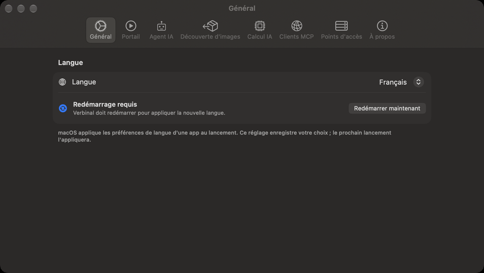
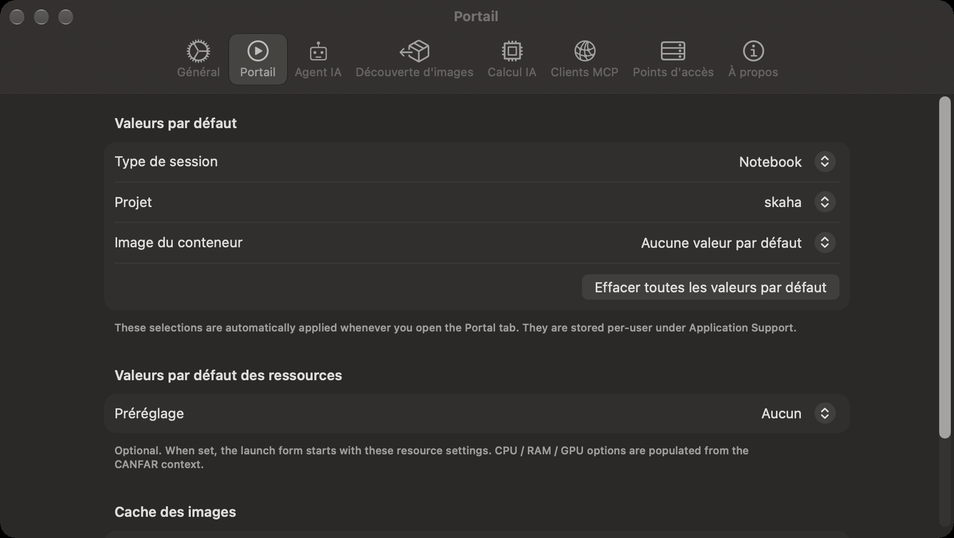
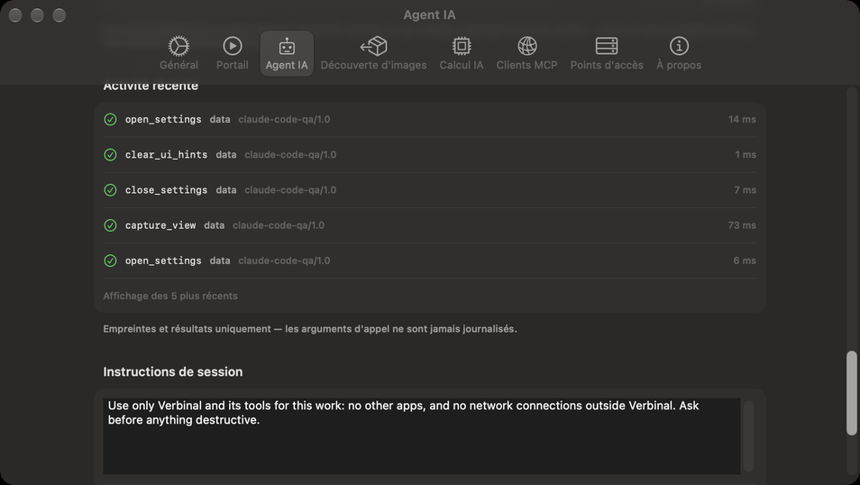
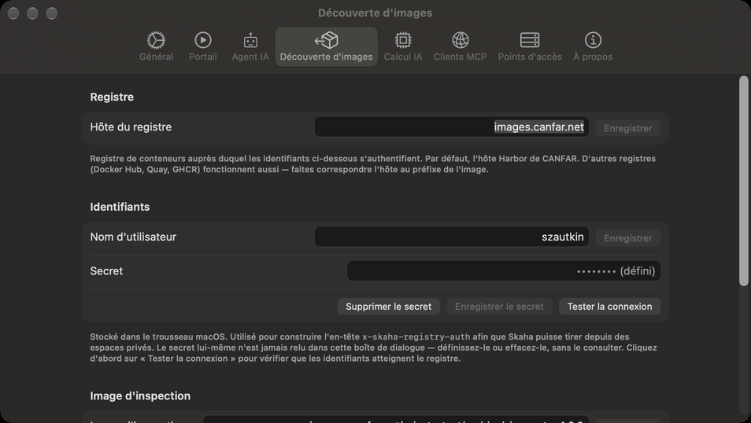
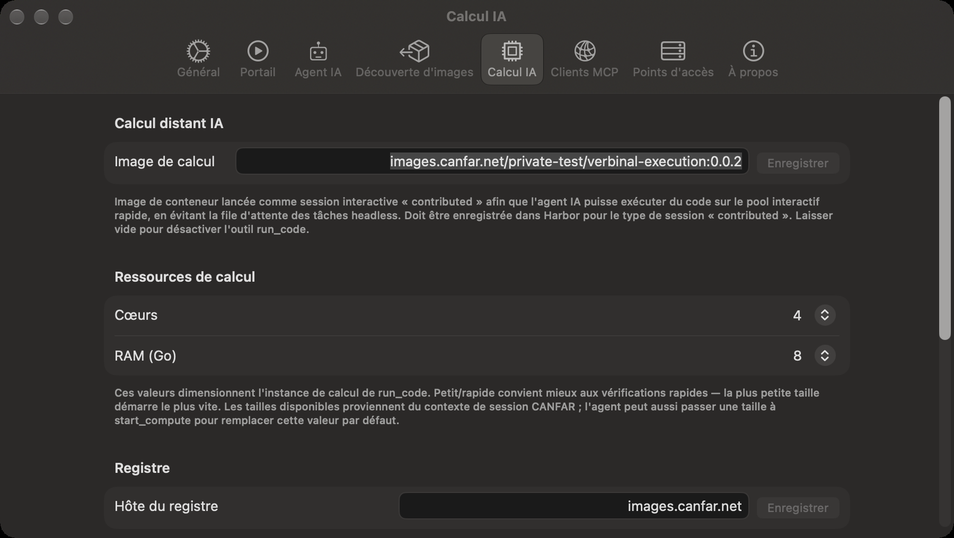
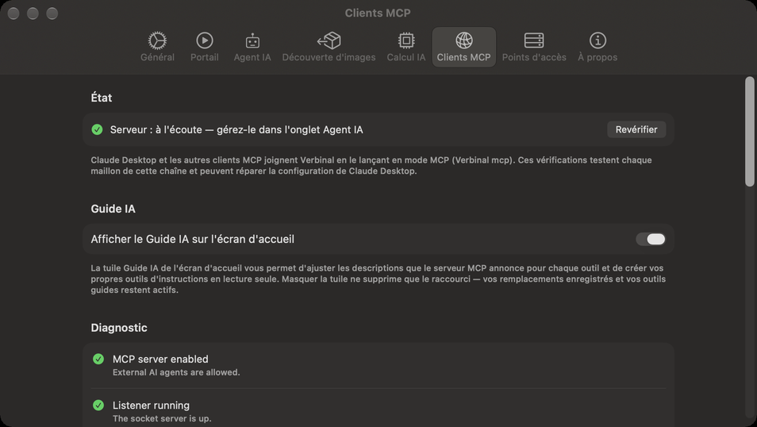
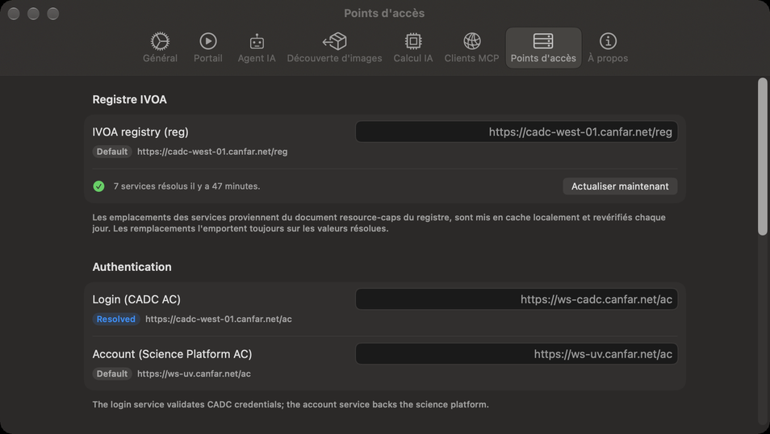
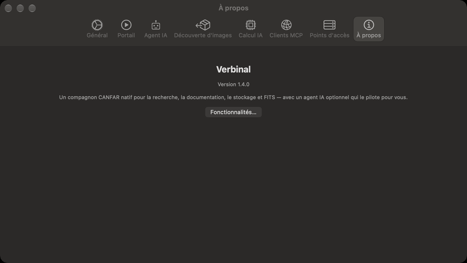

# Réglages

Ouvrez les réglages avec ⌘, ou le bouton en forme d’engrenage de la barre d’outils. Ils comptent huit
sections ; chacune est décrite ici avec tous ses réglages. Les réglages sont à vous seul : un assistant
IA peut en lire certains, jamais les modifier.

## Général

| Réglage | Ce qu’il fait |
|---|---|
| **Langue** | **Système** suit votre Mac ; ou choisissez **Anglais** ou **Français**. Verbinal affiche **Redémarrage requis** : cliquez sur **Redémarrer maintenant** pour l’appliquer. |

## Portail

Les valeurs avec lesquelles s’ouvre le formulaire de lancement (voir
[Portail : les sessions](06-portal-sessions.md)). Connectez-vous pour les changer ; elles sont gardées
pour votre compte sur ce Mac.

| Réglage | Ce qu’il fait |
|---|---|
| **Valeurs par défaut** ▸ **Type de session** | Le type sur lequel s’ouvre le formulaire, parmi ceux que CANFAR propose (Notebook, Desktop, etc.), ou **Aucune valeur par défaut**. |
| **Valeurs par défaut** ▸ **Projet** | Le projet d’images sur lequel s’ouvre le formulaire, ou **Aucune valeur par défaut**. |
| **Valeurs par défaut** ▸ **Image du conteneur** | L’image que le formulaire sélectionne, ou **Aucune valeur par défaut**. |
| **Effacer toutes les valeurs par défaut** | Oublie les valeurs ci-dessus pour ce compte. |
| **Valeurs par défaut des ressources** ▸ **Préréglage** | **Aucun**, **Flexible** ou **Fixe**. Avec **Fixe**, choisissez **Cœurs** et **RAM (Go)**, et **GPU** quand CANFAR en propose. Les tailles proposées viennent de CANFAR. |
| **Cache des images** | Quand la liste des images a été récupérée (**En cache :** …). **Actualiser maintenant** récupère à nouveau le catalogue d’images ; **Vider le cache** le supprime, et il est récupéré à la prochaine ouverture de Portail. |

## Agent IA

Comment les assistants IA joignent Verbinal et ce qu’ils peuvent faire.
[Travailler avec un assistant IA](12-ai-assistant.md) explique chaque partie.

| Réglage | Ce qu’il fait |
|---|---|
| **Serveur MCP** ▸ **Autoriser les agents IA externes** | Désactivé tant que vous ne l’activez pas. Activé, il démarre le serveur MCP local ; la ligne en dessous indique **À l'écoute**, et où. |
| **Ce qu’un assistant peut faire sans demander** | Pour chaque type de modification, **Autorisé** ou **Me demander**. **Les consignes données à chaque assistant** est sur **Demande toujours**. |
| **Ce qui supprime, remplace ou arrête** | De même, pour les types qui suppriment ou arrêtent quelque chose. **Rétablir les valeurs par défaut** remet chaque type. |
| **Autonomie** ▸ **Suivre l'activité de l'agent** | La fenêtre va là où la modification d’un assistant se voit. Activé. |
| **Autonomie** ▸ **Afficher la bannière d’activité** | Une bannière en haut de la fenêtre pendant qu’un assistant travaille. Activé. |
| **Autonomie** ▸ **Jouer un son quand un agent commence et s'arrête** | Désactivé. |
| **Diagnostic** | Combien d’assistants sont connectés, et combien d’outils sont enregistrés. |
| **Historique d'activité** | Un court résumé de chaque modification et de chaque vue faite par un assistant ; **Effacer** le vide. |
| **Activité récente** | Les cinq derniers appels : ce que chacun était et comment il a fini, jamais ses arguments. |
| **Instructions de session** | Ce par quoi commence la fenêtre d’autorisation de chaque nouvelle session, jusqu’à 250 mots ; **Réinitialiser** rétablit celles de Verbinal. |
| **Journaux de session** ▸ **Afficher les journaux de session…** | Chaque session d’assistant, ce qui s’est passé et pourquoi. |

Les types et **Autonomie** s’affichent quand **Autoriser les agents IA externes** est activé, et les
sections de **Diagnostic** à **Activité récente** quand le serveur tourne.

## Découverte d'images

Ce dont la [Découverte d’images](08-image-discovery.md) a besoin pour regarder dans des images privées.

| Réglage | Ce qu’il fait |
|---|---|
| **Registre** ▸ **Hôte du registre** | Le registre de conteneurs auquel vos identifiants s’appliquent. Par défaut, celui de CANFAR (`images.canfar.net`) ; Docker Hub, Quay ou GHCR fonctionnent aussi, avec l’hôte qui correspond au nom de l’image. **Enregistrer**. |
| **Identifiants** ▸ **Nom d'utilisateur** | Votre nom d’utilisateur du registre, en général votre nom d’utilisateur CADC. **Enregistrer**. |
| **Identifiants** ▸ **Secret** | Votre secret de registre : pour celui de CANFAR, le **secret CLI** de votre profil Harbor, pas votre mot de passe CADC. **Enregistrer le secret** le garde dans le trousseau macOS ; il n’est plus jamais affiché, seulement remplacé ou supprimé (**Supprimer le secret**). |
| **Tester la connexion** | Vérifie les identifiants auprès du registre. **Connexion rejetée** signifie le plus souvent qu’un mot de passe CADC a été saisi au lieu du secret CLI Harbor. |
| **Image d'inspection** | L’image qui exécute les tâches de sonde. Laissez-la vide pour celle de Verbinal. |
| **Cache de découverte d'images** | Combien d’images ont été examinées. **Effacer** les oublie toutes ; les sondes en cours continuent. |
| **Réinitialiser** | Efface l’hôte du registre, le nom d’utilisateur, le secret et l’image d’inspection ; ce qui est en cache reste. |

## Calcul IA

La session dans laquelle le [Calcul à distance](10-remote-compute.md) exécute le code.

| Réglage | Ce qu’il fait |
|---|---|
| **Calcul distant IA** ▸ **Image de calcul** | L’image de conteneur que le Calcul à distance lance comme session « contributed », par exemple `images.canfar.net/<projet>/verbinal-execution:<version>`. Elle doit être enregistrée dans le registre de CANFAR pour le type de session « contributed ». Vide, le Calcul à distance est désactivé. **Enregistrer**. |
| **Ressources de calcul** ▸ **Cœurs**, **RAM (Go)** | La taille de cette session. La plus petite démarre le plus vite ; les tailles proposées viennent de CANFAR. |
| **Registre** et **Identifiants** | Comme dans Découverte d’images : le registre d’où l’image de calcul est tirée, et votre nom d’utilisateur et votre secret pour lui. |
| **Réinitialiser** | Efface l’image de calcul, l’hôte du registre, le nom d’utilisateur et le secret. |

## Clients MCP

Comment chaque programme assistant joint Verbinal.

| Réglage | Ce qu’il fait |
|---|---|
| **État** | Si le serveur est à l’écoute ; il s’active et se désactive dans Agent IA. **Revérifier** le relit. |
| **Guide IA** ▸ **Afficher le Guide IA sur l'écran d'accueil** | Affiche ou masque la tuile Guide IA de l’accueil. Vos guides restent en vigueur dans les deux cas. |
| **Diagnostic** | Vérifie chaque maillon entre un assistant et Verbinal quand vous ouvrez l’onglet, chacun avec une réparation quand il y en a une. |
| **Autotest du serveur MCP** | **Lancer la vérification du serveur MCP** vérifie que le serveur répond. La preuve finale est de redémarrer votre client et d’y voir les outils de Verbinal. |
| **Configuration de Claude Desktop** | **Configurer Claude Desktop** ajoute Verbinal à la configuration de Claude Desktop en un clic. **Autoriser l’accès…**, **Mettre à jour la configuration**, **Copier l'extrait**, **Afficher la config** et **Ouvrir Claude** le font à la main. Redémarrez ensuite Claude Desktop. |
| **Claude Code** | Si Claude Code est installé. **Copier la commande** copie la commande `claude mcp add` pour ce Mac ; **Copier l'extrait JSON** copie l’entrée à coller dans `~/.claude.json`. |

## Points d'accès

Les adresses des services du CADC et de CANFAR auxquels Verbinal s’adresse. Vous avez rarement besoin
de les changer. Certains de leurs noms restent en anglais dans l’app.

| Réglage | Ce qu’il fait |
|---|---|
| **Registre IVOA** ▸ **IVOA registry (reg)** | Où Verbinal trouve les autres services. Il revérifie chaque jour ; **Actualiser maintenant** le fait tout de suite, et la ligne en dessous dit combien de services il a trouvés, et quand. |
| **Authentication** | **Login (CADC AC)** et **Account (Science Platform AC)** : la connexion, et votre compte de la plateforme. |
| **Science Platform** | **Science Platform (Skaha)**, qui exécute sessions et tâches, et **Storage (VOSpace nodes)**. |
| **Archive & Data** | **Archive (TAP / DataLink)**, pour la recherche, les métadonnées et les téléchargements, et **External web (browser)**. |
| **Tout réinitialiser aux valeurs par défaut** | Retire toutes les adresses que vous avez saisies. |
| **Tester les connexions** | Demande à chaque service s’il est disponible, et à quelle vitesse il répond. |

Chaque adresse montre d’où vient sa valeur : **Default** (par défaut), **Resolved** (du registre), ou
celle que vous avez saisie, qui l’emporte toujours ; **Effacer le remplacement** retire la vôtre. Les
adresses s’appliquent au démarrage de Verbinal : après un changement, **Redémarrage requis** propose
**Redémarrer maintenant**.

## À propos

La version de Verbinal, et **Fonctionnalités…**, qui ouvre **Ce que Verbinal peut faire**.
