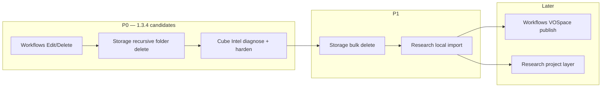

# Global dev plan — post–1.3.3 backlog

**Date:** 2026-07-27  
**Baseline:** Verbinal **1.3.3** (tag `v1.3.3`)  
**Audience:** sequencing across Storage, Cube, Workflows, Research

---

## Review summary

| Area | User ask | Verdict |
|------|----------|---------|
| **Storage delete** | Non-empty folder; async endpoint?; bulk delete? | Sync DELETE only — **no async job API**. Non-empty folders often fail with one-shot DELETE; MCP already has recursive walk (cap 100). UI is single-select — no bulk. |
| **Cube Intel** | 2019 Intel: no volume / cube frame | Metal path silently early-returns; volume **and** wireframe share one guard. Half-float already Intel-safe. Need logs + UI error + possible downsample / decouple frame. |
| **Workflows** | No edit, add, delete | **Add exists** (`+` toolbar). **Edit + Delete missing** in UI though store/MCP support them. |
| **Research** | Import folder / FITS·fz under project/collection | Archive is CADC-download-only; group by `collection` only (no project entity). Local open elsewhere does not ingest. |

---

## Recommended release sequencing

Ship as **1.3.4** (small polish) then **1.4.0** (Research import), or one 1.3.4 if capacity allows.

### Priority order (why)

1. **Workflows Edit/Delete** — smallest gap; store ready; high user frustration; low risk.  
2. **Storage non-empty delete** — clear broken UX vs confirm copy; reuse MCP walker.  
3. **Cube Intel** — blocks science on Intel Macs; needs hardware to confirm root cause.  
4. **Storage bulk delete** — nice-to-have after single recursive works.  
5. **Research local import** — largest product change; new ingest model.  
6. **Workflows VOSpace / Research projects** — parity / structure after core works.

---

## Per-area plans

| # | Plan | Effort (P0) |
|---|------|-------------|
| 1 | [Storage delete & bulk](./01-storage-delete.md) | M (+ M–L bulk) |
| 2 | [Cube Intel volume](./02-cube-intel-volume.md) | S diagnose + M fix |
| 3 | [Workflows CRUD UI](./03-workflows-crud.md) | S–M |
| 4 | [Research local import](./04-research-local-import.md) | M–L |

---

## Cross-cutting constraints

- **Sandbox:** folder import and Research bookmarks must use security-scoped URLs / `LocalFolderAccessStore`.
- **Windows parity:** prefer matching CanfarDesktop where it already has the feature (Workflows Edit/Delete/Publish; Storage remains single-select there).
- **Agents:** Storage recursive already on Mac MCP; Research import should get an MCP tool once UI lands; Workflows tools already cover edit/delete.
- **i18n:** all new chrome → `Localizable.xcstrings` EN + FR.
- **No fake async delete:** do not invent a VOSpace job API; use client-side recursive DELETE with progress/cancel.

---

## Suggested 1.3.4 scope (tight)

- Workflows: Edit + Delete + clearer New  
- Storage: recursive folder delete + honest errors (+ status progress)  
- Cube: failure surfacing + Intel fix once diagnosed  

**Defer to 1.4.0:** Research folder/file import + collection assignment; Storage multi-select bulk delete; Workflows VOSpace.

---

## Open questions (product)

1. Storage: always recursive for folders, or confirm “Delete contents too?”  
2. Research: is **collection** enough as the bucket, or do we need a separate **project**? (Plan recommends collection-only for v1.)  
3. Cube: if Metal cannot run on a given Intel GPU, is slice-only an acceptable permanent fallback?  
4. Bulk delete: required for 1.3.4 or wait until after recursive folders?

---

## Next actions

1. ~~Start **03-workflows-crud** (fast win).~~ — in progress on `release/1.3.4`.  
2. Confirm product answers above.  
3. Book Intel Mac time for **02-cube** Phase A logs.  
4. Implement **01-storage** Phase A (extract recursive delete for UI).  
5. Spec **04-research** data-model change before UI.
