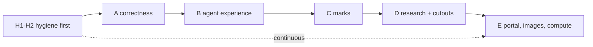

# Dev plan — Windows catch-up (1.4.x line)

**Date:** 2026-09-26
**Baseline:** Verbinal macOS **1.3.4** build 17 + review fixes (`release/1.3.4` @ `4d60f9c`)
vs Verbinal Windows **1.4.1** (`CanfarDesktop` @ `76896c8`, shipped 2026-09-26)
**Sources:** `CanfarDesktop/CHANGELOG.md` 1.4.0 + 1.4.1, the Windows tool catalogue,
and this tree. Every gap below was checked against the code, not assumed.
**Supersedes:** [08 Ubuntu catch-up](./08-ubuntu-catchup.md) Phases 2–4 and its
hygiene track. Windows 1.4.0 was built by measuring against Ubuntu 1.4.4, so
Windows is the newer superset. 08 Phase 1 shipped in 1.3.4.

Branching: this work goes on `release/1.4.0`, cut from the plan commit, so
`release/1.3.4` stays shippable. We tag once, when parity is reached, not at
each step. Out of scope: Notebook (it stays in the VerbinalPi addon, decided
2026-09-20), Windows packaging (MSIX, x86 bridge, Store), and Windows-only
fixes whose cause does not exist here.

---

## Engineering rules (The Pragmatic Programmer, 2nd ed. + SOLID)

These are acceptance criteria. A step that breaks one is not done.

| Rule | What it means here |
|---|---|
| **ETC** — easier to change | The value that decides between two designs. |
| **DRY** — one place for each piece of knowledge | One sexagesimal formatter, one colour table, one "copy details" text, one auto-apply sentence, one cutout interface. Guard tests stop a second private copy from being written. |
| **Orthogonality / SRP** | Each feature is its own module with its own model, service, view and MCP file (`Verbinal/<Feature>/…`). New tools do **not** go into `AppState+AgentTools.swift`. |
| **OCP / DIP** | New behaviour plugs in behind a protocol: the SODA and local cutout makers sit behind one `CutoutMaker`. Tools take closures or protocols, never `AppState`. |
| **ISP** | Keep protocols narrow, like `ViewerTabHosting` / `ViewerDocument`. |
| **Tracer bullets** | Build each feature as a thin slice through every layer first (model → service → view → tool → test), then widen it. |
| **Design by contract / crash early** | Typed errors that say why. Never report `opened: true` or `applied: true` before it happened. |
| **Don't outrun your headlights** | Small steps. Each is committed when green: `xcodebuild test`, `swift test` in `shared/VerbinalKit`, and the iOS scheme when shared code changes. |
| **No broken windows** | No new compiler warnings. The backlog is burned down in H2. |
| **Don't program by coincidence** | Coordinates are checked against astropy reference values, not eyeballed. |

Every new user-facing string goes into `Localizable.xcstrings` with EN and FR.
Every new tool is registered in `AIGuideCatalog` and the parity matrix
(`docs/agent-ui-parity.md`), and is covered by `AgentToolCatalogParityTests`.

---

## Verified gaps

MCP catalogue diff: Windows has 182 tools. Leaving out the 21 notebook tools,
46 are missing on the Mac. We have 34 Mac-only tools, mostly finer-grained
twins of theirs, which we keep.

### Correctness (fix first)

| # | Gap | Evidence |
|---|---|---|
| C1 | **Sexagesimal rollover** — `59.996″` prints `60.00`, e.g. `23h59m60.00s`. There are two implementations: the search-table one is right, the viewer one is wrong. | `FITSWCSTransform.formatRA/formatDec` use `%05.2f` on a float remainder. `HMSFormatter`/`DMSFormatter` in `CellFormatters.swift` round integer centiseconds correctly. |
| C2 | **Viridis is not viridis** — a teal-to-orange approximation, the same bug Windows fixed in 1.4.0. | `FITSRenderEngine.colormapColor(.viridis)` is a linear ramp, while inferno/magma/plasma use anchor tables. |
| C3 | **No SIP distortion** — HST calibrated frames land up to ~6 px (0.26″) off, in both directions (Windows was missing only sky→pixel). | `FITSWCSTransform` treats a `-SIP` ctype as a tag only and never reads `A_i_j`/`B_i_j`/`AP`/`BP`. |
| C4 | **MCP bridge dies with the app** — if Verbinal is closed, `initialize` fails, so the client drops the server for the whole session. If it quits mid-session, the bridge exits. | `MCPStdioBridge.Bridge.run` calls `drainAndFail` when there is no sidecar, and returns when the splice ends. |
| C5 | **Search cannot be cancelled** — the form and the ADQL editor stay busy until CADC answers. | `SearchFormModel.executeSearch/executeRawQuery` has no task handle and no cancel. |
| C6 | **Fixed 15 s session poll** — a job that starts and fails between polls is never announced. | `SessionListModel.pollInterval = 15`. |
| C7 | **Huge-file agent opens** — `open_fits_file` now waits for the load, so a 1.6 GB file runs past the tool deadline, and the agent retries and opens duplicates. Opening a file that is already open adds a second tab. | `loadFITSNow` has no "still loading" answer. `FITSTabHostModel.openFile` always calls `addTab()`. |
| C8 | **Fixed memory caps** — 4 GB file / 500 Mpx refused whatever is free, and full resolution is always rendered. | `FITSViewerModel` (4 GB), `FITSParser`/`FITSDecompressor` (500 Mpx). |

### Features (Windows 1.4.0 / 1.4.1)

| # | Feature | Mac today |
|---|---|---|
| F1 | Tool map: `list_apps`, `search_tools` (matches words), `man` | only `describe_app` |
| F2 | TAP schema: `describe_tap_schema`, `validate_adql_query`, and an ADQL editor that checks as you type and disables Execute until the query can run | none |
| F3 | Agent vision: `get_fits_image`, `get_cube_image` (the view on screen plus its transform) | none |
| F4 | `close_tab`; `show_search_row_detail` / `show_observation_detail` (we have `open_observation_detail`) | partial |
| F5 | Copy: cell / details / rows as TSV; **Copy details** in Research and the detail view; `copy_to_clipboard` | "Copy Row" only |
| F6 | UI pointer: `list_ui_targets`, `point_at_ui`, `open_settings`, `close_settings` | none |
| F7 | Background work: `start_background_apply`, `get_job_status`; long agent downloads become background jobs; approval rule enforced | none |
| F8 | **Marks** (annotations) on FITS and cubes, Marks panel, DS9/JSON export, 9 tools | none |
| F9 | FITS figure export of a **selected region**, with marks | whole view only (1×/2×/4× and PDF exist) |
| F10 | Research: keep an observation without its file (`save_observation_to_research`); remove the file but keep the observation (`remove_downloaded_file`, always needs approval); `show_research_observation` | the record needs its file |
| F11 | **SODA cutouts** (cut on CADC's side) — editor, prefill, checks, size estimate, Research "Cutout" record; the Search spatial/spectral cutout boxes are honoured; 3 tools | none |
| F12 | **Local cutouts** — from a downloaded file; MEF, cubes, fpack, weight-map companions, checksums | none |
| F13 | Portal laid out as on Linux; launch form in a sheet; `show_launch_form` | inline form |
| F14 | CANFAR images card: session-type chips, project row, count of inspected images; `list_session_images(project)` | type filter only |
| F15 | Registry search and "my images": `search_image_registry`, `add/remove_registry_image`, `list_my_images`, `describe_image`, `search_packages` | ImageDiscovery covers manifests and probes only |
| F16 | **Remote Compute screen** (tile locked until sign-in): state, Start/Stop, run history, run your own snippet, setup help; 6 tools; `show_storage_folder` | settings plus `run_code` / `start_compute` / `stop_compute` only |
| F17 | Activity bar plus **job history** (finished batch jobs remembered after CANFAR removes them) | live agent activity only |
| F18 | FITS empty state offers recent files (the cube viewer already has this); load progress | cube only |
| F19 | Agent sound cues, About with copyable runtime info, `AGENTS.md`, accessibility labels, home-tile order | none / partial |

---

## Status

| Phase | State | Commits |
|---|---|---|
| H1 split `AppState+AgentTools` | done | `3a8fa1b` |
| H2 zero warnings, non-blocking tests | done | `f0d1e2c` |
| H3 invariant tests | ongoing (a guard lands with each step) | — |
| H4 pinned toolchain, CI package tests | done | `76f11a7` |
| A1–A8 correctness | done — QA: [11](./11-qa-windows-phase-a.md) | `4433b44` … `1d3be2f` |
| B agent experience | done — B1 tool map, B2 TAP schema + ADQL checker, B3 viewer pictures, B4 tabs/details, B5 copy, B6 background applies, B7 UI pointer + Settings | `c647e64` … |
| C marks | done — QA: [12](./12-qa-windows-phase-c.md). C1 FITS marks: model, store (normalised path, per HDU), overlay, 7 tools, DS9/JSON export; C2 drawing and editing by hand, Marks panel, mark menu; C3a cube marks on the slice, `annotate_cube`, `list_cube_annotations`; C3b marks in the volume (one `CubeCamera`); C4a FITS figures of a region, with marks; C4b cube figures with marks | `178d67f` … `f5d7527` |
| D Research and cutouts | done — QA: [13](./13-qa-windows-phase-d.md). D1 records without their file; D2 SODA cutouts, the editor, the search's cutout boxes; D3 local cutouts: images, mosaics, cubes by band, fpack tiles, weight maps | `3094375` … `a264cb5` |
| E portal/compute | in progress — E1 Portal layout, launch form in a sheet, show_launch_form; E2 images card chips and projects; E3 registry search, your images, describe_image, search_packages | `2a4dfe4`, `ba14192`, E3 |

A8 found no message truncation on the Mac (a Windows-only bug) and
corrected a real one instead: destructive tools told agents they ran
immediately under auto-apply, which they never do.

## Phases

### H — hygiene first (every later phase touches these files)

1. **H1 Split `AppState+AgentTools.swift`** (3,331 lines, SRP) into one
   extension file per module (`+SearchTools`, `+FITSTools`, `+CubeTools`,
   `+ResearchTools`, `+StorageTools`, `+PortalTools`, `+AgentLifecycleTools`).
   Move code only; no behaviour change; one commit.
2. **H2 Warnings to zero**: the 15 in the 1.3.4 build — Swift 6 captured-var
   races in the search-form tools, a `MainActor` default in `WorkflowStore` /
   `ObservationNoteStore`, a redundant `??`, and needless `nonisolated(unsafe)`.
3. **H3 Invariant tests** (carried over from 08): every advertised argument is
   read; settable ↔ readable; no dead xcstrings keys.
4. **H4 Pinned toolchain** (`.xcode-version`), with README/CONTRIBUTING
   quoting the gate commands.

### A — correctness

1. **A1 One `Sexagesimal`** in VerbinalKit: integer-unit rounding with carry
   and wrap, and a parameter for precision and separators. It replaces
   `formatRA/formatDec` and backs `HMSFormatter`/`DMSFormatter`. A guard test
   fails if any other file formats sexagesimal itself. (C1)
2. **A2 Real viridis**: anchor table from matplotlib `_viridis_data`, in the
   single `colormapColor`, so FITS and cube match. Tests pin the endpoints and
   the midpoint. (C2)
3. **A3 SIP**: forward `A/B`, inverse `AP/BP`, and a Newton inverse when only
   the forward terms are given. Tested against astropy on a WFC3 header,
   corners included. (C3)
4. **A4 Resilient bridge**: answer `initialize` and `tools/list` from the last
   manifest cached next to the sidecar. While the app is closed, each tool
   answers with a tool error ("Verbinal is not running — open it and turn on
   Allow external agents"). Reconnect when the sidecar appears, then send
   `notifications/tools/list_changed`. Answer in-flight requests if the app
   quits. (C4)
5. **A5 Cancel search**: a task handle in `SearchFormModel`; Cancel on the
   form and in the ADQL editor. Rows already shown stay. A cancelled search is
   not kept in recents; a failed one stays on the form. CSV is parsed off the
   main actor and checks for cancellation. Adds `cancel_search`, and
   `run_search` reports `cancelled`. (C5)
6. **A6 Adaptive poll**: one `PollCadence` (about 5 s after a change, easing
   to the ceiling) used by sessions and headless jobs. Never announce a
   session that failed before the app started. (C6)
7. **A7 Honest large opens**: open tools answer `stillLoading` at the
   deadline instead of failing, and reopening a file that is already open
   switches to its tab, in both viewers. (C7)
8. **A8 Tool text**: error messages arrive whole. Every proposing tool's
   description ends with the one auto-apply rule sentence, from one source.
   `get_fits_wcs` without an HDU reads the one on screen, otherwise the first
   HDU with a WCS, and says which. Go To off the image says where the
   position falls. The RA/Dec fields accept a decimal comma.

### B — agent experience

1. **B1 Tool map**: `list_apps`, `search_tools` (word match), `man` —
   generated from the router's manifest, not a second list. (F1)
2. **B2 TAP schema**: a cached `TapSchemaService`, an `ADQLValidator` (unknown
   tables, columns and functions; the dialect: TOP not LIMIT, geometry `= 1`),
   `describe_tap_schema`, `validate_adql_query`, and the editor's problem list
   with Execute disabled until it is clear. Queries run from the editor are
   kept in recents (`fromEditor`). (F2)
3. **B3 `get_fits_image` / `get_cube_image`**: the on-screen raster (zoom,
   pan, colormap, crosshair, marks once C lands) plus the inverse transform,
   capped by settings in pixels and MB. (F3)
4. **B4** `close_tab`, `show_search_row_detail`, and `show_observation_detail`
   as the Windows names, with our names kept as aliases. (F4)
5. **B5 Copy**: one `ObservationSummaryText` (ID, collection, publisher ID,
   target, the position in both forms, instrument, filter, date, cal level,
   proposal, release) used by every copy action and by `copy_to_clipboard`.
   Adds cell / details / rows-as-TSV context menus. (F5)
6. **B6 Background jobs**: a `TaskRegistry` behind `start_background_apply`
   and `get_job_status`; an agent download that outlives the call becomes a
   job. `start_background_apply` applies only what auto-apply would have
   applied. (F7)
7. **B7 UI pointer**: named targets registered from views, an overlay hint,
   and `open_settings`/`close_settings` at a section; this works inside
   sheets. (F6)

### C — marks

A `Marks` module (model, store, renderer, views, tools):
- One mark model: box, circle, callout, text; pinned to the sky, to pixels,
  or to a cube channel; styled (colour, weight, label size, outline); stored
  per file and per HDU under a **normalised path**.
- One renderer for the FITS canvas, cube slice and cube volume. Label with a
  leader line; grips for resizing; click to place, drag to size or move.
- Marks panel (list, filter, style) and a per-mark menu: edit label, copy
  coordinates (in a form Search reads), centre, search here, export a figure
  around it, delete.
- Export as JSON with provenance, or as a DS9 region file. Marks are included
  in `export_fits_figure` / `export_cube_figure`; F9 region export ships here.
- Tools: `annotate_fits`, `annotate_cube`, `list_fits_annotations`,
  `list_cube_annotations`, `update_annotation`, `select_annotation`,
  `remove_annotation`, `clear_annotations`, `export_annotations` (which also
  works for a file that is not open).

### D — Research and cutouts

1. **D1** A Research record may have no file: Save to Research, Remove file
   (destructive, always needs approval), Download brings the file back, and
   `show_research_observation`. (F10)
2. **D2 SODA cutouts**: parse the DataLink SODA descriptor, with the reasons
   when it cannot be used; a `CutoutSpec` (circle, box, wavelength band); an
   editor prefilled from the last search, checked as you type, with a size
   estimate; the download goes through `DownloadService`; the Research record
   is marked **Cutout** with its region and links to the original
   observation. Tools: `get_cutout_options`, `download_cutout`,
   `show_cutout_editor`. The Search spatial/spectral cutout boxes are honoured
   on download. (F11)
3. **D3 Local cutouts** behind the same `CutoutMaker`: copy the pixels (same
   BITPIX and scaling); rewrite the header (NAXIS, CRPIX, LTV/LTM, HISTORY);
   add CHECKSUM/DATASUM; keep SIP valid; choose MEF extensions; cut cubes by
   spectral range; decompress only the tiles an fpack RICE_1 region touches;
   carry weight-map companions after a WCS-grid alignment check. (F12)

### E — Portal, images, compute, polish

1. **E1** Portal layout plus the launch form in a sheet; `show_launch_form`. (F13)
2. **E2** Images card chips, project row, inspected count;
   `list_session_images(project)`. (F14)
3. **E3** Registry search, "my images", `describe_image`, `search_packages`,
   and add/remove, extending `ImageDiscovery`. (F15)
4. **E4** Remote Compute screen and its 6 tools, plus `show_storage_folder`.
   The image field drops a pasted `https://`. (F16)
5. **E5** Activity bar and job history. (F17)
6. **E6** FITS empty-state recents, sharing the cube viewer's component and
   store; load progress; a memory-based limit and a display raster of at most
   64 Mpx with full-resolution readouts (C8). (F18)
7. **E7** Sound cues, About, `AGENTS.md`, accessibility labels, tile order. (F19)

---

## Done means

- Each step is its own commit (author and committer
  `Serhii Zautkin <szautkin@prog.app>`) with its tests and a CHANGELOG entry
  under `[1.4.0] - Unreleased`.
- The tool diff against Windows is empty apart from notebook tools and the
  deliberate Mac-only extras.
- QA handouts in the style of [09](./09-qa-ubuntu-phase1.md) at the end of
  phases A, C and D.
